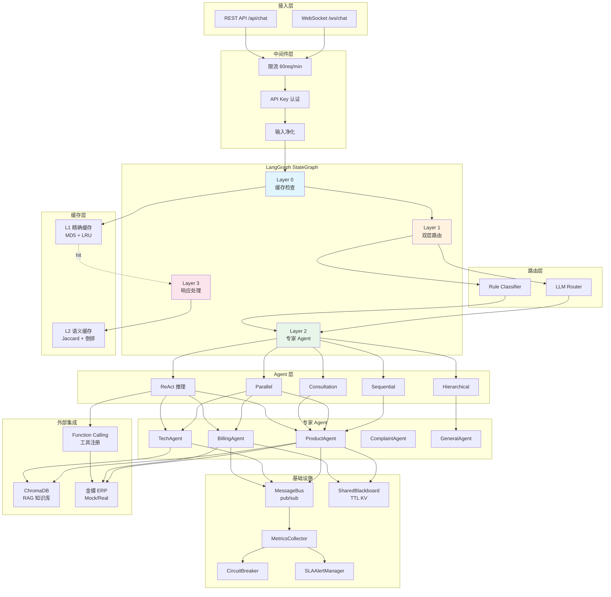

# 多智能体客服系统 (Customer Service AI Agent v3.7)

面向化妆品生产企业的基于 **LangGraph** 多 Agent 协作问答系统，实现四层状态机动态路由：缓存检查 → 意图路由 → 专家 Agent → 响应处理。

> **v3.7** 完成安全加固 + 结构性重构；**v3.6** 完成 RAG 知识库 + Function Calling + ReAct 推理；当前稳定版 **182 tests passed, 4 skipped**。

---

## 🏗️ 架构设计

### 系统架构图



### 四层状态机

| 层级 | 节点 | 职责 |
|------|------|------|
| **Layer 0** | `check_cache` | L1 精确匹配 + L2 语义匹配，命中直接返回（<10ms） |
| **Layer 1** | `classify_query` | LLM Router ∥ Rule Classifier 并行 + 复杂度评分（阈值 50） |
| **Layer 2** | `sequential/parallel/consultation/hierarchical/react` | 5 种协作模式动态选择 |
| **Layer 3** | `final_response` | 解决状态评估 + 缓存写入 + SLA 监控 + 事件广播 |

---

## 🤖 功能模块详解

### Agent 系统

| Agent | 职责 | 协作方式 | 集成 |
|-------|------|----------|------|
| **BaseAgent** | 所有 Agent 的抽象基类，提供 `process()` 模板方法 | - | Bus/BB/ERP/RAG/FC |
| **ProductAgent** | 产品成分分析、功效查询、价格对比、库存查询 | Sequential/Parallel | ERP + RAG |
| **TechAgent** | 使用指导、过敏处理、产品搭配、保质期咨询 | Sequential/Parallel | RAG |
| **BillingAgent** | 退款处理、订单查询、发票管理、物流追踪 | Sequential/Parallel | ERP |
| **ComplaintAgent** | 情绪安抚、问题解决、补偿方案、升级处理 | Hierarchical | - |
| **GeneralAgent** | FAQ、产品概览、服务介绍、协调调度 | Sequential/Consultation | - |
| **ResponseAgent** | 解决状态评估、缓存写入、SLA 监控、事件广播 | 最终环节 | Cache |
| **ReActAgent** | 多步推理 + RAG 检索 + Function Calling 工具调用循环 | ReAct 模式 | RAG + FC |

### 5 种协作模式

| 模式 | 触发条件 | 行为 | 复杂度 |
|------|----------|------|--------|
| **Sequential** | `fast_path=True` 或 `complexity < 50` | 单 Agent 顺序处理 | 低 |
| **Parallel** | 多领域意图（≥2 domain hints） | 多 Agent 并发（Semaphore 限流） + 结果聚合 | 中 |
| **Consultation** | `complexity ≥ 60` + 需要补充信息 | 主 Agent + 顾问 Agent 补充信息 | 高 |
| **Hierarchical** | 投诉/升级场景 | 协调者（GeneralAgent）分配子任务 + 汇总 | 中高 |
| **ReAct** | `complexity ≥ 60` + 多领域（≥2） | RAG 检索 + Function Calling 多轮推理 | 最高 |

### 缓存系统

```mermaid
flowchart LR
    Query[用户查询] --> L1[L1 精确缓存<br/>MD5 哈希 O(1)]
    L1 -- hit --> Response[直接响应<br/><10ms]
    L1 -- miss --> L2[L2 语义缓存<br/>Jaccard + 倒排]
    L2 -- hit --> Response
    L2 -- miss --> Router[LLM 路由]

    subgraph L1Config["L1 配置"]
        direction TB
        CAP500[容量 500]
        TTL3600[TTL 3600s]
        LRU[LRU 淘汰]
    end

    subgraph L2Config["L2 配置"]
        direction TB
        CAP2000[容量 2000]
        JIEBA[jieba 分词]
        THRESHOLD[动态阈值<br/>短文本 0.7 / 长文本 0.5]
    end

    L1Config --> L1
    L2Config --> L2
```

### 会话管理

| 功能 | 实现 | 配置 |
|------|------|------|
| 滑动窗口裁剪 | 消息数 + token 数双重控制（tiktoken 精确计数） | `SESSION_WINDOW_SIZE=10` |
| 历史摘要 | LLM 生成 2-3 句异步摘要，注入上下文 | `SESSION_MAX_TOKENS=4000` |
| 漂移检测 | 话题漂移（jieba Jaccard < 0.15）+ 意图漂移 + 矛盾检测 + 重复检测 | `DRIFT_*` |
| 漂移修复 | 自动注入修复提示到 Agent 上下文 | - |
| 漂移升级 | 累计 ≥5 次漂移建议转人工 | `DRIFT_ESCALATION_THRESHOLD=5` |

### RAG 知识库

| Collection | 文档数 | 用途 |
|------------|--------|------|
| `product_knowledge` | 25 条 | 产品成分、功效、价格 |
| `faq` | 18 条 | 常见问题解答 |
| `tech_support` | 15 条 | 技术支持知识 |

### Function Calling

| 工具 | 功能 | ERP 操作 |
|------|------|----------|
| `query_product` | 产品信息查询 | BD_MATERIAL |
| `query_inventory` | 库存余量查询 | STK_INVENTORY |
| `query_order` | 订单状态查询 | SAL_ORDER |
| `query_customer` | 客户资料查询 | BD_CUSTOMER |

### ReAct 推理

```
Thought → Action（RAG 检索 / ERP 工具调用）→ Observation → Loop → Final Answer
```

- **最大迭代**：`REACT_MAX_ITERATIONS=5`（可配置）
- **触发阈值**：`REACT_COMPLEXITY_THRESHOLD=60`

### 安全设计

| 类别 | 措施 |
|------|------|
| **认证** | API Key 认证（默认开启）+ `hmac.compare_digest` 防时序攻击 |
| **限流** | 请求限流中间件（60 req/min/IP）+ WebSocket 连接限制 |
| **输入验证** | Pydantic 请求模型 + 字段长度约束（MAX_QUERY_LENGTH=2000） |
| **注入防护** | ERP 输入消毒（白名单 + LIKE 通配符转义）+ Prompt XML 标签隔离 |
| **错误脱敏** | 工具执行错误返回通用消息，详细异常仅写服务端日志 |
| **安全头** | HSTS / CSP / X-Frame-Options / X-Content-Type-Options / Referrer-Policy |
| **会话安全** | session_id UUID 格式校验，防路径遍历 |
| **CORS** | 默认 `http://localhost:8000`，不再使用通配符 `*` |
| **v3.7 新增** | 监控端点 Token + WebSocket 连接限制 + 会话令牌签名 + TLS 支持 |

---

## 🚀 快速开始

### 环境要求

- Python 3.10+
- Redis 7（可选，用于 Session/Cache 持久化）
- Docker & Docker Compose（可选）

### 安装

```bash
# 克隆项目
git clone <repository>
cd customer-service-ai-agent

# 安装依赖
pip install -r requirements.txt

# 配置环境变量
cp .env.example .env
# 编辑 .env，填入 OPENAI_API_KEY 等配置
```

### 配置说明

```bash
# ===== LLM 配置 =====
OPENAI_API_KEY=sk-xxx                    # API Key（必填）
OPENAI_BASE_URL=https://api.siliconflow.cn/v1  # 兼容 OpenAI 的 API 地址
OPENAI_MODEL=Qwen/Qwen3-8B               # 模型名称

# ===== 安全配置 =====
API_KEY_ENABLED=true                       # 是否启用 API Key 认证（默认开启）
API_KEY=your-secure-api-key-here          # API Key 值
MAX_QUERY_LENGTH=2000                     # 用户查询最大字符数

# ===== ERP 配置 =====
ERP_MODE=mock                             # mock（模拟数据）| real（真实金蝶 API）
# real 模式必填：ERP_BASE_URL, ERP_APP_ID, ERP_APP_SECRET, ERP_DB_ID

# ===== Redis（可选） =====
REDIS_URL=redis://localhost:6379          # 用于 Session/Cache 持久化
```

### 启动服务

```bash
# 方式一：直接运行（开发）
uvicorn api.app_factory:app --host 0.0.0.0 --port 8000 --reload

# 方式二：LangGraph CLI（生产）
langgraph up

# 方式三：Docker（推荐）
docker-compose up -d

# 方式四：仅运行测试（无需 API Key）
python3 -m pytest test_e2e.py test_rag_tools_react.py test_v32_optimizations.py test_v34_optimizations.py -v
```

### 验证

- **前端界面**：http://localhost:8000（暗色主题，含对话 + 监控仪表盘）
- **API 文档**：http://localhost:8000/docs
- **健康检查**：`curl http://localhost:8000/api/health`

---

## 📡 API 参考

### WebSocket 实时对话

```javascript
// 连接
const ws = new WebSocket('ws://localhost:8000/ws/chat', {
    headers: { 'X-API-Key': 'your-api-key' }
});

// 发送消息
ws.send(JSON.stringify({
    query: "这款产品的成分是什么？",
    session_id: "optional-session-id"
}));

// 接收消息（渐进式推送）
ws.onmessage = (event) => {
    const data = JSON.parse(event.data);
    if (data.type === 'progress') {
        console.log('进度:', data.content);
    } else if (data.type === 'response') {
        console.log('最终响应:', data.content);
    }
};
```

### REST API 端点

| 方法 | 路径 | 说明 | 认证 |
|------|------|------|------|
| `POST` | `/api/chat` | 同步对话接口 | API Key |
| `GET` | `/api/health` | 健康检查 | 无 |
| `GET` | `/api/metrics` | 性能监控 | Admin Token |
| `GET` | `/api/kpi` | 业务 KPI | Admin Token |
| `GET` | `/api/cache/stats` | 缓存统计 | Admin Token |
| `GET` | `/api/sessions` | 会话列表 | API Key |
| `GET` | `/api/sessions/{id}` | 会话详情 | API Key |
| `DELETE` | `/api/sessions/{id}` | 删除会话 | API Key |
| `POST` | `/api/feedback` | 客户满意度反馈 | API Key |
| `GET` | `/api/alerts` | SLA 告警记录 | Admin Token |
| `GET` | `/api/circuit-breaker` | LLM 熔断器状态 | Admin Token |

### 错误码

| 错误码 | 含义 | 处理建议 |
|--------|------|----------|
| `400` | 请求参数错误 | 检查 query 字段长度和格式 |
| `401` | 认证失败 | 检查 API Key 是否正确 |
| `403` | 权限不足 | 使用 Admin Token 访问管理端点 |
| `429` | 请求过于频繁 | 降低请求频率 |
| `500` | 服务内部错误 | 检查日志，联系管理员 |
| `503` | LLM 服务不可用 | 检查 CircuitBreaker 状态，等待恢复 |

---

## 📁 项目结构

```
customer-service-ai-agent/
├── agents/                          # 多 Agent 专家体系
│   ├── __init__.py                   # 导出所有 Agent
│   ├── base_agent.py                 # Agent 抽象基类（363 行）
│   ├── product_agent.py              # 产品专家 Agent（68 行）
│   ├── tech_agent.py                 # 技术支持 Agent（37 行）
│   ├── billing_agent.py              # 账单专家 Agent（72 行）
│   ├── complaint_agent.py            # 投诉处理 Agent（35 行）
│   ├── general_agent.py              # 通用咨询 Agent（63 行）
│   ├── response_agent.py             # 响应处理 Agent（139 行）
│   └── react_agent.py                # ReAct 推理 Agent（74 行）
├── router/                           # 双层查询路由器
│   └── query_router.py               # LLM Router ∥ Rule Classifier（184 行）
├── collaboration/                    # 协作模式编排
│   ├── modes.py                      # 5 种模式实现（391 行）
│   └── orchestrator.py               # 统一模式选择（108 行）
├── core/                             # 通信与监控基础设施
│   ├── message_bus.py                # 异步 pub/sub 消息总线（68 行）
│   ├── shared_blackboard.py          # TTL 共享黑板（36 行）
│   └── monitoring.py                 # Metrics + CircuitBreaker + SLA（507 行）
├── cache/                            # 二级缓存系统
│   └── response_cache.py             # L1 MD5 + L2 Jaccard（207 行）
├── rag/                              # RAG 知识库
│   ├── knowledge_base.py             # ChromaDB 管理（159 行）
│   └── seed_data.py                  # 种子数据（290 行）
├── tools/                            # Function Calling
│   ├── tool_registry.py              # 工具注册中心（70 行）
│   └── erp_tools.py                  # ERP 工具封装（147 行）
├── erp/                              # 金蝶 ERP 集成
│   ├── __init__.py                   # 抽象接口 + 输入消毒
│   ├── factory.py                    # 适配器工厂
│   ├── kingdee_adapter.py           # Mock 适配器
│   └── kingdee_real_adapter.py      # 真实金蝶 API
├── api/                              # FastAPI 服务层
│   ├── app.py                        # FastAPI 应用（639 行）
│   └── app_factory.py                # uvicorn 入口
├── session_manager.py                # 会话管理（599 行）
├── multi_agent_customer_service.py   # LangGraph 图构建（444 行）
├── config.py                         # 统一配置（121 行）
├── logger.py                         # 结构化日志
├── langgraph.json                    # LangGraph CLI 配置
├── Dockerfile                        # Docker 构建
├── docker-compose.yml                # Docker Compose
├── requirements.txt                  # Python 依赖
├── .env.example                      # 环境变量模板
├── test_*.py                         # 测试套件
└── docs/                             # 深度文档
    ├── architecture.md               # 架构详解
    ├── api-reference.md              # API 完整参考
    ├── deployment-guide.md           # 部署指南
    └── security-model.md             # 安全设计
```

---

## 🧪 测试指南

### 测试套件

| 测试文件 | 测试数 | 覆盖范围 |
|---------|--------|---------|
| `test_e2e.py` | 68 | 端到端：导入/图构建/路由/缓存/会话/漂移/通信/ERP/协作/API/性能/指标 |
| `test_rag_tools_react.py` | 43 | v3.5：工具注册/ERP 工具/知识库/种子数据/FC 格式/ReAct/图集成/RAG |
| `test_v32_optimizations.py` | 27 | v3.2：CircuitBreaker 状态机/SLA 告警/首次解决率 |
| `test_v34_optimizations.py` | 17 | v3.4：并发安全/安全加固/中文缓存/逻辑修复/安全头 |
| `test_stress.py` | 12 | 压力/性能：缓存高频/总线并发/黑板并发/会话扩展/Agent 顺序/API 压力 |
| `test_v31_improvements.py` | 9 | v3.1：jieba 回退/矛盾检测/意图漂移/token 计数/漂移升级/客户资料 |
| `test_security_hardening.py` | ~10 | v3.7：安全加固专项测试 |

**总计：182 tests passed, 4 skipped**

### 运行测试

```bash
# 全量测试
python3 -m pytest test_e2e.py test_rag_tools_react.py test_v32_optimizations.py test_v34_optimizations.py -v

# 压力测试
python3 -m pytest test_stress.py -v

# 安全测试
python3 -m pytest test_security_hardening.py -v

# 单个测试文件
python3 -m pytest test_e2e.py -v -k "test_router"

# 覆盖率
python3 -m pytest test_e2e.py --cov=. --cov-report=html
```

> 所有测试**无需 LLM API Key 或网络**（Mock 适配器 + 内存 ChromaDB + Mock 图执行）

---

## 📋 变更日志

### v3.7 (2026-06-03)
- 安全加固：监控端点 Token + WebSocket 连接限制 + 会话令牌签名
- 新增 TLS 配置支持
- 代码瘦身：消除重复代码，统一模板方法

### v3.6 (2026-06-02)
- 前端 WebSocket 修复 + 暗色主题
- 安全加固：限流/认证/输入验证/注入防护/安全头
- 并发安全：asyncio.Lock 初始化保护
- 代码瘦身：消除重复代码，统一模板方法

### v3.5 (2026-06-02)
- RAG 知识库（ChromaDB）：产品成分/FAQ/技术支持检索增强
- Function Calling：Agent 可自主调用 ERP 工具
- ReAct 推理模式：第 5 种协作模式，适用于复杂多步骤查询

### v3.4 (2026-06-01)
- 并发安全：asyncio.Lock 初始化保护
- 安全加固：输入验证、注入防护、安全头
- 中文缓存：jieba 分词 + Jaccard 语义缓存

### v3.3 (2026-05-30)
- 性能优化：缓存前置，命中跳过 LLM 路由调用
- 缓存优化：L1/L2 二级缓存

---

## 🔧 配置参考

详细配置说明见 [docs/configuration.md](docs/configuration.md)。

| 配置项 | 默认值 | 说明 |
|--------|--------|------|
| `ROUTING_COMPLEXITY_THRESHOLD` | 50 | 复杂度阈值（<50 快速通道） |
| `CACHE_L1_MAX` | 500 | L1 精确缓存容量 |
| `CACHE_L2_MAX` | 2000 | L2 语义缓存容量 |
| `CACHE_TTL` | 3600 | 缓存过期时间（秒） |
| `SESSION_WINDOW_SIZE` | 10 | 滑动窗口大小 |
| `SESSION_MAX_TOKENS` | 4000 | 上下文最大 token |
| `CIRCUIT_BREAKER_FAIL_THRESHOLD` | 5 | 熔断触发失败次数 |
| `CIRCUIT_BREAKER_RECOVERY_TIME` | 60 | 熔断恢复时间（秒） |
| `REACT_MAX_ITERATIONS` | 5 | ReAct 最大推理步数 |
| `TOOL_MAX_ROUNDS` | 3 | 工具调用最大轮数 |

---

## 🤝 贡献指南

1. Fork 本仓库
2. 创建特性分支 (`git checkout -b feature/amazing-feature`)
3. 提交更改 (`git commit -m 'feat: add amazing feature'`)
4. 推送到分支 (`git push origin feature/amazing-feature`)
5. 创建 Pull Request

### 开发规范

- 使用 `pytest` 运行测试，确保全部通过
- 遵循 PEP 8 代码风格
- 新功能需包含对应的测试用例
- 更新相关文档

---

## 📄 许可证

Apache 2.0 - see [LICENSE](LICENSE) for details.