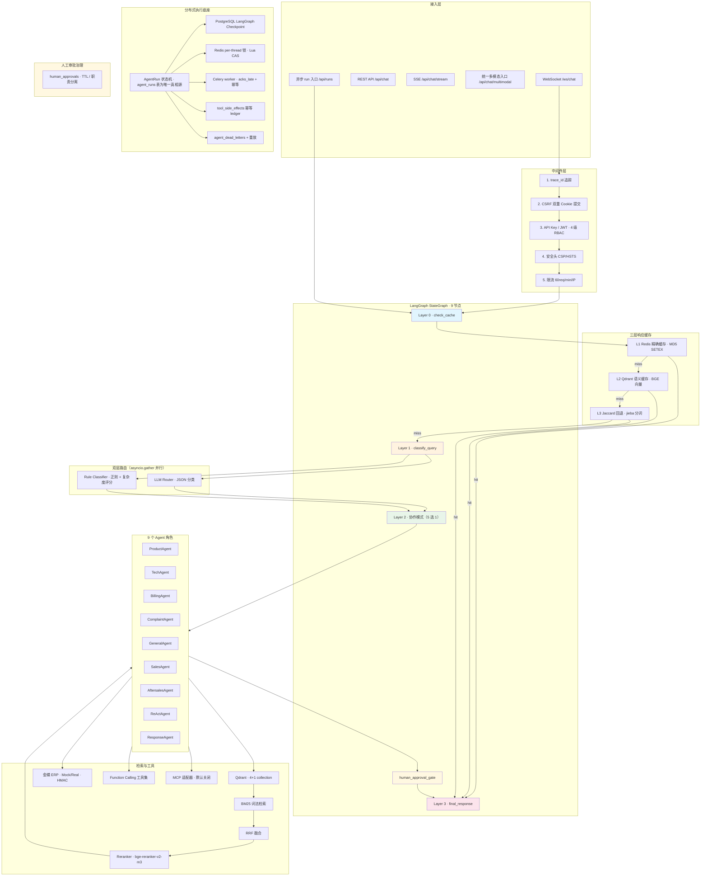
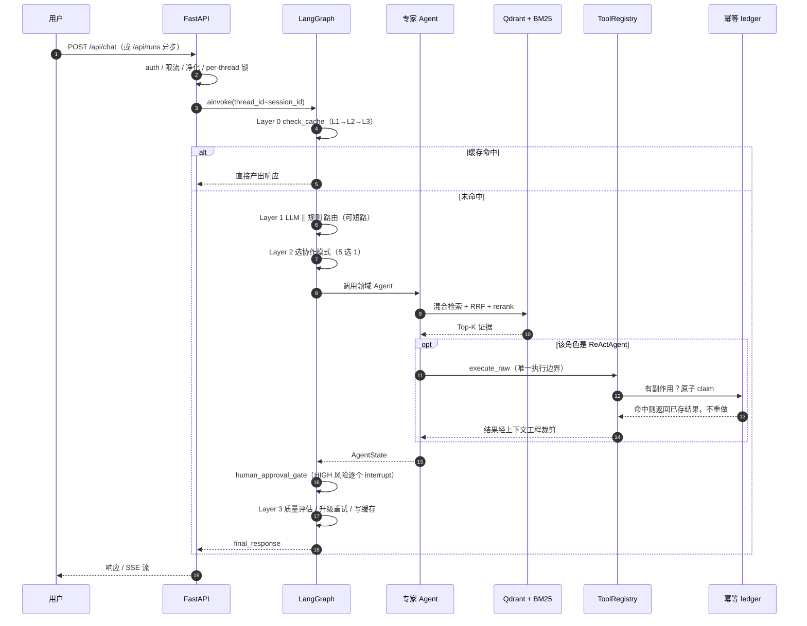

# Customer Service AI Agent

> **LangGraph multi-agent runtime for enterprise customer service** — hybrid RAG,
> durable distributed execution, human approval governance, and evidence-driven evaluation.

面向化妆品生产/销售企业的 **LangGraph 多 Agent 客服运行时**：四层状态机动态路由
（缓存检查 → 意图路由 → 专家 Agent 协作 → 响应后处理），叠加分布式执行底座
（PostgreSQL checkpoint + Redis 锁 + Celery worker + 工具副作用幂等 ledger）
与高风险操作的人工审批治理。

[](https://github.com/Xander-Xai/Customer-Service-AI-Agent/actions/workflows/ci.yml)


不是 demo：`make test` 默认**离线**可跑（无 API Key、不出公网）；CI 在 3 个 Python
版本上跑单测/集成，并在**真实** PostgreSQL + Redis 上跑分布式运行时验收
（依赖缺失时硬 FAIL，不静默 skip）。

| 事实项 | 当前值 | 真相源 |
|---|---|---|
| Runtime version | `6.3` | `core/config.py::VERSION` |
| LLM（默认） | `siliconflow` / `Qwen/Qwen3-8B` | `core/config.py` |
| Embedding / Rerank | `BAAI/bge-large-zh-v1.5` / `BAAI/bge-reranker-v2-m3` | `core/config.py` |
| Agent 角色 / 协作模式 | 9 / 5 | `agents/`、`collaboration/modes.py` |
| OpenAPI 路径数 | 62 | `docs/openapi.json`（`make openapi-check` 校验） |
| RAG 正式 649-query 指标 | **NOT_VERIFIED**（且当前不可测） | [docs/reference/rag-evaluation.md](docs/reference/rag-evaluation.md) |
| 生产上线验收 | **未完成** | [Production Readiness](docs/production-readiness.md) · [生产准备度检查清单](docs/checklists/production-readiness-checklist.md) |

**入口文档**：[docs/reference/current-state.md](docs/reference/current-state.md)。
版本变更历史在 [docs/reports/releases/changelog.md](docs/reports/releases/changelog.md)。

> **关于证据**：本仓库区分「代码存在」与「证据支持」。正式 RAG 指标、生产 QPS/P95、
> 真实 ERP 写操作、真实用户业务指标一律标记 `NOT_VERIFIED` / `NOT_MEASURED`。
> 任何未经 provenance 支撑的数字都不应从这里、README 或任何对外材料中被引用为当前结果。
> 完整不宣称清单见 [docs/limitations.md](docs/limitations.md)。

---

## Contents

- [Problem](#problem) — 客服场景为什么难
- [Solution](#solution) — 这套架构怎么解决
- [Architecture](#architecture) — 图、状态机、协作模式
- [Engineering Highlights](#engineering-highlights) — 企业级能力的源码锚点
- [Limitations](#limitations) — **先读这一节**
- [Quick Start](#quick-start)
- [Test & Evidence](#test--evidence)
- [Tech Stack](#tech-stack)
- [Project Structure](#project-structure)
- [Docs](#docs)

---

## Problem

企业智能客服的难点不在"能不能调通 LLM"，而在下面这六件事。任何一件没做对，
上线后就会以事故的形式出现。

### 1. 长任务与在线交互是两种负载，不能用同一套机制

用户问"这个成分会不会刺激"，要在两秒内回答。
但一个需要人工审批的退款，可能要挂几十分钟。

用同步接口处理后者 = HTTP 早就超时了，副作用还悬在半空。
用队列处理前者 = 凭空多一跳延迟，用户已经关页面了。

### 2. Agent 一定会做出有副作用的动作

只要 Agent 能调工具，它就能"真的"下单、退款、改单。
于是问题从"Agent 聪不聪明"变成"**它什么时候被允许做不可逆的事**"。
LLM 说"我觉得该退款"不构成授权。

### 3. 崩溃 + 重投 = 重复副作用

分布式执行必然是 at-least-once：worker 崩了，任务会被重新投递。
如果幂等没做对，**一次崩溃就变成两次扣款**。
"恰好一次"不是框架给你的，是你自己要用 ledger 换来的。

### 4. 状态散落在四个互不相干的地方

对话历史、图执行位置、响应缓存、工具结果——它们有**不同的生命周期、
不同的 scope、不同的失效条件**，其中工具结果还带用户身份。
把它们塞进一个"上下文管理器"必然出现"该留的丢了 / 不该留的留下了"。

### 5. 工具结果是上下文杀手

一次 ERP 查询返回几百条记录。全塞进 prompt：撑爆上下文、烧 token、
而且挤掉用户问题本身。**没有做过工具结果上下文工程的 Agent，成本和
质量都会随数据量线性恶化。**

### 6. 最难的不是上线，是"你怎么知道它还好使"

指标显示一切正常，但 DLQ 里躺了 200 个 run——因为**告警规则依赖的指标
从来没被导出过**。这类"看起来有监控、实际上没有闭环"的问题，
在真实生产里是最高频的静默故障。

---

## Solution

> 一句话：**一个同步快路径 + 异步耐久路径并存的企业客服 Agent 服务。**
> 快路径用 LangGraph 实时编排多 Agent 回答请求；长任务落库入队，
> 由 Celery worker 从 Postgres checkpoint 续跑，并给每一次工具副作用加**恰好一次**的幂等记账。

针对上面六个问题：

| 问题 | 方案 | 关键点 |
|---|---|---|
| 两种负载 | **Hybrid 双路径** | 快路径 `POST /api/chat` 永远 inline 不经队列；异步 `POST /api/runs` 落库 + 入队。共享同一份图与 checkpoint |
| 有副作用的 Agent | **执行前拦截 + 人工审批** | HIGH 风险调用被**摘出**到 `pending_actions`（不执行），由图节点 `interrupt()` 逐个等人决策 |
| 崩溃重投 | **三层幂等** | run 级（终态 no-op + 唯一约束）· thread 级（Redis 锁 + lease）· 工具级（`tool_side_effects` ledger，原子 claim） |
| 状态四分 | **四类状态显式分离** | checkpoint（Postgres，跨进程）· session（Redis）· response cache（三层）· tool store（Redis，**scope 精确绑定**） |
| 工具结果 | **Tool Result Context Engineering** | 压缩 → 字段白名单 → 预算裁剪（**优先丢最大的非标识字段**）→ 超限卸载 → 旧消息 stub 化 |
| 可观测闭环 | **三条独立信号 + 证据分级** | Trace（OTel 语义 span）/ Metric（~70 个 prometheus_client 指标）/ Log（两层密钥脱敏）；`NOT_VERIFIED` 是一等公民 |

**四条设计原则**（贯穿全仓，也是本项目与"会调 LangChain"的差别）：

1. **Fail closed, never fail silently.**
   Postgres checkpoint 起不来 → 拒绝回退 `MemorySaver`（`core/container.py:341-351`）。
   embedding 挂 → 语义缓存失效并显式标记 degraded，**不静默退化成词面命中**。
   无治理上下文的写操作 → 拒绝执行。
2. **AgentRun 表是唯一真相源.** Celery result backend 不是（`task_ignore_result=True`）。
3. **副作用必须恰好一次.** 用 `operation_key = run_id:tool_call_id` + 原子 claim 换，
   而不是假装消息队列是 exactly-once。
4. **没证据就不写数字.** 正式检索指标当前**不可测**（gold 不是相关度标注），
   所以本仓库不发布任何 Hit@K / MRR 百分比。用随机同类别文档当 gold 算出来的数字
   **比没有数字更糟**。

---

## Architecture



### 四层状态机

| 层 | 节点 | 做什么 | 关键设计 |
|---|---|---|---|
| **Layer 0** | `check_cache` | L1 精确 → L2 语义 → L3 Jaccard 回退 | 命中直接短路到 Layer 3；embedding 不可用时 **fail closed** |
| **Layer 1** | `classify_query` | LLM 分类器 ∥ 规则分类器 | `asyncio.gather` 并行；高置信规则匹配（≥ 0.75）**跳过 LLM 调用** |
| **Layer 2** | 协作模式节点 | Sequential / Parallel / Consultation / Hierarchical / ReAct | 模式由路由结果 + 查询复杂度决定，不是硬编码分支 |
| **审批闸** | `human_approval_gate` | 逐个 `interrupt()` 等待人工决策 | **无 HIGH 风险动作时是纯 no-op**（普通流量零开销） |
| **Layer 3** | `final_response` | 质量评估 → 模式升级重试 → 缓存写入 → SLA 监控 → 事件广播 | 评估不达标则升级协作模式重跑，而不是原样返回 |

图定义：`core/graph_builder.py:399-457`（唯一生产 `StateGraph`）。
状态：`core/state.py:6`（`AgentState`，单一定义点）。
节点逐行与边设计理由见 [docs/architecture.md](docs/architecture.md)。

### 一次请求实际怎么走



Agent 角色内部循环、工具边界与幂等记账的细节图见
[docs/agent-design.md §2.0](docs/agent-design.md)；异步路径与崩溃恢复见
[docs/architecture.md §2.1](docs/architecture.md)。

### 五种协作模式

| 模式 | 何时选 | 结构 |
|---|---|---|
| `Sequential` | 单意图、单一领域（**默认**） | 一个 Agent 串行执行 |
| `Parallel` | 多领域可切分（成分 + 库存 + 价格） | 并发执行 → 聚合 |
| `Consultation` | 需要专家意见但由主 Agent 交付 | 主 Agent + 顾问 Agent |
| `Hierarchical` | 投诉、复杂任务需分解 | 协调者拆解 → 子任务 → 汇总 |
| `ReAct` | 需检索 + 工具调用的多步推理 | RAG → Function Calling → 观察 → 迭代 |

投诉固定走 `Hierarchical` 不是因为"复杂度高"，而是**结构需求**：
投诉需要**一个统一对外口径**，多个 Agent 各说各话会互相矛盾。

### 为什么不是一条裸 Chain

裸 `if/elif` + LLM 在四个地方会断：分支组合爆炸（9 Agent × 5 模式 = 45 种）、
没有"暂停等人"的原语、进程死了状态就没了、多 Agent 中间结果没有统一载体。
LangGraph 恰好提供了这四个原语（`StateGraph` / `interrupt()` / Checkpointer /
`AgentState`）——详见 [docs/agent-design.md](docs/agent-design.md)。

Response Cache（L1/L2/L3）与 **Tool Result Cache、Tool Result Store、Session Memory、
LangGraph Checkpoint 是相互独立的机制**（[ADR-006](docs/decisions/)），不共用 TTL
或失效条件。

---

## Engineering Highlights

每一项都有源码锚点。这一节是本项目与「会调 LangChain」的差别。

### 分布式 Agent Runtime

- **AgentRun 是唯一真相源**：业务状态只认 `agent_runs` 表；Celery result backend
  **不是**真相源（`task_ignore_result=True`）。状态机 9 状态、DB 层原子 CAS 转移：
  `runtime/statuses.py:45-103`、`runtime/repository.py:182,211`。
- **四个 ID 严格区分**：`thread_id`（对话级 == `session_id`）· `run_id`（单轮执行）·
  `task_id`（Celery，重投会变）· `AgentRun`（业务记录，跨重投稳定）。
  **为什么重要**：崩溃恢复时 Celery 用**新 task_id** 重投同一条 run，
  把 task_id 当业务标识会让幂等键变化 → **重试真的重复扣款**。
- **at-least-once，明确不是 exactly-once**：`task_acks_late` +
  `task_reject_on_worker_lost` + Redis `visibility_timeout`。正确性由三层幂等承担。
- **崩溃恢复**：worker 崩溃 → 未 ACK 任务重投 → lease 过期后 `mark_running` 接管
  （attempt+1）→ **从 checkpoint `next` 续跑**（`runtime/bootstrap.py`）→ 退避重试 →
  用尽写 DLQ → `scripts/replay_dead_run.py` **复用原 `run_id`** 人工重放
  （新 run_id 会绕过工具幂等键）。
- **归属权 fencing（owner CAS）**：worker 提交终态走 `transition_owned()`，
  ownership 谓词长在**同一条 UPDATE 的 WHERE 内部**（`SELECT → 判断 → UPDATE` 是
  TOCTOU）。失去所有权抛 `RunOwnershipLost`，executor 读到即退出：不记失败、不重试、
  不进 DLQ、不消耗 attempt。
- **Checkpoint 生产 fail-closed**：三层守卫（`core/config.py:637`、
  `core/container.py:341-351`、`core/container.py:278-289`）。内存 checkpoint 在多副本下
  会给出"看起来正常但状态已丢"的行为，**比启动失败危险得多**。

### Human-in-the-Loop 高风险审批

高风险工具调用在**执行前**被摘出到 `state["pending_actions"]`（**不执行**），
由图节点 `human_approval_gate` 逐个 `interrupt()`。

- 风险分级 LOW/MEDIUM/HIGH，优先级为「工具显式声明 > 工具名白名单 > 金额阈值 >
  默认 LOW」，**只有 HIGH 需要审批**；判定失败 fail-closed。
- 审批落表（唯一约束 `(run_id, action, proposal_fingerprint)`），
  `PENDING → APPROVED | REJECTED | EXPIRED` 均为终态。
- **职责分离** `reviewer_id != user_id` 在 **service 层**强制
  （`core/hitl/approval_service.py:338-349`），API 层不是唯一防线。
- TTL 到期落 `EXPIRED`，**按拒绝处理，绝不默认放行**，并在读/决策/恢复**三处收敛**，
  保证图不会死等。
- **幂等双防线**（缺一不可）：审批防「不该做的被做了」，side-effect ledger 防
  「做了一次被重做」。已批准执行走 `operation_key = run_id:approval:{approval_id}`，
  在**任意次重试中恒定**。
- `/api/chat` 快路径**无 run 上下文，明确不在该治理边界内**；补偿措施是**拒绝**
  无治理的副作用调用，不是放行。

设计：[docs/design/human-in-the-loop.md](docs/design/human-in-the-loop.md)

### 工具执行的统一边界

所有工具（含 MCP）必须穿过 `ToolRegistry.execute_raw`，因此能统一做授权、超时、
幂等、缓存、脱敏、埋点。**模型永远拿不到 tool store 的访问权**——只能用
`recover_tool_result(reference_id)`，而这仍受 scope 精确校验
（不同 `(user_id, session_id)` 拿不到别人的结果）。否则一次 prompt injection
就能捞走别的用户的工具结果。

### 评测的真实性

正式评测流水线会**自我认证失败**：`scripts/rag_evidence_validity.py` 从执行事实
（子集运行？查询数？四条 ablation leg？请求错误？降级比例？required channel
是否真的跑过并产出候选？gold 覆盖？）判定有效性，**不看指标大小**——
一个真正差的检索器产出低 Hit@K 是**有效测量**。生产者写 `evidence_validity` 块且在
`INVALID` 时不允许输出 `VERIFIED_FULL`；消费者**重算**并交叉核对。
手工编辑或旧版 artifact 无法自我认证。

### 其他

| 能力 | 锚点 |
|---|---|
| Tool Result Context Engineering | `core/tool_result_*.py`（预算、压缩、offload/recovery、scope-safe exact reuse） |
| MCP 适配器 | `tools/mcp_adapter.py`（11 条 fail-closed 策略、8 类错误分类、init 回滚事务；默认关闭） |
| 三层响应缓存 | `cache/`（L1 Redis MD5 · L2 Qdrant 语义 · L3 Jaccard 回退） |
| 混合检索 | `rag/`（Qdrant + BM25 → RRF → cross-encoder rerank；确定性 point ID） |
| Token 配额与追踪 | `core/token_tracker.py`（用户级日/月限额，Redis 持久化 + 内存回退） |
| 分布式追踪 | `core/tracing.py` + `core/telemetry.py`（5 个语义 span，属性白名单 + 敏感键黑名单双层） |
| 结构化日志 | `core/logger.py`（两层密钥脱敏；`scrub_exception_message()` 就地脱敏，**防止 ASGI 自己的 traceback 泄漏**） |
| 输入净化与注入防御 | `api/utils.py` + 历史对话包在「不可信数据」边界标记内 |
| 数据权限与会话隔离 | ContextVar per-session SharedBlackboard + 可选 AES-256-Fernet 会话加密 |
| 文档一致性守卫 | `scripts/audit_doc_consistency.py`（链接/配置/OpenAPI/生命周期/指标声明/Mermaid 结构/HITL 默认值/状态机完整性/生产声明） |

### 证据分级

| 级别 | 含义 | 现状 |
|---|---|---|
| **Level 1 — IMPLEMENTED** | 代码存在且可读 | 图编排、工具循环、RAG、分布式 Runtime、HITL、OTel |
| **Level 2 — CI VERIFIED** | 真实基础设施 + 命令 + 可复查 artifact | `make runtime-e2e`（真实 PG + Redis + 多进程 Celery）、`make runtime-chaos`（SIGKILL worker 恢复）在 CI lane 上跑；OTel Collector 传输链路（`make otel-collector-smoke`）为 **LOCALLY VERIFIED**，不在 CI lane |
| **Level 3 — 生产验证** | 真实生产集群 / 多副本 / 真实流量 | **全部 NOT_VERIFIED** |

> **Level 2 ≠ 生产验证。** 本仓库任何文档都不得把 Level 2 说成"生产集群已验证"。

---

## Limitations

> **这一节是本 README 里最重要的一节。**
> 每一条都是当前**没有**做到的事。收藏前请先读它。

> 本节整体状态：**`PRODUCTION NOT_VERIFIED`**。
> Compose 扩容能力可配置 ≠ 多副本在生产跑过；
> Level 2 的真实验收（真实 PG / Redis / 多进程 Celery、SIGKILL 崩溃恢复）
> **不等于**生产验证。

完整清单（含代码级债务与未做方向）见 **[docs/limitations.md](docs/limitations.md)**。

### 已知功能断链（声明强于事实）

| # | 问题 | 状态 | 说明 |
|---|---|---|---|
| 1 | **DLQ 告警规则永远不可能触发** | `Partial` | `core/monitoring.py` 用 `prometheus_client` 注册了约 70 个指标（含 `agent_run_dead_letter_total`），但唯一的端点 `GET /metrics/prometheus`（`api/routes/monitoring.py:332`）**手工拼接** 10 个 `csai_*` 行，全仓无 `generate_latest` → 注册表**从未被序列化输出**。`monitoring/alert_rules.yml` 的 `AgentRunDeadLetterDetected` 依赖一个不存在的时间序列。**DLQ 目前靠人看或主动查询。** Grafana 另有 6 个面板永远为空 |
| 2 | **"转人工"不是已实现的功能** | `Partial` | escalation 只有两处：`agents/response_agent.py:280` 检查回复文本是否含"转人工"等词；`agents/complaint_agent.py:88` 设一个提示词 flag。**没有工单表、没有队列、没有坐席台、没有推送。** 系统能*说出* "建议转人工"，但没有东西接住这句话。（注意：这与"人工**审批**"是两件事，后者是 Implemented） |
| 3 | **`HITL_ENABLED=true` 但没配 = 静默放行** | `Partial`（fail-open） | `HITL_HIGH_RISK_TOOLS` 默认空 + `HITL_HIGH_AMOUNT_THRESHOLD` 默认 `0.0` → 风险优先级链全部落空 → 判定 `LOW` → **什么都不拦且不报警**。与本仓库其余部分（checkpoint / MCP / 分布式运行时都 fail-closed）**不一致**。生产部署前必须显式设置这些变量 |

### 证据状态

| 项 | 状态 | 原因 |
|---|---|---|
| RAG 正式 649-query 指标 | `NOT_VERIFIED`，且**当前不可测** | shipped gold **没有任何一条是人工相关度判定**（是"同类别随机抽样"），另有 160 个 gold id 不在语料中。流水线完整，缺的是标注 |
| 真实 ERP 写操作（退款/改单） | `NOT_VERIFIED` | 只在 `tools/hitl_staging_tools.py` 上验证了**治理机制**，不是金蝶 ERP 的正确性。无企业 staging 环境 |
| 生产集群 / 多副本长期稳定性 / K8s autoscaling / 跨区域 | `NOT_VERIFIED` | 无生产环境 |
| 生产 QPS / P95 / P99 / Token 成本 / 真实用户 FCR 与满意度 | `NOT_MEASURED` | 有 8 个 benchmark 脚本，但**无 SLO 定义、无生产基线** |
| 真实 trace 后端（Jaeger / Tempo） | `NOT_VERIFIED` | 已验证的 Collector 只有 `debug` exporter，**无持久化、无查询 UI** |
| Nginx 横向扩容 | `NOT_VERIFIED` | 多副本可渲染，但 upstream 分发到多副本未验证 |
| MCP 真实第三方 server | `NOT_VERIFIED` | 适配器已进 `main`（默认关闭 / read-only-first），有 deterministic fake-server 契约测试；真实 server 的网络/鉴权/多副本/写工具未验证 |

### 默认关闭 / 明确不在边界内

| 项 | 说明 |
|---|---|
| `HITL_ENABLED` 默认 `false` | 需要显式开启 + 显式配规则 |
| `POST /api/chat` 快路径 | **无 run 上下文，明确不在 HITL 治理边界内**。补偿措施是拒绝无治理的写操作 |
| 待审批主动通知 | 只有轮询队列，**没有 push / 邮件 / IM** |
| MCP 写操作工具 | **结构上不可能存在**：只注册 `risk_level=low` 的 MCP 服务器 |
| `media/` 与 `alerts/` | 是 **API 层集成，不是 Agent 可调用的工具**。不要算进"工具生态" |
| LangGraph `store` 长期记忆 | `compile()` 只传 `checkpointer`；跨会话记忆由 `core/session/` 承担，两者**明确分离** |
| LangSmith / Langfuse / OpenInference | **未集成**。tracing 是手写 span，不是 LangChain-native |
| Kubernetes manifests | **没有**。没有真实集群与多副本一致性验证的 K8s manifest 是**装饰性声明，比没有更糟** |
| Agent 行为回归评测 | **未实现**。无 golden 用例集 |
| LLM-as-judge | **未实现**。`agents/evaluator.py` 是启发式关键词打分 |

### 没有做的技术选择（及理由）

写清楚不做什么和写清楚做了什么一样重要：

| 不做 | 理由 |
|---|---|
| `interrupt_before` / `interrupt_after` | 无法表达"只有 HIGH 风险工具才审批"这种**数据相关**条件 |
| LangGraph 原生 `astream` / `astream_events` | 走自建 callback 总线。**有代价**：`stream_callback` 若作为 state channel 会破坏 checkpoint 序列化，生产已改走 ContextVar，但 `core/state.py:19` 的声明仍在 |
| 把同步快路径也异步化 | 给秒级交互凭空加一跳延迟 |
| 把异步长任务也走同步 | 审批可能挂几十分钟，HTTP 等不了；且崩溃 = 状态丢失 |
| Celery result backend 作为真相源 | 真相源是 `agent_runs` 表 |
| Agent 之间自由对话 | 本项目是**受控编排**（LangGraph 决定调谁），要可预测的成本与延迟 |

整改计划（按 P0/P1/P2 分类、含执行顺序与验收方式）：
[docs/reports/audit/PROJECT_FINALIZATION_PLAN.md](docs/reports/audit/PROJECT_FINALIZATION_PLAN.md)

---

## Quick Start

### 最小可跑路径（默认离线，不需要任何 API Key）

```bash
# 1) 环境
python3 -m venv .venv && source .venv/bin/activate
pip install -r requirements.txt -r requirements-dev.txt

# 2) 跑测试（默认离线：不发起公网请求，Mock 一切外部依赖）
make test

# 3) 读当前事实（不硬编码任何数字，全部从代码/配置推导）
make facts
make audit-docs        # 文档一致性守卫
```

### 一键可审计 demo

```bash
make demo-offline
```

离线、确定性地跑通「正常客服路由」，并输出证据卡（Mock LLM、无 API Key、无出网）：
包含 scenario / `MOCK/OFFLINE` / verdict（`PASS` / `FAIL` / `NOT_RUN`）/ Git SHA /
UTC 时间戳 / 源码与测试锚点。退出码即底层检查退出码——
**「没跑」或「跑挂」永远不会被输出成 `PASS`**。
详见 [docs/guides/offline-demo.md](docs/guides/offline-demo.md)。

### 起服务

```bash
make dev               # → http://localhost:8000（热重载）
make prod              # 生产栈（Docker Compose + Nginx + TLS），缺 TLS 物料会 fail fast
make tls-local-cert    # 仅本地开发：生成本地自签证书
```

### 部署前必须设置的变量

| 变量 | 为什么 | 缺了会怎样 |
|---|---|---|
| `ADMIN_PASSWORD` | app 首次启动用它引导 admin 账号 | `docker compose config` 直接失败并提示 |
| `POSTGRES_PASSWORD` / `JWT_SECRET` / `SESSION_TOKEN_SECRET` / `API_KEY` | 生产凭据 | 启动校验 **fail-fast，不降级** |
| `LLM_PROVIDER` 对应凭据 | LLM 调用 | 熔断器连续失败后降级到规则引擎 |
| `HITL_HIGH_RISK_TOOLS` 或 `HITL_HIGH_AMOUNT_THRESHOLD` | 让审批开关真的生效 | **静默什么都不拦**（见 [Limitations](#limitations)） |

配置全表见 [docs/reference/configuration.md](docs/reference/configuration.md)，
模板见 [`.env.example`](.env.example)（提交的是占位符，不是密钥），
部署细节见 [docs/deployment.md](docs/deployment.md)。

### 端口语义

| 场景 | 地址 | 说明 |
|---|---|---|
| 开发（`make dev`） | `localhost:8000` | dev override **确实**发布 app:8000 |
| 生产 | nginx `NGINX_HTTP_PORT` / `NGINX_HTTPS_PORT`（默认 80 / 443） | app 只 `expose: 8000`、**不对宿主机发布** |

生产栈唯一发布应用端口的是 nginx——TLS、安全响应头、灰度流量分割都在它那里。
**8000 不是生产可达地址。**

---

## Test & Evidence

```bash
make test          # 默认离线：无 API Key、无公网访问
make test-fast     # 跳过 stress 标记的慢测试
make test-cov      # 覆盖率报告（门槛 80%）
npm test           # 前端 Vitest
```

测试数量以 `pytest --collect-only -q` / `npm test` 的当前输出为准，不在文档里硬编码。

| 门禁 | 命令 | 需要的环境 |
|---|---|---|
| 代码规范（Ruff check + format，**阻塞**） | `make lint` | 无 |
| 文档事实一致性（`make audit-docs` 守卫） | `make audit-docs` | 无 |
| OpenAPI 快照一致 | `make openapi-check` | 无 |
| 分布式运行时验收 | `make runtime-e2e` | 真实 PostgreSQL + Redis + 多进程 Celery（**缺失时硬 FAIL**） |
| worker 崩溃恢复（SIGKILL） | `make runtime-chaos` | 同上 |
| 运行时证据报告 | `make runtime-verify` | 同上 → `artifacts/distributed-runtime/<ts>/report.json` |
| DLQ 人工重放 | `make runtime-replay-help` | 同上 |
| RAG 正式 649-query 评测 | `make rag-eval-import` → `make rag-eval-649-preflight` → `make rag-eval-649` | 真实 provider + 已索引语料（**当前 NOT_VERIFIED**） |

CI 有 7 条 lane：`lint`（Ruff，blocking）、`test`（3 个 Python 版本 + MCP 契约
**禁止静默 skip**）、`dev-compat`、`runtime-e2e`（真实 PG + Redis + chaos）、
`security`（严格 mypy + bandit + secret guard）、`build-and-push`、`deploy`
（容器内健康探测 + Celery 原生 worker 就绪断言）。

> **为什么有些测试"不允许 skip"？** 一个会因为"依赖没装 / 环境没配"而变绿的测试
> 证明了不了任何事，却会给人"已验证"的错觉。分布式 Runtime 验收的
> `TEST_DISTRIBUTED_DB_URL` 缺失时是**硬 FAIL**。

评测与证据的完整口径见 [docs/evaluation.md](docs/evaluation.md)。

---

## Tech Stack

| 层 | 选型 |
|---|---|
| 编排 | LangGraph（`StateGraph` + PostgreSQL checkpointer + `interrupt()`） |
| 服务 | Python 3.10+ · FastAPI · SSE · WebSocket · Uvicorn/Gunicorn |
| 检索 | Qdrant（4+1 collection）· BM25 · RRF 融合 · `bge-reranker-v2-m3` |
| 异步 | Celery（Redis broker）· `acks_late` · `visibility_timeout` · DLQ |
| 状态 | PostgreSQL 15（`agent_runs` / `agent_dead_letters` / `tool_side_effects` / `human_approvals`）+ Redis 7（Session / Cache / JWT 黑名单 / per-thread 锁） |
| 观测 | OpenTelemetry 语义 span + Prometheus + Grafana + Alertmanager + Loki |
| 安全 | Argon2id · JWT（access + refresh + Redis 黑名单）· 4 级 RBAC · CSRF 双提交 · CSP nonce · SSRF 防护 · 限流 |
| 部署 | Docker Compose 6 变体（base / prod / override / canary / scale / monitoring）+ Nginx + TLS |
| 工具 | OpenAI Function Calling · MCP（read-only-first，默认关闭）· 金蝶 ERP 适配器（Mock/Real + HMAC + 重试 + 分页） |
| 前端 | 原生 JS + Vite 8 · Vitest（可嵌入 widget） |

---

## Project Structure

```
customer-service-ai-agent/
├── agents/         # 9 个 Agent 角色 + 质量评估器
├── core/           # 配置 / DI 容器 / 图构建 / 消息总线 / 监控 / 会话 / HITL / 追踪
├── runtime/        # 分布式 Agent Runtime（状态机 / thread 锁 / worker / 幂等 ledger / DLQ）
├── api/            # FastAPI 服务层（路由 / SSE / WebSocket / 中间件）
├── auth/           # JWT + Argon2id + Redis 黑名单 + 4 级 RBAC
├── router/         # 双层查询路由（LLM ∥ 规则 + 熔断器降级）
├── collaboration/  # 5 种协作模式 + 升级重试
├── rag/            # Qdrant + BM25 + RRF + 重排 + 查询改写
├── cache/          # 三层响应缓存（与 Tool Result Cache / Store 分离）
├── db/             # SQLAlchemy 模型 + Alembic 迁移
├── erp/            # 金蝶 ERP 适配器（Mock / Real + HMAC + 重试 + 分页）
├── tools/          # Function Calling 工具注册 + MCP 适配器
├── llm/            # LLM 客户端（重试 / 熔断 / FC / SSE / 连接池）+ 规则兜底
├── media/          # 多模态（图片 / 音频 / 视频 / 文档 / TTS）——API 层，非工具
├── deploy/         # 部署资产根（compose/ · nginx/ · loki/ · otel/）
├── monitoring/     # Prometheus + Grafana + Alertmanager
├── web/            # 前端（原生 JS + Vite 8 + Vitest）
├── tests/          # unit / integration / runtime / e2e / stress / eval
├── docs/           # 文档与 ADR
├── alembic/        # 数据库迁移脚本（7 个版本）
└── scripts/        # 运维 / 验证 / 评测脚本（51 个 Python + 5 shell）
```

完整目录说明见 [docs/reference/project-structure.md](docs/reference/project-structure.md)。

---

## Business Scenarios

| 场景 | Agent | 涉及能力 |
|---|---|---|
| 产品成分/功效咨询 | `ProductAgent` | RAG + 查询改写 + BM25 混合检索 |
| 技术使用与故障排查 | `TechAgent` | RAG + 多跳重排 |
| 账单与对账 | `BillingAgent` | ERP Function Calling |
| 投诉与差评处理 | `ComplaintAgent` | RAG + 会话记忆 + 情绪路由 + Hierarchical 编排 |
| 售前推荐 | `SalesAgent` | RAG + 场景过滤 |
| 售后退换 | `AftersalesAgent` | 高风险 → HITL 审批（治理机制已实现，真实 ERP 写操作 `NOT_VERIFIED`） |
| 复杂订单问题 | `GeneralAgent` + 协作模式 | Hierarchical 任务分解 |

---

## Docs

| 我想知道… | 去哪 |
|---|---|
| **当前系统的真实状态（唯一入口）** | [docs/reference/current-state.md](docs/reference/current-state.md) |
| **架构总览与状态归属** | [docs/architecture.md](docs/architecture.md) |
| **为什么这样设计（LangGraph / Human fallback / 不用裸 Chain）** | [docs/agent-design.md](docs/agent-design.md) |
| **效果怎么衡量、测过什么** | [docs/evaluation.md](docs/evaluation.md) |
| **能宣称到什么程度 / 上线还缺什么** | [docs/production-readiness.md](docs/production-readiness.md) |
| **怎么部署、配置为什么这么设** | [docs/deployment.md](docs/deployment.md) |
| **不宣称什么（最重要）** | [docs/limitations.md](docs/limitations.md) |
| 整改计划（P0/P1/P2） | [docs/reports/audit/PROJECT_FINALIZATION_PLAN.md](docs/reports/audit/PROJECT_FINALIZATION_PLAN.md) |
| 文档总索引 | [docs/README.md](docs/README.md) |
| 分布式 Runtime 设计（架构/幂等/崩溃恢复/取舍） | [docs/design/agent-runtime.md](docs/design/agent-runtime.md) · [ADR-009](docs/decisions/009-distributed-agent-runtime.md) |
| HITL 审批治理 | [docs/design/human-in-the-loop.md](docs/design/human-in-the-loop.md) |
| RAG 方法论与评测口径（canonical） | [docs/reference/rag-evaluation.md](docs/reference/rag-evaluation.md) |
| 分布式 Runtime 运维 / DLQ 重放 | [docs/operations/distributed-runtime-runbook.md](docs/operations/distributed-runtime-runbook.md) |
| 生产部署与上线前检查 | [docs/operations/production-operations-guide.md](docs/operations/production-operations-guide.md) · [检查清单](docs/checklists/production-readiness-checklist.md) |
| API 参考 / 配置项全表 / 测试指南 | [docs/reference/](docs/reference/) |
| 历史版本与审计快照 | [docs/reports/](docs/reports/)（**历史快照，非当前事实**） |

---

## License

[Apache 2.0](LICENSE).

企业级实践参考实现；生产环境所需凭据与基础设施不在本仓库内。
