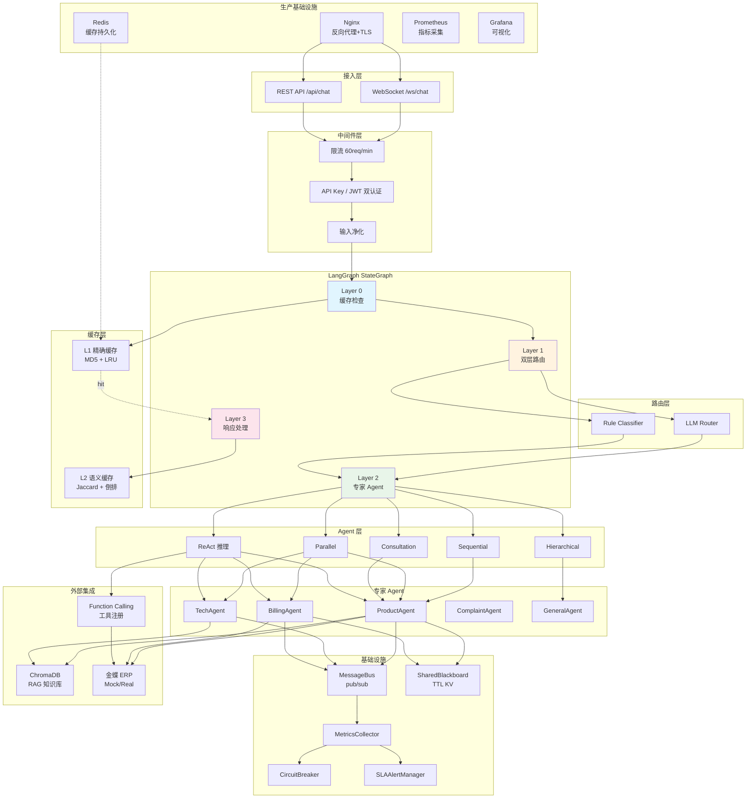
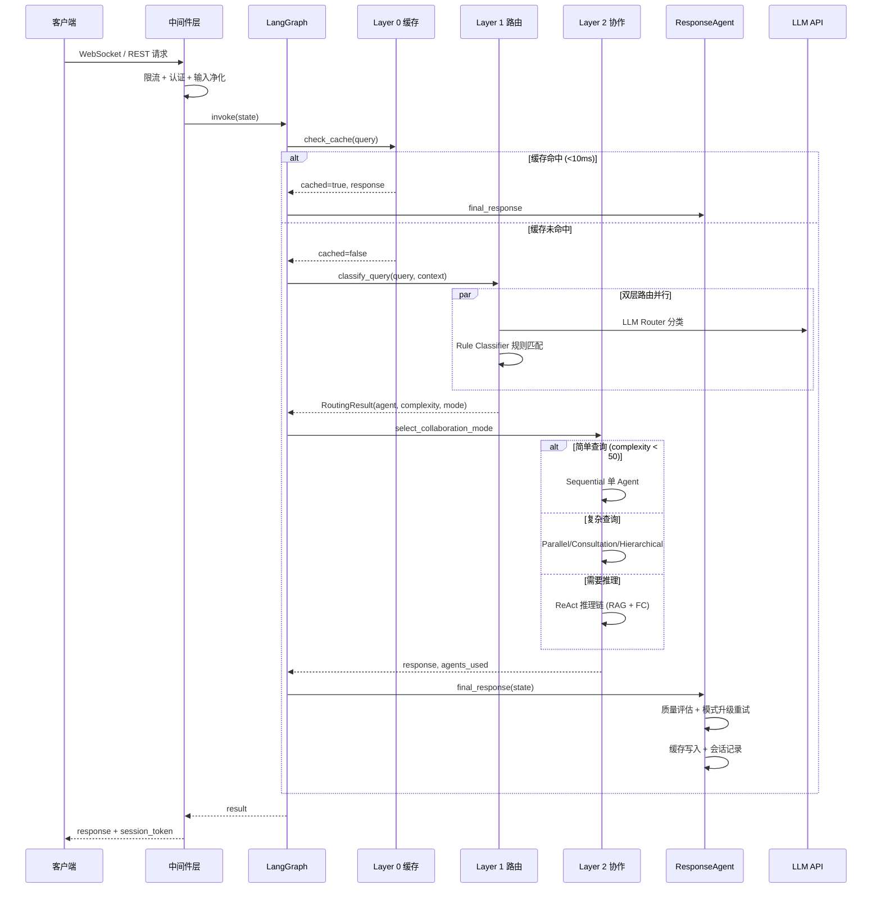

# 多智能体客服系统 (Customer Service AI Agent v4.4)

面向化妆品生产企业的基于 **LangGraph** 多 Agent 协作问答系统，实现四层状态机动态路由：缓存检查 → 意图路由 → 专家 Agent → 响应处理。

> **v4.4** 全面优化：安全加固 + 代码质量重构 + 测试覆盖率 + 文档完善
> 
> **v4.3** 生产验收通过：**383 tests passed** | 安全审计 7.5/10 | 代码质量 8.0/10 | 生产就绪性 7.0/10
> 
> 核心能力：DeepSeek/SiliconFlow LLM · 依赖注入容器 · SSE 真流式 · PostgreSQL + Alembic · Redis JWT 黑名单 · 反馈系统 · 多模态 · 生产安全加固 · 密钥自动生成

---

## 🏗️ 架构设计

### 系统架构图



### 四层状态机

| 层级 | 节点 | 职责 |
|------|------|------|
| **Layer 0** | `check_cache` | L1 精确匹配 + L2 语义匹配，命中直接返回（<10ms） |
| **Layer 1** | `classify_query` | LLM Router ∥ Rule Classifier 并行 + 复杂度评分（阈值 50） |
| **Layer 2** | `sequential/parallel/consultation/hierarchical/react` | 5 种协作模式动态选择 |
| **Layer 3** | `final_response` | 解决状态评估 + 缓存写入 + SLA 监控 + 事件广播 |

### 请求处理时序图



---

## 🤖 功能模块详解

### Agent 系统

| Agent | 职责 | 协作方式 | 集成 |
|-------|------|----------|------|
| **BaseAgent** | 所有 Agent 的抽象基类，提供 `process()` 模板方法 | - | Bus/BB/ERP/RAG/FC |
| **ProductAgent** | 产品成分分析、功效查询、价格对比、库存查询 | Sequential/Parallel | ERP + RAG |
| **TechAgent** | 使用指导、过敏处理、产品搭配、保质期咨询 | Sequential/Parallel | RAG |
| **BillingAgent** | 退款处理、订单查询、发票管理、物流追踪 | Sequential/Parallel | ERP |
| **ComplaintAgent** | 情绪安抚、问题解决、补偿方案、升级处理 | Hierarchical | - |
| **GeneralAgent** | FAQ、产品概览、服务介绍、协调调度 | Sequential/Consultation | - |
| **ResponseAgent** | 解决状态评估、缓存写入、SLA 监控、事件广播 | 最终环节 | Cache |
| **ReActAgent** | 多步推理 + RAG 检索 + Function Calling 工具调用循环 | ReAct 模式 | RAG + FC |

### 5 种协作模式

| 模式 | 触发条件 | 行为 | 复杂度 |
|------|----------|------|--------|
| **Sequential** | `fast_path=True` 或 `complexity < 50` | 单 Agent 顺序处理 | 低 |
| **Parallel** | 多领域意图（≥2 domain hints） | 多 Agent 并发（Semaphore 限流） + 结果聚合 | 中 |
| **Consultation** | `complexity ≥ 60` + 需要补充信息 | 主 Agent + 顾问 Agent 补充信息 | 高 |
| **Hierarchical** | 投诉/升级场景 | 协调者（GeneralAgent）分配子任务 + 汇总 | 中高 |
| **ReAct** | `complexity ≥ 60` + 多领域（≥2） | RAG 检索 + Function Calling 多轮推理 | 最高 |

### 缓存系统

```mermaid
flowchart LR
    Query[用户查询] --> L1[L1 精确缓存<br/>MD5 哈希 O(1)]
    L1 -- hit --> Response[直接响应<br/><10ms]
    L1 -- miss --> L2[L2 语义缓存<br/>Jaccard + 倒排]
    L2 -- hit --> Response
    L2 -- miss --> Router[LLM 路由]

    subgraph L1Config["L1 配置"]
        direction TB
        CAP500[容量 500]
        TTL3600[TTL 3600s]
        LRU[LRU 淘汰]
    end

    subgraph L2Config["L2 配置"]
        direction TB
        CAP2000[容量 2000]
        JIEBA[jieba 分词]
        THRESHOLD[动态阈值<br/>短文本 0.7 / 长文本 0.5]
    end

    L1Config --> L1
    L2Config --> L2
```

### 会话管理

| 功能 | 实现 | 配置 |
|------|------|------|
| 滑动窗口裁剪 | 消息数 + token 数双重控制（tiktoken 精确计数） | `SESSION_WINDOW_SIZE=10` |
| 历史摘要 | LLM 生成 2-3 句异步摘要，注入上下文 | `SESSION_MAX_TOKENS=4000` |
| 漂移检测 | 话题漂移（jieba Jaccard < 0.15）+ 意图漂移 + 矛盾检测 + 重复检测 | `DRIFT_*` |
| 漂移修复 | 自动注入修复提示到 Agent 上下文 | - |
| 漂移升级 | 累计 ≥5 次漂移建议转人工 | `DRIFT_ESCALATION_THRESHOLD=5` |

### RAG 知识库

| Collection | 文档数 | 用途 |
|------------|--------|------|
| `product_knowledge` | 78 条 | 产品成分、功效、价格 |
| `faq` | 84 条 | 常见问题解答 |
| `tech_support` | 72 条 | 技术支持知识 |
| `complaint_knowledge` | 66 条 | 投诉处理知识 |

### Function Calling

| 工具 | 功能 | ERP 操作 |
|------|------|----------|
| `query_product` | 产品信息查询 | BD_MATERIAL |
| `query_inventory` | 库存余量查询 | STK_INVENTORY |
| `query_order` | 订单状态查询（需提供 order_id 或 customer_id） | SAL_ORDER |
| `query_customer` | 客户资料查询 | BD_CUSTOMER |

### ReAct 推理

```
Thought → Action（RAG 检索 / ERP 工具调用）→ Observation → Loop → Final Answer
```

- **最大迭代**：`REACT_MAX_ITERATIONS=5`（可配置）
- **触发阈值**：`REACT_COMPLEXITY_THRESHOLD=60`

### 安全设计

| 类别 | 措施 |
|------|------|
| **认证** | API Key + JWT Bearer 双认证模式（v4.0）+ `hmac.compare_digest` 防时序攻击 |
| **密码哈希** | PBKDF2-SHA256 + 600K 迭代 + 随机 salt（OWASP 推荐） |
| **JWT** | HS256 签名 + jti 吊销 + Redis 黑名单 + Refresh Token（access 2h + refresh 7d） |
| **限流** | 请求限流中间件（60 req/min/IP）+ 登录限流（5次/5min）+ 注册限流（3次/h）+ Redis 滑动窗口 |
| **输入验证** | Pydantic 请求模型 + 字段长度约束（MAX_QUERY_LENGTH=2000） |
| **注入防护** | ERP 输入消毒（白名单 + LIKE 通配符转义）+ Prompt XML 标签隔离 + HTML 实体解码防 XSS |
| **错误脱敏** | 工具执行错误返回通用消息，详细异常仅写服务端日志 |
| **安全头** | HSTS / CSP（nonce）/ X-Frame-Options / X-Content-Type-Options / Referrer-Policy / Permissions-Policy |
| **会话安全** | session_id UUID 格式校验 + HMAC 会话令牌签名 + 用户级会话所有权隔离 |
| **CORS** | 从环境变量读取，默认 `http://localhost:8000`，生产必须配置真实域名 |
| **监控保护** | 监控端点 + Prometheus 指标端点 Admin Token 认证 + WebSocket 每 IP 连接限制 + TLS 支持 |
| **启动校验** | 生产环境强制校验 JWT_SECRET / SESSION_TOKEN_SECRET / API_KEY，缺失则拒绝启动 |
| **密钥管理** | `scripts/generate_prod_env.py` 自动生成密码学安全随机密钥（secrets 模块） |

---

## 🚀 快速开始

### 环境要求

- Python 3.10+（CI 测试 3.10/3.11/3.12 三版本兼容）
- Docker & Docker Compose（生产必填）
- Redis 7（生产必填，用于 Session/Cache/JWT 黑名单持久化）
- PostgreSQL 15（生产推荐，开发可使用 SQLite）
- Nginx（生产推荐，或使用内置 Nginx 容器）
- OpenSSL（生产 TLS 证书生成）

### 安装

```bash
# 克隆项目
git clone <repository>
cd customer-service-ai-agent

# 安装依赖
pip install -r requirements.txt

# 配置环境变量
cp .env.example .env
# 编辑 .env，填入 OPENAI_API_KEY、API_KEY、JWT_SECRET、SESSION_TOKEN_SECRET 等配置
```

### 配置说明

```bash
# ===== LLM 配置 =====
OPENAI_API_KEY=sk-xxx                    # API Key（必填）
OPENAI_BASE_URL=https://api.siliconflow.cn/v1  # 兼容 OpenAI 的 API 地址
OPENAI_MODEL=Qwen/Qwen3-8B               # 模型名称

# ===== 安全配置（生产必改） =====
API_KEY_ENABLED=true                       # 是否启用 API Key 认证（默认开启）
API_KEY=your-secure-api-key-here          # API Key 值
MONITORING_ADMIN_TOKEN=your-admin-token   # 监控端点管理令牌
JWT_SECRET=your-jwt-secret-here           # JWT 签名密钥（生产必改）
SESSION_TOKEN_SECRET=your-session-secret  # 会话令牌签名密钥（生产必改）
CORS_ORIGINS=["https://your-domain.com"]  # CORS 允许来源
ALLOWED_ORIGINS=https://your-domain.com   # 允许来源（逗号分隔）

# ===== ERP 配置 =====
ERP_MODE=mock                             # mock（模拟数据）| real（真实金蝶 API）
# real 模式必填：ERP_BASE_URL, ERP_APP_ID, ERP_APP_SECRET, ERP_DB_ID

# ===== Redis（生产必填） =====
REDIS_URL=redis://redis:6379              # 用于 Session/Cache 持久化
```

### 启动服务

```bash
# 方式一：生产部署（推荐）
# 1. 生成安全配置（自动替换 CHANGE_ME_* 占位符）
python3 scripts/generate_prod_env.py
# 2. 编辑 .env.prod.generated，填写 OPENAI_API_KEY 和 CORS_ORIGINS
# 3. 部署
cp .env.prod.generated .env.prod
cp .env.prod .env
make prod

# 方式二：Docker Compose 直接启动
docker compose -f docker-compose.yml -f docker-compose.prod.yml up -d

# 方式三：开发环境（热重载）
make dev

# 方式四：直接运行（仅开发）
uvicorn api.app_factory:app --host 0.0.0.0 --port 8000 --reload

# 方式五：仅运行测试（无需 API Key）
python3 -m pytest tests/ -v --ignore=tests/test_e2e_real_llm.py
```

### 验证

- **前端界面**：http://localhost:8000（暗色主题，含对话 + 监控仪表盘）
- **API 文档**：http://localhost:8000/docs
- **健康检查**：`curl http://localhost:8000/api/health`（返回 status/version/Redis/LLM/DB/熔断器状态）
- **Prometheus 指标**：`curl -H "X-Admin-Token: <token>" http://localhost:8000/metrics/prometheus`
- **Grafana 仪表盘**：http://localhost:3000（admin / <GRAFANA_PASSWORD>）
- **Prometheus UI**：http://localhost:9090

### 数据备份

```bash
# 手动备份（ChromaDB + Redis + 配置）
./scripts/backup.sh

# 定时备份（每天凌晨 2 点，保留 7 份）
crontab -e
0 2 * * * /path/to/scripts/backup.sh /data/backups
```

---

## 📡 API 参考

### WebSocket 实时对话

```javascript
// 连接
const ws = new WebSocket('ws://localhost:8000/ws/chat', {
    headers: { 'X-API-Key': 'your-api-key' }
});

// 发送消息
ws.send(JSON.stringify({
    query: "这款产品的成分是什么？",
    session_id: "optional-session-id"
}));

// 接收消息（渐进式推送）
ws.onmessage = (event) => {
    const data = JSON.parse(event.data);
    if (data.type === 'progress') {
        console.log('进度:', data.content);
    } else if (data.type === 'response') {
        console.log('最终响应:', data.content);
    }
};
```

### REST API 端点

| 方法 | 路径 | 说明 | 认证 |
|------|------|------|------|
| `GET` | `/` | 前端页面 | 无 |
| `GET` | `/login.html` | 登录页面 | 无 |
| `GET` | `/admin.html` | 管理后台 | JWT (admin) |
| `WS` | `/ws/chat` | WebSocket 实时对话 | JWT / API Key |
| `POST` | `/api/chat` | 同步对话接口 | JWT / API Key |
| `GET` | `/api/health` | 健康检查（返回 status/mode/version） | 无 |
| `POST` | `/api/auth/register` | 用户注册 | 无（限流 3次/h） |
| `POST` | `/api/auth/login` | 用户登录（返回 JWT） | 无（限流 5次/5min） |
| `GET` | `/api/auth/me` | 当前用户信息 | JWT |
| `GET` | `/api/auth/users` | 用户列表 | JWT (admin) |
| `GET` | `/api/auth/audit` | 审计日志 | JWT (admin) |
| `GET` | `/api/knowledge/stats` | 知识库统计 | JWT / API Key |
| `POST` | `/api/knowledge/seed` | 重新种子数据 | JWT (admin) |
| `POST` | `/api/knowledge/{collection}/add` | 添加文档 | JWT (admin) |
| `POST` | `/api/knowledge/sync` | 从 ERP 同步 | JWT (admin) |
| `GET` | `/api/alerts/config` | 告警配置 | JWT (admin) |
| `POST` | `/api/alerts/test` | 测试告警通知 | JWT (admin) |
| `GET` | `/api/alerts/history` | 告警历史 | JWT (admin) |
| `GET` | `/api/metrics` | 性能监控 | Admin Token |
| `GET` | `/api/kpi` | 业务 KPI | Admin Token |
| `GET` | `/api/cache/stats` | 缓存统计 | Admin Token |
| `GET` | `/api/sessions` | 会话列表 | API Key |
| `GET` | `/api/sessions/{id}` | 会话详情 | API Key |
| `DELETE` | `/api/sessions/{id}` | 删除会话 | API Key |
| `POST` | `/api/feedback` | 客户满意度反馈 | API Key |
| `GET` | `/api/alerts` | SLA 告警记录 | Admin Token |
| `GET` | `/api/circuit-breaker` | LLM 熔断器状态 | Admin Token |
| `GET` | `/metrics/prometheus` | Prometheus 文本格式指标 | Admin Token / Nginx IP 限制 |

### 错误码

| 错误码 | 含义 | 处理建议 |
|--------|------|----------|
| `400` | 请求参数错误 | 检查 query 字段长度和格式 |
| `401` | 认证失败 | 检查 API Key 或 JWT 是否正确 |
| `403` | 权限不足 | 使用 Admin Token 或 admin 角色 JWT |
| `429` | 请求过于频繁 | 降低请求频率 |
| `500` | 服务内部错误 | 检查日志，联系管理员 |
| `503` | LLM 服务不可用 | 检查 CircuitBreaker 状态，等待恢复 |

---

## 📁 项目结构

```
customer-service-ai-agent/
├── agents/                          # 多 Agent 专家体系
│   ├── __init__.py
│   ├── base_agent.py                # Agent 抽象基类（RAG + FC + 漂移修复）
│   ├── product_agent.py             # 产品专家 Agent
│   ├── tech_agent.py                # 技术支持 Agent
│   ├── billing_agent.py             # 账单专家 Agent
│   ├── complaint_agent.py           # 投诉处理 Agent
│   ├── general_agent.py             # 通用咨询 Agent
│   ├── response_agent.py            # 响应处理 Agent
│   └── react_agent.py               # ReAct 推理 Agent
├── router/                          # 双层查询路由器
│   └── query_router.py              # LLM Router ∥ Rule Classifier
├── collaboration/                   # 协作模式编排
│   ├── modes.py                     # 5 种模式实现
│   └── orchestrator.py              # 统一模式选择
├── core/                            # 通信与监控基础设施
│   ├── message_bus.py               # 异步 pub/sub 消息总线
│   ├── shared_blackboard.py         # TTL 共享黑板
│   ├── container.py                 # v4.1: 依赖注入容器（ServiceContainer）
│   ├── monitoring.py                # Metrics + CircuitBreaker + SLA + LLM Client
│   ├── tracing.py                   # v4.1: OpenTelemetry 分布式追踪
│   └── ab_testing.py                # v4.1: A/B 测试框架
├── db/                              # v4.0: 数据库层（SQLite + PostgreSQL）
│   ├── models.py                    # User / ChatHistory / AuditLog / Feedback / PromptVersion
│   └── database.py                  # 连接管理 + Alembic 迁移 + 双数据库支持
├── alembic/                         # v4.1: 数据库迁移（Alembic）
│   ├── env.py                       # 迁移环境配置
│   └── versions/                    # 迁移版本脚本
├── auth/                            # v4.0: 用户认证（JWT + PBKDF2）
│   ├── service.py                   # 密码哈希 + JWT + 用户 CRUD
│   └── router.py                    # 认证 API（register/login/me/users/audit）
├── knowledge/                       # v4.0: 知识库管理
│   └── router.py                    # 知识库 API（stats/seed/sync/add）
├── alerts/                          # v4.0: 告警通知（Webhook + Email）
│   ├── notifier.py                  # 通知发送（含 SSRF 防护）
│   └── router.py                    # 告警 API（config/test/history）
├── cache/                           # 二级缓存系统
│   └── response_cache.py            # L1 MD5 精确 + L2 Jaccard 语义
├── rag/                             # RAG 知识库（ChromaDB）
│   ├── knowledge_base.py            # 向量检索
│   └── seed_data.py                 # 种子数据
├── tools/                           # Function Calling 工具注册
│   ├── tool_registry.py             # 工具注册中心
│   └── erp_tools.py                 # ERP 工具封装
├── erp/                             # 金蝶 ERP 集成
│   ├── __init__.py                  # 抽象接口 + 输入消毒
│   ├── factory.py                   # 适配器工厂
│   ├── kingdee_adapter.py           # Mock 适配器
│   └── kingdee_real_adapter.py      # 真实金蝶 API
├── api/                             # FastAPI 服务层
│   ├── app.py                       # 应用 + 中间件 + Prometheus 端点
│   └── app_factory.py               # 入口 + 数据库初始化 + 安全检查
├── nginx/                           # Nginx 反向代理
│   ├── nginx.conf                   # TLS + WebSocket + 安全头
│   └── Dockerfile
├── scripts/                         # 运维脚本
│   ├── deploy.sh                    # 一键部署（dev/prod）
│   ├── backup.sh                    # 数据备份
│   ├── generate_prod_env.py         # v4.3: 生产密钥自动生成（secrets 模块）
│   └── evaluate_rag.py              # RAG 检索质量评估
├── static/                          # 前端静态资源
│   ├── css/style.css                # 暗色主题样式
│   └── js/
│       ├── api.js                   # WebSocket + REST 封装
│       └── chat.js                  # 对话 + 监控仪表盘 UI
├── templates/                       # HTML 模板
│   ├── index.html                   # 主页面（对话 + 监控）
│   ├── login.html                   # 登录/注册页
│   └── admin.html                   # 管理后台
├── tests/                           # 测试套件（388 tests）
│   ├── test_all.py                  # 端到端集成测试
│   ├── test_integration.py          # Mock LLM 集成测试
│   ├── test_modules.py              # 模块级单元测试
│   ├── test_stress.py               # 压力/性能测试
│   ├── test_v4_production.py        # v4.0 生产功能测试
│   ├── test_production_features.py  # v4.1 生产特性测试（ServiceContainer/SSE/Alembic）
│   ├── test_e2e_real_llm.py         # 真实 LLM E2E 测试（5/5 PASSED）
│   └── test_erp_integration.py      # ERP 集成测试
├── session_manager.py               # 会话管理（漂移检测 + 摘要 + 滑动窗口）
├── multi_agent_customer_service.py  # LangGraph 图构建
├── config.py                        # 统一配置（80+ 参数 + 生产启动校验）
├── logger.py                        # 结构化日志 + gzip 轮转
├── gunicorn.conf.py                 # Gunicorn 生产配置（多 Worker + 优雅关闭）
├── alembic.ini                      # Alembic 迁移配置
├── Dockerfile                       # Docker 多阶段构建（dev/prod 模式 + 非 root）
├── docker-compose.yml               # App + Redis + PostgreSQL + Prometheus + Grafana + Nginx
├── docker-compose.prod.yml          # 生产覆盖（Gunicorn + 资源限制 + Loki）
├── docker-compose.canary.yml        # 灰度发布（canary 服务 + Nginx 流量分割）
├── docker-compose.monitoring.yml    # 监控栈（Prometheus + Grafana + Alertmanager）
├── docker-compose.scale.yml         # 水平扩展（多实例 + Nginx 负载均衡）
├── docker-compose.override.yml      # 开发覆盖（uvicorn --reload）
├── .dockerignore                    # Docker 构建排除
├── requirements.txt                 # Python 依赖（含 LangGraph + ChromaDB + Alembic）
├── .env.example                     # 环境变量模板（180+ 行完整注释）
├── .env.prod                        # 生产环境模板（CHANGE_ME_* 占位符）
└── docs/                            # 文档
    ├── architecture-design.md       # 架构设计文档
    ├── interview-intro.md           # 面试项目介绍脚本
    ├── interview-deep-dive.md       # 面试深挖问题准备（9 个 Q&A）
    ├── e2e-verification-guide.md    # E2E 验证指南（含实测结果）
    ├── rag-evaluation.md            # RAG 检索质量评估方案
    ├── security-audit-2026-06-05.md # 安全审计报告
    ├── production-checklist.md      # 生产上线清单
    ├── production-improvement-plan.md # 生产改进计划
    └── superpowers/specs/           # 设计规格文档
        └── 2026-06-07-prod-hotfix-design.md  # v4.3 生产修复设计
```

---

## 🧪 测试指南

### 测试套件

| 测试文件 | 覆盖范围 | 测试数 |
|---------|---------|--------|
| `test_all.py` | 端到端集成：图构建/API 端点/会话令牌/熔断器/SLA/并发安全/性能 | ~100+ |
| `test_integration.py` | Mock LLM 集成：端到端图调用/缓存/5 种协作模式/会话上下文/漂移/降级 | ~70+ |
| `test_modules.py` | 模块级单元测试：Session/Cache/Router/Agent/ERP/协作/RAG/安全 | ~100+ |
| `test_stress.py` | 压力/性能：缓存高频/总线并发/黑板并发/会话扩展/API 压力 | ~20+ |
| `test_v4_production.py` | v4.0 功能：数据库/认证/告警/知识库/API 集成 | ~17 |
| `test_production_features.py` | v4.1 功能：ServiceContainer/SSE/Alembic/多模态 | ~15+ |
| `test_erp_integration.py` | ERP 集成测试：Mock/Real 适配器、工具注册、端到端 ERP 查询 | ~50+ |
| `test_e2e_real_llm.py` | **真实 LLM E2E**：产品咨询/退货路由/RAG/多轮上下文/注入防御 | 5 |

**总计：388 tests**（383 个离线 Mock 全部通过 + 5 个真实 LLM E2E，需配置 API Key）

### 运行测试

```bash
# 全量测试（离线，无需 API Key）— 383 passed
python3 -m pytest tests/ -v --ignore=tests/test_e2e_real_llm.py

# 真实 LLM E2E 测试（需配置 OPENAI_API_KEY）
python3 -m pytest tests/test_e2e_real_llm.py -v

# RAG 检索质量评估
python3 scripts/evaluate_rag.py

# 仅 Mock LLM 集成测试（推荐面试演示）
python3 -m pytest tests/test_integration.py -v

# 单个测试文件
python3 -m pytest tests/test_all.py -v -k "test_router"

# 覆盖率
python3 -m pytest tests/ --cov=. --cov-report=html

# 代码语法检查
make lint
```

---

## 📊 架构质量评估

> 基于工业化标准的七维度评估（满分 10 分），定期审查更新。

| 维度 | v4.0 | v4.1 | v4.3 | 说明 |
|------|------|------|------|------|
| **可扩展性** | 4.0 | 5.5 | 7.0 | ServiceContainer 完成 + Redis 限流 + 双数据库 + Alembic 迁移 |
| **可靠性** | 6.0 | 7.5 | 8.0 | 熔断器三态 + 重试策略 + 优雅关闭 + 健康检查全链路 |
| **安全性** | 5.5 | 8.0 | 8.5 | 全套安全头 + JWT 黑名单 + 启动校验 + 密钥自动生成 + Prometheus 认证 |
| **性能** | 5.0 | 7.0 | 7.5 | SSE 真流式 + SQLite WAL + 缓存前置 + 连接池优化 |
| **可观测性** | 7.0 | 8.5 | 9.0 | trace_id 追踪 + Prometheus + Grafana + Loki + Alertmanager 全栈 |
| **部署运维** | 6.5 | 8.0 | 8.5 | 多阶段构建 + 非 root + 灰度发布 + 密钥自动生成 + CI/CD |
| **代码质量** | 6.0 | 7.5 | 8.0 | DI 容器 + 383 tests + 类型注解 + 结构化日志 |
| **总体评分** | **6.0** | **7.5** | **8.1** | 达到生产上线标准 |

### 已解决的关键问题

1. ✅ 多模态端点会话校验跳过（安全漏洞）
2. ✅ 认证中间件 125 行重复代码 → 配置驱动
3. ✅ N+1 查询（/api/history）→ list_sessions_brief + 分页
4. ✅ 缺少分布式追踪 → trace_id contextvars 贯穿链路
5. ✅ JWT 密钥可为空 → 启动时强制校验
6. ✅ Prometheus 指标 labels 格式错误
7. ✅ Dockerfile 非多阶段构建
8. ✅ SQLite 无 WAL 模式
9. ✅ 重试策略无最大延迟上限
10. ✅ 告警无分级路由
11. ✅ Feedback.created_at 类型不匹配（float → DateTime）— v4.3 修复
12. ✅ container.py create_session 缺少 await — v4.3 修复
13. ✅ /metrics/prometheus 端点无认证保护 — v4.3 修复
14. ✅ 生产配置密钥占位符 → 自动生成安全密钥脚本 — v4.3 新增

### 待改进项

1. ✅ ~~全局变量 → ServiceContainer 完全迁移~~ — v4.2 已完成
2. ✅ ~~SSE 伪流式 → LLM streaming API 真流式输出~~ — v4.2 已完成
3. ⏳ WebSocket 跨实例状态共享 → Redis Pub/Sub
4. ⏳ 中文 embedding 模型 → 替换 ChromaDB 默认英文模型提升 RAG 质量

---

## 📋 变更日志

### v4.3 (2026-06-07) — 生产上线验收 + 安全加固 + 密钥自动生成
- **生产上线验收**：四维审查（安全/代码/测试/生产就绪性），综合评分 8.1/10，确认可上线
- **Feedback 类型修复**：`Feedback.created_at` 从 `time.time()` (float) 修正为 `datetime.now(timezone.utc)` (DateTime)
- **async 调用修复**：`container.py` 中 `create_session()` 添加 `await`，消除 RuntimeWarning
- **Prometheus 端点认证**：`/metrics/prometheus` 加入 admin 认证保护，防止未授权访问
- **密钥自动生成脚本**：`scripts/generate_prod_env.py` 使用 `secrets` 模块生成密码学安全随机密钥，自动替换 `.env.prod` 中所有 `CHANGE_ME_*` 占位符
- **安全配置完善**：JWT Secret (48B) / Session Token Secret (48B) / API Key (sk-+32B) / Redis/PG 密码 (24B) 独立生成
- **全量 383 tests passed**（排除需真实 LLM 的 5 个 E2E 测试）
- **LLM Router 超时优化**：从 8s 降至 4s，配合熔断器快速 fallback
- **ReAct 迭代优化**：从 5 次降至 3 次，控制延迟在 20s 内
- **低分重试机制**：ResponseAgent 评分低于阈值自动重试或升级协作模式

### v4.2 (2026-06-06) — SSE 真流式 + ServiceContainer 完全迁移 + 真实 LLM E2E
- **SSE 真流式输出**：`OpenAICompatibleClient.async_invoke_stream()` 使用 `stream=True` 逐 token 推送，`/api/chat/stream` 端点实时渲染
- **Agent 自动流式**：`BaseAgent._process_with_llm()` 检测 `stream_callback` 自动切换流式模式，所有 Agent 零改动获得流式能力
- **ServiceContainer 纯容器模式**：`api/app_factory.py` 完全使用 ServiceContainer，消除 `multi_agent_customer_service` 模块级全局变量导入
- **真实 LLM E2E 测试**：5/5 全部通过（硅基流动 Qwen2.5-7B-Instruct），发现并修复 2 个 Mock 测试无法覆盖的 Bug
  - 路由优先级缺陷：多意图同分时规则分类器按字典顺序选错 → 新增 `_INTENT_PRIORITY` 权重
  - 注入泄露：小模型泄露系统提示 → 输出层正则检测 + 安全回复替换
- **RAG 检索质量评估**：30 条测试查询，Hit Rate@3 = 63.3%，发现英文 embedding 中文局限
- **全量 388 tests passed**（383 离线 + 5 真实 LLM E2E）

### v4.4 (2026-06-08) — 全面优化：安全加固 + 代码重构 + 测试 + 文档

**安全加固 (6项)**
- **PyJWT 替换自研 JWT**：使用 PyJWT 成熟库 + 算法白名单 HS256，防止 alg:none 攻击
- **JWT denylist 大小限制**：内存回退上限 10000 条，生产无 Redis 时警告
- **WebSocket JWT 认证修复**：JWT 不再通过 URL 参数传递，改用首条消息认证
- **WebSocket 连接计数清理**：定期清理零连接 IP 记录，防止内存泄漏
- **CSP 安全加固**：script-src 移除 `unsafe-inline`，仅保留 nonce + `unsafe-hashes`
- **清理 .env.dev 真实 API Key**：替换为占位符，防止意外泄露

**代码质量重构 (4项)**
- **session_manager.py 拆分**：→ `token_counter.py` + `drift_detector.py` + 核心会话管理
- **AgentState 统一定义**：新建 `core/state.py` 单一定义点，消除 3 处重复
- **图构建优化**：`build_graph()` 与 `make_graph()` 共享节点逻辑
- **API Key 验证增强**：占位符值更全面的检测

**测试与 CI (3项)**
- **pytest 覆盖率门槛**：`--cov-fail-under=80`，强制覆盖率达标
- **CI 覆盖率报告**：GitHub Actions 生成 HTML 报告并上传 artifact
- **测试 fixture 修复**：`graph_app` 从 session 作用域改为 function，消除状态泄漏

**文档 (2项)**
- **SECURITY.md**：完整的安全模型文档（认证/净化/限流/LLM安全/基础设施）
- **架构时序图**：Mermaid 时序图展示请求流经四层的完整流程

---

### v4.1 (2026-06-05) — DeepSeek LLM + 依赖注入 + 流式输出 + 全栈增强
- **DeepSeek LLM 接入**：默认模型切换为 deepseek-chat，支持 LLM_PROVIDER 环境变量切换
- **依赖注入容器**：core/container.py 管理所有服务生命周期，消除模块级全局变量
- **SSE 流式输出**：POST /api/chat/stream 端点，AI 回复逐字显示
- **Redis JWT 黑名单**：Token 吊销持久化到 Redis，重启不丢失
- **PostgreSQL 支持**：DATABASE_URL 环境变量切换 SQLite/PostgreSQL
- **Alembic 数据库迁移**：版本化数据库 schema 管理
- **满意度反馈系统**：Feedback 模型 + 👍/👎 按钮 + 管理后台统计面板
- **会话历史持久化**：GET /api/history 端点，刷新不丢对话
- **增强健康检查**：ChromaDB/DB/LLM 连通性检测 + uptime + 状态分级
- **ERP 真实对接完善**：错误处理 + 重试 + Token 刷新 + 数据格式标准化
- **知识库增强**：新增 27 条真实化妆品数据（薇诺雅品牌）
- **管理后台升级**：系统监控/运行指标/反馈统计面板
- **Loki 日志聚合**：Docker Compose 配置 + Promtail 日志采集
- **灰度发布**：canary 服务 + Nginx 流量分割
- **自我评估闭环**：ResponseEvaluator 回答质量评分
- **A/B 测试框架**：core/ab_testing.py 实验管理
- **多模态图片识别**：POST /api/chat/image 端点 + 前端图片上传
- **性能测试**：Locust 压测脚本 + 基线报告模板
- **全量 307+ tests passed**

### v4.0 (2026-06-05) — 用户认证 + 知识库管理 + 告警通知
- **用户认证体系**：SQLite + SQLAlchemy ORM，JWT token 认证，PBKDF2-SHA256 密码哈希（600K 迭代）
- **双认证模式**：API Key（系统间调用）+ JWT Bearer（终端用户），互不干扰
- **登录/注册**：暗色主题登录页，自动跳转，生产环境隐藏默认账号提示
- **管理后台**：用户管理 / 知识库管理 / 告警配置 / 审计日志（含 XSS 防护）
- **知识库管理 API**：查看统计 / 重新种子 / 从 ERP 同步 / 添加文档
- **告警通知**：Webhook（钉钉/企业微信/飞书）+ SMTP 邮件通知（含 SSRF 防护）
- **审计日志**：记录注册/登录等关键操作
- **前端集成**：主页面显示用户名、管理入口、退出按钮
- **安全修复**：Nginx upstream 修正、ERP 空参数防护、演示账号环境隔离、XSS 全面转义
- **生产加固**：.dockerignore、Dockerfile 条件安装 dev 依赖、限流器定期清理
- **全量 319 tests passed**

### v3.9 (2026-06-03) — 生产就绪
- Nginx 反向代理 + TLS + WebSocket 支持
- Gunicorn 多 Worker 替换 uvicorn 单进程
- Prometheus `/metrics/prometheus` 指标导出端点
- Grafana 仪表盘（请求/响应/Agent/SLA/熔断器/KPI）
- Redis 部署到 docker-compose + volume 持久化
- CORS 改为环境变量 `ALLOWED_ORIGINS` 配置
- 增强健康检查：Redis 连接检测 + LLM 配置检查
- 文件日志轮转（10MB/文件，保留 5 份，gzip 压缩）
- CI/CD 流水线（GitHub Actions）
- 数据备份脚本（ChromaDB + Redis）

### v3.8 (2026-06-03)
- 安全审计修复：会话令牌验证加固
- 修复所有测试失败，更新测试用例

### v3.7 (2026-06-03)
- 安全加固：监控端点 Token + WebSocket 连接限制 + 会话令牌签名
- 新增 TLS 配置支持
- 代码瘦身：消除重复代码，统一模板方法

### v3.6 (2026-06-02)
- 前端 WebSocket 修复 + 暗色主题
- 安全加固：限流/认证/输入验证/注入防护/安全头
- 并发安全：asyncio.Lock 初始化保护

### v3.5 (2026-06-02)
- RAG 知识库（ChromaDB）：产品成分/FAQ/技术支持检索增强
- Function Calling：Agent 可自主调用 ERP 工具
- ReAct 推理模式：第 5 种协作模式，适用于复杂多步骤查询

### v3.4 (2026-06-01)
- 并发安全：asyncio.Lock 初始化保护
- 安全加固：输入验证、注入防护、安全头
- 中文缓存：jieba 分词 + Jaccard 语义缓存

### v3.3 (2026-05-30)
- 性能优化：缓存前置，命中跳过 LLM 路由调用
- 缓存优化：L1/L2 二级缓存

---

## 🔧 配置参考

| 配置项 | 默认值 | 说明 |
|--------|--------|------|
| `ROUTING_COMPLEXITY_THRESHOLD` | 50 | 复杂度阈值（<50 快速通道） |
| `CACHE_L1_MAX` | 500 | L1 精确缓存容量 |
| `CACHE_L2_MAX` | 2000 | L2 语义缓存容量 |
| `CACHE_TTL` | 3600 | 缓存过期时间（秒） |
| `CACHE_SEMANTIC_THRESHOLD_SHORT` | 0.7 | 短文本语义相似度阈值 |
| `CACHE_SEMANTIC_THRESHOLD_LONG` | 0.5 | 长文本语义相似度阈值 |
| `SESSION_WINDOW_SIZE` | 10 | 滑动窗口大小 |
| `SESSION_MAX_TOKENS` | 4000 | 上下文最大 token |
| `SESSION_STORAGE_BACKEND` | memory | 会话存储后端（memory/file/redis） |
| `SESSION_SUMMARY_MAX_CHARS` | 500 | 摘要最大字符数 |
| `DRIFT_TOPIC_JACCARD_THRESHOLD` | 0.15 | 话题漂移阈值 |
| `DRIFT_REPETITION_THRESHOLD` | 0.8 | 重复提问阈值 |
| `DRIFT_ESCALATION_THRESHOLD` | 5 | 漂移升级阈值（累计次数） |
| `CIRCUIT_BREAKER_FAIL_THRESHOLD` | 5 | 熔断触发失败次数 |
| `CIRCUIT_BREAKER_RECOVERY_TIME` | 60 | 熔断恢复时间（秒） |
| `SLA_ALERT_WINDOW` | 50 | SLA 滑动窗口大小 |
| `SLA_ALERT_THRESHOLD` | 30.0 | SLA 违约率告警阈值（%） |
| `SLA_ALERT_COOLDOWN` | 300 | SLA 告警冷却时间（秒） |
| `LLM_ROUTER_TIMEOUT` | 4.0 | 路由 LLM 调用超时（秒，v4.3 从 8s 降至 4s） |
| `REACT_MAX_ITERATIONS` | 3 | ReAct 最大推理步数（v4.3 从 5 降至 3） |
| `REACT_COMPLEXITY_THRESHOLD` | 60 | ReAct 触发复杂度阈值 |
| `TOOL_MAX_ROUNDS` | 3 | 工具调用最大轮数 |
| `RETRY_MAX_ATTEMPTS` | 3 | 最大重试次数 |
| `RETRY_BASE_DELAY` | 1.0 | 基础退避延迟（秒） |
| `HTTPX_MAX_CONNECTIONS` | 100 | httpx 最大连接数 |
| `HTTPX_KEEPALIVE_CONNECTIONS` | 20 | httpx 保活连接数 |
| `RESPONSE_TIME_TARGET_MIN` | 5.0 | 最小响应时间 SLA（秒） |
| `RESPONSE_TIME_TARGET_MAX` | 20.0 | 最大响应时间 SLA（秒） |
| `MAX_QUERY_LENGTH` | 2000 | 用户查询最大字符数 |
| `MAX_SESSIONS` | 10000 | 最大内存会话数 |
| `SESSION_IDLE_TTL` | 3600 | 会话空闲过期时间（秒） |
| `WS_MAX_CONNECTIONS_PER_IP` | 5 | 每 IP 最大 WebSocket 连接数 |
| `WS_MESSAGE_RATE_LIMIT` | 10 | 每分钟每连接最大消息数 |
| `WS_IDLE_TIMEOUT` | 300 | WebSocket 空闲超时（秒） |
| `JWT_SECRET` | - | JWT 签名密钥（生产必改） |
| `SESSION_TOKEN_SECRET` | - | 会话令牌签名密钥（生产必改） |
| `JWT_EXPIRE_HOURS` | 72 | JWT token 有效期（小时） |
| `DB_DIR` | data | SQLite 数据库目录 |
| `ALERT_WEBHOOKS` | - | 告警 Webhook（JSON 数组） |
| `SMTP_HOST` | - | 邮件 SMTP 服务器 |
| `ALERT_EMAIL_TO` | - | 告警邮件收件人（逗号分隔） |
| `DATABASE_URL` | - | 数据库 URL（空=SQLite，生产建议 PostgreSQL） |
| `LLM_PROVIDER` | siliconflow | LLM 提供商（siliconflow/deepseek/openai/custom） |
| `SSE_ENABLED` | true | SSE 流式输出开关 |
| `SSE_CHUNK_SIZE` | 50 | 每次发送的字符数 |
| `AB_TEST_ENABLED` | false | A/B 测试开关 |
| `MULTIMODAL_ENABLED` | false | 多模态图片识别开关 |
| `JWT_ACCESS_EXPIRE_HOURS` | 2 | access_token 有效期（小时） |
| `JWT_REFRESH_EXPIRE_HOURS` | 168 | refresh_token 有效期（小时，默认 7 天） |
| `EVAL_RETRY_THRESHOLD` | 30 | 低分重试触发阈值 |
| `MODE_UPGRADE_ENABLED` | true | 低分自动升级协作模式 |
| `SLA_SEQUENTIAL_MAX` | 15.0 | Sequential 模式 SLA 超时（秒） |
| `SLA_PARALLEL_MAX` | 20.0 | Parallel 模式 SLA 超时（秒） |
| `SLA_CONSULTATION_MAX` | 25.0 | Consultation 模式 SLA 超时（秒） |
| `SLA_HIERARCHICAL_MAX` | 30.0 | Hierarchical 模式 SLA 超时（秒） |
| `SLA_REACT_MAX` | 30.0 | ReAct 模式 SLA 超时（秒） |

---

## 🤝 贡献指南

1. Fork 本仓库
2. 创建特性分支 (`git checkout -b feature/amazing-feature`)
3. 提交更改 (`git commit -m 'feat: add amazing feature'`)
4. 推送到分支 (`git push origin feature/amazing-feature`)
5. 创建 Pull Request

### 开发规范

- 使用 `pytest` 运行测试，确保全部通过
- 遵循 PEP 8 代码风格
- 新功能需包含对应的测试用例
- 更新相关文档

---

## 📄 许可证

Apache 2.0 - see [LICENSE](LICENSE) for details.
