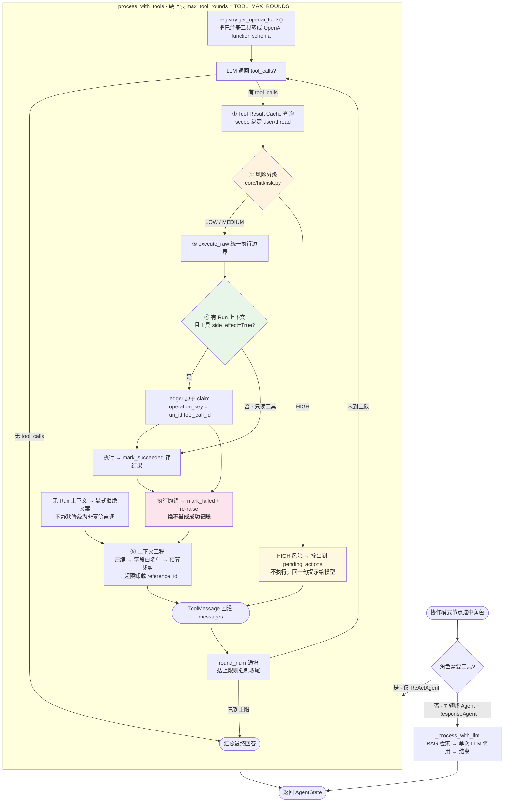

# Agent Design

> 🟢 CURRENT — 本文描述本项目的**技术设计目标与关键取舍**：
> 为什么采用 LangGraph 图状态机、为什么不用裸 Chain、以及为什么需要
> Human fallback 治理边界。
>
> 代码事实见 [architecture.md](architecture.md)；本文专注**设计理由与取舍**。

---

## 1. 为什么是 LangGraph，而不是一条裸 Chain

### 1.1 裸 Chain 撑不住的四件事

一个朴素的实现大概是：

```python
def answer(query):
    intent = classify(query)
    if intent == "complaint": ...
    elif intent == "product": ...
    return llm(prompt)
```

它在这个业务上会在四个地方断掉：

| 断点 | 真实场景 | 裸 Chain 的失败方式 |
|---|---|---|
| **条件分支爆炸** | 9 个 Agent × 5 种协作模式 = 45 种组合 | `if/elif` 嵌套到无法 review，组合逻辑无法穷举验证 |
| **工具副作用需要人工闸门** | 退款、改单 | 没有"暂停在这里等一个人"的机制，只能同步阻塞或直接跳过 |
| **长任务要能崩溃恢复** | 审批等了 40 分钟，worker 被 OOM kill | 进程死了状态就没了，要么重头跑（危险，因为有副作用）要么人工重来 |
| **多 Agent 协作的中间结果要可见** | 投诉要产品+技术+客服三方意见 | 中间状态没有统一载体，只能靠 print/日志猜 |

### 1.2 LangGraph 各自提供了什么

| 需求 | LangGraph 机制 | 本项目用法 |
|---|---|---|
| 分支与状态机 | `StateGraph` + `add_conditional_edges` | 9 节点、2 条条件边，路由表**穷举无 fallback**（`core/graph_builder.py:430-440`） |
| 暂停等人 | `interrupt()` / `Command(resume=...)` | `core/hitl/gate.py:205` 逐个审批 HIGH 风险动作 |
| 崩溃恢复 | Checkpointer | Postgres `AsyncPostgresSaver`，从 `aget_state().next` 续跑 |
| 中间状态统一载体 | `AgentState` TypedDict | `core/state.py:6`，单一定义点 |
| 并行扇出 | 节点内 `asyncio.gather` | 路由双层并行、RAG 预取与分类并行 |
| 跨进程共享 | Checkpointer 落在 Postgres | API 快路径与 Celery worker 共享同一份进度 |

**关键点：LangGraph 在这里不是"框架炫技"，是恰好提供了裸 Chain 缺的四个原语。**
如果只需要条件分支，用 LangChain LCEL 更轻；如果只需要工具循环，裸 loop 更好读。

### 1.3 我们没有用的 LangGraph 能力（以及为什么）

刻意不写进架构，是设计判断的一部分：

| 不用 | 理由 |
|---|---|
| `interrupt_before` / `interrupt_after` | 静态断点只能"在节点 X 前停"。我们需要的是"**只有 HIGH 风险工具调用**才停"，这是数据相关条件，静态断点表达不了 |
| `store`（长期记忆） | 会与 `core/session/session_manager.py` 职责重叠。没有 memory schema 与失效策略之前，加 store 只会制造两套"记忆" |
| `astream` / `astream_events` | 自建 callback 总线（`core/streaming_context.py`）。**这是有代价的**：`stream_callback` 若作为 state channel 会破坏 checkpoint 的 msgpack 序列化，所以生产改走 ContextVar。详见 [limitations.md](limitations.md) |
| Subgraph 组合 | 5 种协作模式共享同一实现体（`_make_collaboration_node`），模式名只影响调度。拆 subgraph 会让 checkpoint 结构变复杂，收益不匹配 |
| 多 Agent 自治 | 本项目是**受控编排**（LangGraph 决定调谁），不是 Agent 之间自由对话。客服场景要可预测的成本与延迟 |

---

## 2. 为什么 Agent 不能只是 Chain：五个必须由 Agent 承担的点

### 2.0 一次 Agent 执行的完整流程

先看图，后面五节是每一步的理由。
**注意图里第一个分叉**：工具循环**只有 ReActAgent 走**
（`agents/react_agent.py:88` 是全仓唯一调用 `_process_with_tools` 的地方），
其余 8 个角色走 `_process_with_llm`（`agents/base_agent.py:1000`）——
单次 LLM 调用 + RAG 检索，**不进入工具循环**。



图里有四处是**刻意设计**，不是省略：

| 环节 | 设计 | 反例会怎样 |
|---|---|---|
| ① 先查 Tool Result Cache | 同工具同参数在 scope 内不重复调外部系统 | ERP 每次查询都打一次网络 |
| ② 高风险先分流 | HIGH 在**执行前**摘出，不执行 | 退款已经退了才问人同不同意 |
| ④ 幂等 claim 在执行**内** | 失败 → `mark_failed`，成功 → `mark_succeeded` | 失败被记成成功 = 丢一次退款 |
| ⑤ 结果先裁剪再回灌 | 超预算卸载为 `reference_id` | 几百条 ERP 记录撑爆上下文 |

**关于错误传播，准确的说法是**（这里容易讲错）：

- `ToolRegistry` 对**幂等前置条件缺失**是 fail-closed 的：缺 `run_id` /
  `tool_call_id` / ledger 时**返回显式拒绝文案**，不静默降级成非幂等直调
  （`tools/tool_registry.py:271-329`，Issue #130）。
- 真正的工具异常由 ledger 记 `mark_failed` 后 **re-raise**（`:413-421`），
  避免"失败被当成成功记账"。
- 但 re-raise 到 Agent 循环边界后，`agents/base_agent.py:824-826` 会
  **把它转成一句 `工具暂时不可用，请稍后重试` 交给模型观察**。
  这是标准 ReAct 语义——模型需要看到失败才能换策略；
  **安全性由"失败绝不 `mark_succeeded`"保证，而不是靠异常一路冒泡。**
- 触发 run 级重试 / DLQ 的是 **run 级失败**（`runtime/errors.py` 的错误分类），
  与单个工具异常是否冒泡**无关**。

### 2.1 工具调用必须由模型决定，但受注册表约束

`agents/base_agent.py:629` 的工具循环：

```
for round_num in range(max_tool_rounds):        # 硬上限，防死循环
    response = await llm.invoke(messages, tools=registry.get_openai_tools())
    if not response.tool_calls: break
    for tc in response.tool_calls:
        cached = tool_result_cache.get(...)      # 1. 先查缓存
        if should_gate(tc): defer(tc)            # 2. HIGH 风险 → 摘出，不执行
        else: raw = registry.execute(tc)          # 3. 执行（带幂等记账）
        result = optimizer.optimize(raw)          # 4. 预算裁剪 / 卸载
        messages.append(ToolMessage(result))
```

**为什么模型不能直接拼 HTTP 请求？** 因为那样就没有一个**统一的执行边界**
可以做授权、超时、幂等、缓存、脱敏、埋点。本项目把这个边界放在
`ToolRegistry.execute_raw`，所有工具（含 MCP）都必须穿过它。

**为什么硬上限轮数？** 模型可能反复调同一个工具。`max_tool_rounds` 默认 3
（ReAct Agent 用 `max_iterations`）。没有上限，一次幻觉的工具循环就能烧掉
真实用户的钱。

### 2.2 工具结果必须做上下文工程

ERP 查询一次可能返回几百条记录，全塞进 prompt 会：
- 撑爆上下文 → 后续轮次质量下降
- 烧 token → 成本线性上升
- 挤掉用户问题本身

`core/tool_result_optimizer.py` 的处理链：

1. **形状感知压缩**（`core/tool_result_compressors.py`）：搜索结果去重 + 去
   `utm_*`/`fbclid`；HTML 抽可见文本并跳过 `script/style`。
2. **字段白名单**（`DEFAULT_TOOL_POLICIES`）：每个工具只保留有用的字段。
3. **预算裁剪**（`_fit_structured`）：超预算时**优先丢最大的非标识字段值**，
   保护 `{id, name, status, order_id, product_id, customer_id}`。
   **为什么保标识字段？** 保住它们，模型才能发起后续的精确查询；
   丢掉就等于这次调用白费。
4. **超限卸载 + 恢复**（`optimize_async` / `recover`）：结果存 Redis，
   prompt 里只放 `reference_id` + 摘要 + 可用字段清单。
   **恢复按 scope 精确匹配**（`core/tool_result_store.py:51-52`，
   `dict` 全等），不同 `(user_id, session_id)` 拿不到别人的结果。
5. **旧消息压缩**（`compact_old_tool_messages`）：保留最近 N 轮完整，
   更早的替换为 stub + key fields。

**关键设计：模型永远拿不到 store 的访问权**（`agents/base_agent.py:196-202`）。
模型只能用 `recover_tool_result(reference_id)`，而这仍受 scope 校验。
否则一次 prompt injection 就能捞走别的用户的工具结果。

### 2.3 工具副作用必须恰好一次

`runtime/side_effects.py` 的原子 claim（`:140-277`）修复的是一个**真实的双重执行缺陷**
（`:152-156` 记录）：旧的 `SELECT → 判断 → UPDATE` 会让两个 worker
同时拿到 `CLAIM_EXECUTE`。唯一约束防住了**重复行**，防不住**重复执行**。

```
1. 原子创建    INSERT ... ON CONFLICT DO NOTHING → 提交 → CLAIM_EXECUTE
2. 行锁        SELECT ... FOR UPDATE
3. 锁内决策    SUCCEEDED + 相同 fingerprint → CLAIM_SUCCEEDED（返回缓存结果）
               SUCCEEDED + 不同 fingerprint → CLAIM_CONFLICT（永久错误，不重试）
               PENDING + lease 未过期        → CLAIM_IN_PROGRESS（退避后重投）
               PENDING + lease 已过期 / FAILED → 接管 → CLAIM_EXECUTE
```

**为什么用 lease 而不是纯状态锁？** worker 崩溃后锁不会自动释放。
lease（`claim_expires_at`，默认 60s）让**另一个 worker 可以接管**。
owner token 记 `hostname:pid:uuid4[:12]`，接管过程可审计。
lease 信息**全部缺失时判定为"未过期"**（`:62-63`）——宁可重试也不重复执行。

**为什么 `CLAIM_CONFLICT` 是永久错误？** 同一个 `operation_key` 却有不同的
`request_fingerprint`，说明调用方逻辑有问题，重试一万次也一样。
把它归为可重试错误会造成 DLQ 里躺满本来就不该重跑的任务。

### 2.4 审批通过后的执行，幂等键必须与"重试"无关

`core/hitl/gate.py:232-244`：审批通过后执行的工具，
`tool_call_id` 被改写成 `f"approval:{approval_id}"`，
于是 `operation_key = f"{run_id}:approval:{approval_id}"`。

**为什么不用原始 tool_call_id？** 审批恢复经过一次 worker 重投，
如果键里含有随机或轮次相关的部分，重投就会算出新键 → **审批后重复执行**。
用 `approval_id` 派生的键**在任意次重试中恒定**。

审批记录本身也是幂等的：`create_or_get`（`gate.py:196`）+
`(run_id, action, proposal_fingerprint)` 唯一约束
（`alembic/versions/006`），所以重复的 `interrupt()` 不会重复打扰审批人。

### 2.5 Agent 自我反思是被限量的，不是自由循环

`REACT_SELF_REFLECTION` 在 `agents/base_agent.py:930-953` 触发，
但整体受 `max_tool_rounds` 约束。反思失败不会改变最终状态——
它只是给下一轮一个额外提示。**反思是启发式增强，不是可靠性机制。**

---

## 3. 九个 Agent 角色与协作模式

### 3.1 角色分工

| 角色 | 职责 | 特点 |
|---|---|---|
| 7 个领域 Agent | 产品/成分、销售/价格、售后、物流、计费、投诉、技术 | 各自有专属 prompt 与 RAG scene 过滤 |
| `ReActAgent` | 复杂多步推理 | **唯一走工具循环的角色**（`agents/react_agent.py:88`） |
| `ResponseAgent` | 响应后处理 | 质量评估 / 模式升级重试 / 缓存写入 / SLA |

`BaseAgent` 是抽象基类，`ResponseEvaluator` 是评估器，**都不计入运行时角色**。

**为什么只有 ReAct 走工具循环？** 领域 Agent 用的是 `_process_with_llm`。
理由：绝大多数客服问题不需要多轮工具调用；给每个角色都挂上工具循环，
会让成本和延迟翻倍，收益只在少数复杂问题上出现。
ReAct 是按 complexity 门槛**按需**启用的。

### 3.2 五种协作模式：按复杂度递增成本

`collaboration/orchestrator.py:149-198` 的选择顺序：

```
1. fast_path（缓存/规则短路）        → sequential
2. query_type == "complaint"         → hierarchical   ← 投诉固定升级
3. complexity ≥ 阈值 且 ≥2 领域线索   → react
4. ≥2 领域线索                       → parallel
5. 命中 consult_map 且 complexity 高  → consultation
6. 默认                              → sequential
```

| 模式 | 语义 | 何时用 | 成本 |
|---|---|---|---|
| `sequential` | 串行传递，前一个的输出进后一个的上下文 | 默认；简单问题 | 最低 |
| `parallel` | 并行取多个领域意见后汇总 | 跨领域问题（成分+价格+售后） | 中 |
| `consultation` | 主 Agent 主导，按需咨询专家 | 需要专家但不需要全面会诊 | 中 |
| `hierarchical` | 分层，下级汇报给上级 | 投诉（需要决策权与统一口径） | 高 |
| `react` | 推理-行动-观察循环 | 复杂度最高门槛 | 最高 |

**为什么投诉固定走 hierarchical？** 投诉回复需要**一个统一对外口径**，
多个 Agent 各说各话会互相矛盾，而且投诉有升级与合规要求。
这不只是"复杂度高"，是**结构需求**。

---

## 4. 为什么需要 Human fallback：两种完全不同的人

这是本项目里最容易被误解的一节。人工作用在两处，**机制与目的完全不同**：

|  | **人工审批**（HITL） | **转人工坐席**（escalation） |
|---|---|---|
| 介入的**时机** | 工具**执行之前** | 响应**生成之后** |
| 目的 | **阻止**不该发生的事 | **承接**机器做不了的事 |
| 风险 | 高危副作用（退款/改单） | 复杂情绪、异常诉求、超出能力边界 |
| 状态 | `WAITING_APPROVAL` | 仅 `resolution_status="escalated"` 标签 |
| 持久化 | `human_approvals` 表（Alembic `006`） | **无** |
| API | `/api/approvals` 4 个端点 | **无** |
| 送达 | 轮询待审批队列 | **无** |
| 实现状态 | **Implemented**（默认 `HITL_ENABLED=false`） | **Partial：仅状态标记，无工单/队列/坐席台** |

### 4.1 人工审批为什么必须在"执行之前"

如果先执行再让人看，审批就变成了**事后审计**——而副作用已经发生。
`agents/base_agent.py:774-804` 的做法是：识别出 HIGH 风险调用后
**摘出**到 `state["pending_actions"]`，**不执行**，让图节点
`human_approval_gate` 逐个 `interrupt()`。

**为什么用节点内 `interrupt()` 而不是 `interrupt_before=["human_approval_gate"]`？**
因为只有真的有 HIGH 风险动作时才需要停。静态断点会让**每一个请求**
（包括 99% 的"这个成分安全吗"）都走一次审批节点并挂起。

### 4.2 TTL 到期为什么按"拒绝"处理

`HITL_APPROVAL_TTL_SECONDS`（默认 3600s）到期落 `EXPIRED`，**按拒绝处理，绝不默认放行**。

**为什么不是默认放行？** 因为审批人没回应，意味着**没有获得授权**。
默认放行等于把"没人看"解释成"同意"——这正是安全事故最常见的成因。
到期落 `EXPIRED` 并在三处收敛（读 / 决策 / 恢复），
保证**图不会永久死等**：worker 消费到过期的 PENDING 审批时
直接物化成一个拒绝决定（`core/hitl/approval_service.py:527-558`），
而不是无限期挂起 run。

### 4.3 为什么职责分离放在 service 层

`reviewer_id != user_id` 在 `core/hitl/approval_service.py:338-349` 强制，
API 层只是**第二道防线**。

**为什么不只放 API 层？** 因为 service 层是**所有调用路径的必经之处**。
如果只有 API 拦，那么任何一个内部调用（脚本、未来新增的 endpoint、
运维工具）都会绕过它。**治理规则应该在最近于数据的地方，不是在最外层。**

### 4.4 为什么快路径必须明确划在边界外

`/api/chat` 快路径**没有 run 上下文**（`get_current_run_id()` 为空），
所以 `should_propose_approval` 恒为 `False`（`core/hitl/gate.py:82-87`）。

**为什么不给它加审批？** 因为它就是为秒级交互设计的，
加审批等于让它变成异步路径。那样做会让它**名存实亡**。

**那快路径上有高危工具怎么办？** 不放行。
`ToolRegistry` 直接**拒绝**无法建立治理上下文的副作用调用
（`tools/tool_registry.py:192-215`），并要求审批人的身份必须可解析
（`api/routes/approvals.py:92-113`，无法解析时 401 而不是用一个固定字符串兜底）。

### 4.5 一个必须承认的边界

`HITL_ENABLED` 默认 `false`（`core/config.py:795`）。而且：

> 若只开 `HITL_ENABLED=true` 而不配 `HITL_HIGH_RISK_TOOLS` 与
> `HITL_HIGH_AMOUNT_THRESHOLD`，风险优先级链全部落空 → 判定为 `LOW`
> → **什么都不拦，且不报警**。

这是与本仓库其余部分（checkpoint、MCP、分布式运行时都 fail-closed）
**不一致的一处 fail-open**。修复方案见
[PROJECT_FINALIZATION_PLAN.md](reports/audit/PROJECT_FINALIZATION_PLAN.md) P0-3。

另外：**真实 ERP 退款/改单的正确性未验证**。`tools/hitl_staging_tools.py`
验证的是**治理机制**，不是 ERP 集成正确性。

---

## 5. 路由：为什么双层并行，为什么能短路

```
asyncio.gather(
    llm_classifier(query),      # 准确，但慢、会挂、要花钱
    rule_classifier(query),     # 快、免费，但只覆盖高频模式
)
```

- 规则置信度 ≥ 0.75 → **短路，不调 LLM**（成本优化）
- 规则无命中 → 用 LLM 结果
- LLM 挂了（熔断器打开）→ 只用规则结果
- 都拿不到 → 默认 Agent

**为什么熔断器只保护 LLM？** 规则分类器不依赖外部服务，没有"连续失败"的概念。
而 LLM 会超时、限流、欠费。`CircuitBreaker`（`core/monitoring.py:1009`）
连续失败到阈值后降级到规则引擎。

**为什么这是"降级"而不是"失败"？** 因为路由错误的代价远小于服务不可用。
一个分类错但后续能纠正的 Agent 调用，好过一个 500。

---

## 6. RAG 为什么是混合检索而不是纯向量

| 单路 | 失败模式 |
|---|---|
| 纯向量 | 精确 SKU、型号、成分 INCI 名、订单号匹配差（embedding 会"抹平"精确串）；专业缩写不理解 |
| 纯 BM25 | 同义改写、错别字、口语化问法召回极差 |

所以：**Qdrant 向量 + BM25 → RRF 融合 → ApiReranker 重排**。

**为什么 RRF（倒数排名融合）而不是加权分数归一化？**
向量相似度和 BM25 分数**量纲完全不同**（前者有界 [-1,1] 附近，后者无界），
加权需要每套语料重新调参且不稳定。RRF 只用**排名**，
`score = Σ 1/(k + rank_i)`，天然免标定、跨检索器可比。

**为什么还要 rerank？** 融合只解决"召回"，解决不了"排序"。
双路召回的 top-50 里混着关键词命中但语义不对的文档，
cross-encoder rerank 用 query-doc 联合编码重新打分，把相关性拉开。

**确定性 point ID 为什么重要？** 见 [decisions/008](decisions/008-current-rag-retrieval-architecture.md)。
非确定性 ID 会让同一份文档反复迁移时产生重复点。

---

## 7. 上下文工程的四个层次

同一个"上下文"概念在本项目里出现在四个地方，机制完全不同，**刻意不合并**：

| 层 | 优化对象 | 机制 | 文件 |
|---|---|---|---|
| **Session Context** | 对话历史 | 滑动窗口 + 摘要 + 漂移检测 + token 计数 | `core/session/` |
| **Retrieval Context** | 检索到的文档 | scene 过滤 + 数量上限 + 重排 | `rag/` |
| **Tool Result Context** | 工具返回值 | 压缩 → 字段过滤 → 预算裁剪 → 卸载 → 旧消息压缩 | `core/tool_result_*.py` |
| **Prompt Cache** | 静态 prompt 前缀 | 三层响应缓存 | `cache/` |

**为什么不合并成一个 "context manager"？** 因为四者的失效条件、scope 与
安全边界都不同。尤其 Tool Result Store 的 scope 绑定用户身份，
而 Session Memory 的失效是时间驱动的——合并后必然出现
"该保留的丢了 / 不该留的留下了"这类难以定位的问题。

---

## 8. 延伸阅读

| 你想知道 | 去 |
|---|---|
| 架构总览与状态归属 | [architecture.md](architecture.md) |
| 工具调用审计细节（接口/错误处理/超时） | [design/context-engineering.md](design/context-engineering.md) |
| HITL 完整设计与证据边界 | [design/human-in-the-loop.md](design/human-in-the-loop.md) |
| 分布式 Runtime 与崩溃恢复 | [design/agent-runtime.md](design/agent-runtime.md) |
| Prompt 策略 | [design/prompt-engineering.md](design/prompt-engineering.md) |
| 已知不宣称项 | [limitations.md](limitations.md) |
