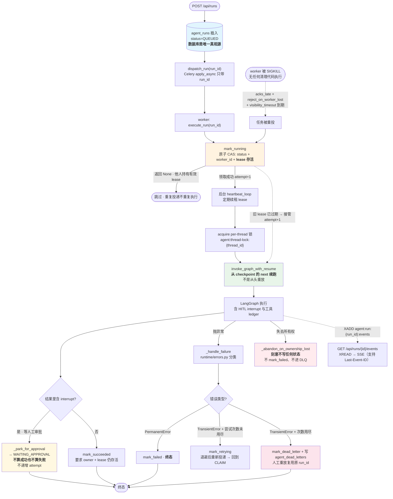

# Architecture

> 🟢 CURRENT — 随代码与配置同步更新。本文只写**结构性事实与设计理由**；
> 版本号、模型名、路径数等会漂移的数值一律去
> [reference/current-state.md](reference/current-state.md) 与
> `python3 scripts/project_facts.py` 取，**本文不硬编码**。
>
> 更细的设计文档在 [design/](design/)；本文是**入口与"为什么"**。

---

## 1. 一句话架构

> 一个**同步快路径 + 异步耐久路径**并存的企业客服 Agent 服务：
> 前者用 LangGraph 实时编排多 Agent 回答请求，后者把长任务落库入队、
> 由 Celery worker 从 Postgres checkpoint 续跑，并给每一次工具副作用
> 加**恰好一次**的幂等记账。

---

## 2. 为什么是两层执行路径（Hybrid）

企业客服有两类根本不同的负载，用同一套机制处理会两头都差：

| 负载 | 特征 | 要求 | 选择的路径 |
|---|---|---|---|
| 用户在线等回答 | 秒级、无副作用、可重试 | **低延迟 + 简单** | 快路径：`POST /api/chat`（+`/api/chat/stream` SSE）**永远 inline**，不经 worker |
| 长任务 / 高危写操作 | 可能超时、需要人工审批、需要崩溃恢复 | **可恢复 + 可审计** | 异步路径：`POST /api/runs` → Celery → `GET /api/runs/{id}` |

**为什么不把快路径也异步化？** 用户在等一个"这个产品有没有刺激成分"的回答，
把它塞进队列只会凭空增加一跳延迟，而且失败后用户已经走了。
**为什么不把长任务也走同步？** 需要人工审批的写操作可能挂几十分钟到几小时，
HTTP 连接不可能等；而且同步进程崩溃 = 状态丢失。

快路径与异步路径**共享同一份图与同一个 checkpointer**（都经 `ServiceContainer.initialize()`），
所以这不是两套系统，是同一条流水线上的两个入口。

### 2.1 异步路径的一次执行（含崩溃恢复）

`runtime/executor.py::execute_run` 是异步路径唯一的执行入口。
图里最关键的一条线是**崩溃恢复**：worker 被 `SIGKILL` 之后没有任何"清理代码"
会跑，恢复完全靠**任务重投 + lease 过期 + checkpoint 续跑**三件事的组合。



四个容易被讲错的点：

| 点 | 准确说法 |
|---|---|
| 交付语义 | **at-least-once**，不是 exactly-once。`acks_late` + `reject_on_worker_lost` + Redis `visibility_timeout` 只会让任务**至少**执行一次 |
| "恰好一次"从哪来 | 靠 run 级（终态重复投递 no-op）+ thread 级（Redis 锁）+ **工具级（`tool_side_effects` ledger 原子 claim）** 三层幂等换来的，**不是框架给的** |
| 崩溃恢复靠什么 | 不靠优雅关闭：靠**任务重投 + lease 过期接管 + 从 checkpoint `next` 续跑**。已成功的工具副作用由 ledger 挡住，不会重做 |
| 事件流不是真相源 | Redis Stream → SSE 是**观测通道**：best-effort 可续读，**非 exactly-once**。真相永远是 `agent_runs` 表 |

> **Level 2 ≠ 生产验证。** 上述流程已用真实 PostgreSQL + Redis + 多进程 Celery
> 验收过（`make runtime-e2e`）并做过 SIGKILL 崩溃恢复验证（`make runtime-chaos`）；
> 但**真实生产集群、多副本长期运行、真实流量**全部 `NOT_VERIFIED`。
> 完整边界见 [limitations.md](limitations.md) §3。

---

## 3. 请求生命周期（快路径）

```
POST /api/chat  或  /api/chat/stream
   │
   ├─ auth / 限流 / 输入净化 / Token Quota
   ├─ acquire per-thread 分布式锁 (Redis Lua CAS)
   │     同一 thread_id 串行，不同 thread 并发
   │
   └─ graph.ainvoke(initial_state, {"configurable":{"thread_id": session_id}})
         │
         ┌─[Layer 0]─ check_cache ────────────────► final_response ──► END
         │            L1 Redis MD5 精确
         │            L2 Qdrant 向量语义
         │            L3 Jaccard 词面回退
         │            命中 → 直接产出（伪流式补齐）
         │            未命中 ↓
         │
         ┌─[Layer 1]─ classify_query ─────────────► final_response
         │            LLM 分类器 ‖ 规则分类器（asyncio.gather）
         │            高置信规则（≥0.75）→ 短路，不调 LLM
         │            并行启动 RAG 预取任务
         │            产出 query_type / complexity / domain hints
         │
         ├─[Layer 2]─ 条件边选协作模式
         │            sequential | parallel | consultation | hierarchical | react
         │            （5 个节点共享同一实现体，模式名只影响调度语义）
         │
         ├─ human_approval_gate ──────────────────► final_response
         │     pending_actions 非空 → LangGraph interrupt()
         │     空 → 纯 no-op（普通流量零开销）
         │
         └─[Layer 3]─ final_response
                     质量评估（ResponseEvaluator，启发式）
                     模式升级重试
                     缓存写入（仅 resolved）
                     SLA 监控 / 事件广播
```

节点与边的**逐行定义**在 `core/graph_builder.py:399-457`。本文只解释结构与理由。

---

## 4. 为什么是四层状态机而不是一坨 if-else

四层是**四种不同的失败模式**，每层有自己的兜底策略：

| 层 | 要解决的问题 | 兜底 | 成本 |
|---|---|---|---|
| **L0 缓存** | 30% 的问题是重复问的（"怎么用"、"多少钱"） | 直接返回，不进 LLM | 最高命中，零成本 |
| **L1 路由** | 选错 Agent = 后面全错 | LLM 失败 → 规则分类器 → 规则也失败 → 熔断到默认 Agent | 中等 |
| **L2 协作** | 复杂问题需要多视角（投诉要产品+技术+客服） | 5 种模式按 complexity 递增成本 | 最贵 |
| **L3 后处理** | 模型可能答得不好 | 质量评分低 → 升级协作模式重试 | 按需 |

**为什么路由要双层并行？** LLM 分类更准（能理解"这个成分会不会刺激"），但慢且会挂；
规则分类快且免费，但只能覆盖高频模式。并行跑然后择优，等于**同时拿到准确率和可用性**，
且规则高置信时可以**直接短路省掉 LLM 调用**（这是成本优化，不是正确性妥协——
高置信规则只在明确模式下才短路）。

**为什么缓存放在路由之前？** 缓存命中意味着**连意图都不需要识别**。反复问同一个问题的
用户，不该付出任何 LLM 代价。放路由之后等于强迫每次都先花钱分类。

---

## 5. 状态、节点与边：LangGraph 用了什么、没用什么

### 5.1 State
`core/state.py:6` 的 `AgentState` 是一个 `TypedDict(total=False)`，
**单一定义点**，全仓无第二份 schema。它承载 session/agent/query/response/
collaboration_mode/cached/agents_used/resolution_status/trace_id/多模态/HITL 字段。

> 已知漂移：运行时还会写入 `_rag_prefetch` / `_needs_upgrade` / `_retried` /
> `_retried_failed` / `ab_variant` / `ab_experiment` / `extracted_entities`
> 七个**未在 TypedDict 声明**的键。因为 `total=False` 且节点返回整份 state，
> 它们能正常传播，但**对 mypy 与对读者都不可见**。

### 5.2 编译
`core/graph_builder.py:453-457`：

```python
compile_kwargs = {}
if checkpointer is not None:
    compile_kwargs["checkpointer"] = checkpointer
app = workflow.compile(**compile_kwargs)
```

**只传 checkpointer。刻意不传的**：
- `store` → 没有 LangGraph 级长期记忆。跨会话记忆由
  `core/session/session_manager.py` 承担，与 checkpoint 是**明确分离的两个概念**
  （见 [design/runtime-state-ownership.md](design/runtime-state-ownership.md)）。
- `interrupt_before` / `interrupt_after` → 静态断点无法表达"**只有 HIGH 风险工具**
  才需要人工"这种数据相关条件。本项目用节点内 `interrupt()`，
  见 `core/hitl/gate.py:205`。
- `cache` / `name` → 未使用。

### 5.3 条件边的路由映射必须穷举
`classify_query` 的条件边（`core/graph_builder.py:430-440`）的路由表**只列了
5 个协作模式，没有 fallback 分支**。这是有意的：如果 `select_mode_name` 返回
表外字符串，LangGraph 会在运行时**报错**而不是静默走一条不存在的路。
**枚举穷举 = 失败可见**，优于"兜底到某个默认节点"。

---

## 6. 四个 ID 必须严格区分

这是分布式 Runtime 里最容易出错、也最值得单独讲的一点：

| 名字 | 是什么 | 谁生成 | 生命周期 |
|---|---|---|---|
| `thread_id` | 对话级。**== `session_id` == LangGraph thread** | 客户端 / 服务端 | 整个会话 |
| `run_id` | **单轮执行**。= `agent_runs.id` | 服务端（`POST /api/runs`） | 一次请求-响应 |
| `task_id` | **Celery task id** | Celery | 一次投递，**重投会变** |
| `AgentRun` | 业务运行记录（数据库行） | 服务端 | 跨重投**稳定** |

**为什么必须区分**：崩溃恢复时 Celery 会用**新 task_id** 重投同一条 run。
如果把 task_id 当业务标识，工具幂等键就会变，**重试会真的重复扣款**。
所以幂等键用 `run_id:tool_call_id`（`runtime/side_effects.py:82-84`），
DLQ 重放**复用原 run_id**（`runtime/run_service.py:512-553`）——
两个设计都指向同一个目的：**重试永远不会变成第二次副作用**。

---

## 7. 状态归属：四种"状态"互不混用

企业 Agent 最常见的架构错误是让 checkpoint、session、cache、tool store
共享一个存储后，然后祈祷它们语义一致。本项目显式分离：

| 状态 | 归属 | 真相源 | 理由 |
|---|---|---|---|
| **LangGraph checkpoint** | 图执行位置 | Postgres `AsyncPostgresSaver` | 必须跨进程、跨副本共享，否则 worker 看不到 API 写下的进度 |
| **Session Memory** | 滑动窗口 + 摘要 + 漂移检测 | Redis（生产强制） | 多 worker 分片下内存态会导致同一会话在不同 worker 看到不同历史 |
| **Response Cache** | L1/L2/L3 三层 | Redis + Qdrant | 与 checkpoint 无关的生命周期，可独立过期 |
| **Tool Result Store** | 卸载的大结果 | Redis，带 `scope` | 与 scope 强绑定，防止跨用户恢复他人结果 |

**Checkpoint 生产 fail-closed 是硬要求**：`core/container.py:341-351` 在
postgres 初始化失败时**直接抛错拒绝回退 MemorySaver**。理由——内存 checkpoint
在多副本下会给出"看起来正常但状态已经丢了"的行为，
这比启动失败**危险得多**。开发/测试环境才允许降级，且降级会**显式标记**
`status="degraded"` 并在健康检查里暴露。

---

## 8. 可观测性：三条独立的信号

| 信号 | 实现 | 用途 | 现状边界 |
|---|---|---|---|
| **Trace** | OpenTelemetry（`core/tracing.py` + `core/telemetry.py`），5 个语义 span | 一次请求跨 Agent/工具/RAG/LLM 的因果链 | **本地已验证**（对真实 Collector 验证过 span 完整性）；持久化后端**未接**（collector 仅 debug exporter） |
| **Metric** | `prometheus_client` 注册表 | 队列深度、run 状态分布、幂等命中、审批等待、工具结果压缩比 | ⚠️ **注册了约 70 个，但标准 `/metrics` 暴露未接**，详见 [limitations.md](limitations.md) |
| **Log** | 结构化 JSON + ContextVar `trace_id` + 两层密钥脱敏 | 排障取证 | 已实现；`scrub_exception_message()` 会在异常对象上就地脱敏，防止 **ASGI 自己打印 traceback 时泄漏** |

**为什么 trace 属性要做白名单 + 黑名单双层？** `core/telemetry.py:61-152`。
只靠黑名单，新增一个 `user_email` 字段就会漏；只靠白名单，
span 会丢关键排障信息。双层是"默认安全 + 显式放行"。

---

## 9. 安全边界（架构级）

| 边界 | 机制 | 关键性质 |
|---|---|---|
| 系统间调用 | API Key | 与终端用户 JWT 分离 |
| 终端用户 | JWT + Argon2id + Redis 黑名单 + Refresh Token | 4 级 RBAC |
| 工具授权 | `erp/authorization.py` **在工具层**强制 | **不靠 prompt 约束** |
| 高危工具副作用 | HITL 审批 + 幂等 ledger 双防线 | 审批防"不该做的被做了"；ledger 防"做了一次被重做" |
| 无治理写操作 | 拒绝执行（fail-closed） | 快路径无 run 上下文时尤其重要 |
| 敏感内容 | 四处独立边界：日志脱敏 / trace 属性 / 审批提案 / run 事件白名单 | 各层用**不同语义**，不能互相替代 |
| SSRF | Webhook URL 校验（拒绝私网/回环/元数据端点） | — |

---

## 10. 与本项目相关但**刻意不做**的事

写清楚不做什么，比罗列做了什么更能说明工程判断：

| 不做 | 理由 |
|---|---|
| `interrupt_before/after` 静态断点 | 无法表达数据相关的审批条件 |
| LangGraph `store` 长期记忆 | 会与 `core/session/` 职责重叠；且没有 memory schema 设计 |
| 工具结果直接进 prompt | 5000+ 文档的检索结果会撑爆上下文；走 offload + reference_id |
| 编排逻辑散落在 Agent 内部 | 状态转移必须在一个地方可审计，否则崩溃恢复无从判断 |
| 同步路径也走队列 | 给秒级交互凭空加一跳延迟 |
| Celery result backend 作为状态真相源 | `task_ignore_result=True`；真相源是 `agent_runs` 表 |

---

## 延伸阅读

| 你想知道 | 去 |
|---|---|
| 分布式 Runtime 完整设计（状态机/锁/幂等/DLQ） | [design/agent-runtime.md](design/agent-runtime.md) |
| 为什么用 LangGraph 而不是裸 Chain | [agent-design.md](agent-design.md) |
| 高危工具为什么要人工审批 | [design/human-in-the-loop.md](design/human-in-the-loop.md) |
| 四类状态的归属与理由 | [design/runtime-state-ownership.md](design/runtime-state-ownership.md) |
| 架构决策记录 | [decisions/](decisions/) |
| 当前事实与验证命令 | [reference/current-state.md](reference/current-state.md) |
| 已知不宣称项 | [limitations.md](limitations.md) |
