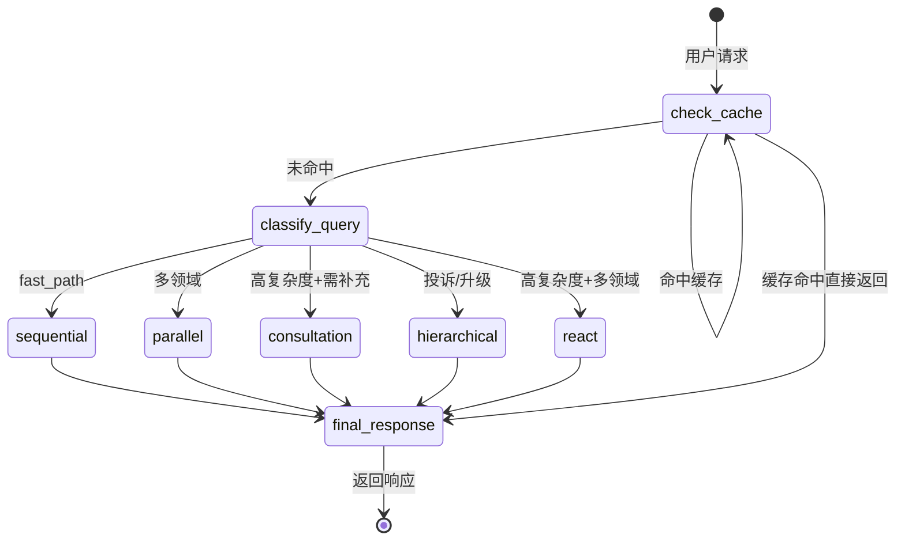
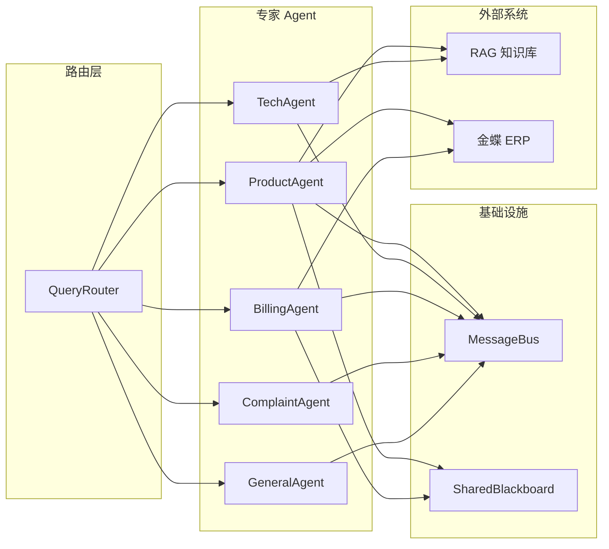
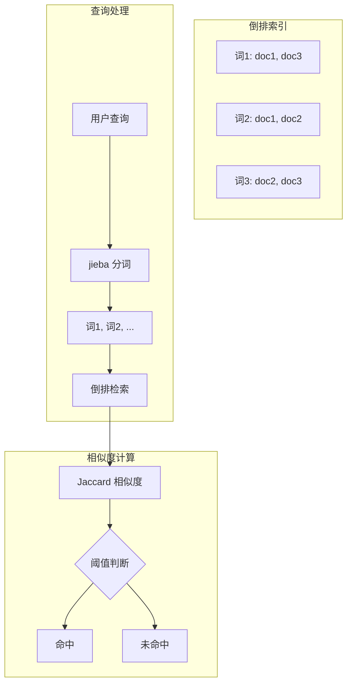
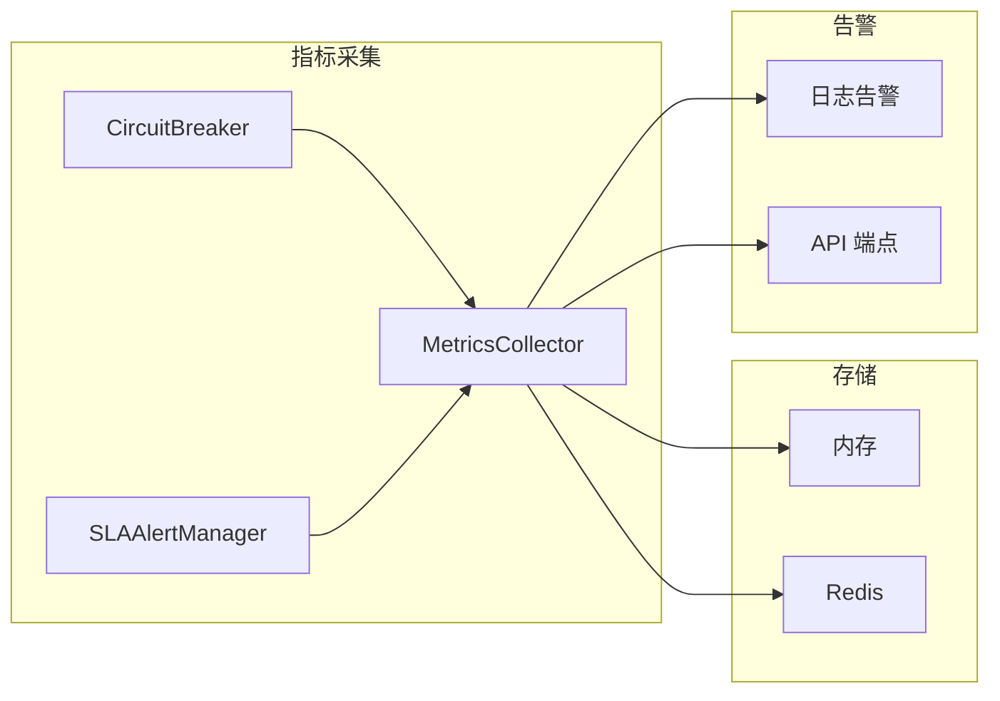
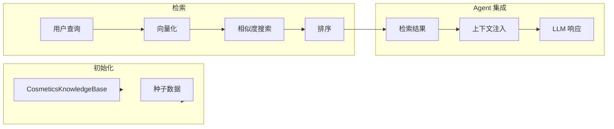
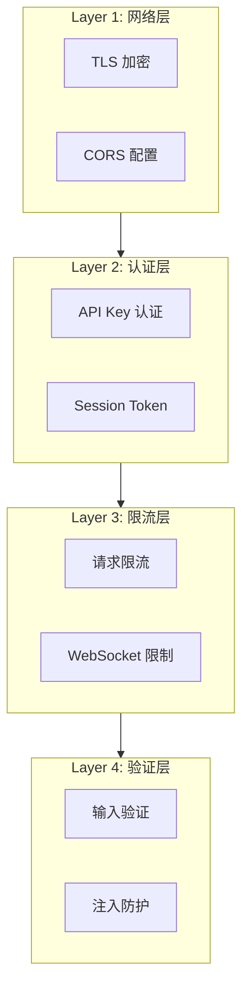

# 架构设计详解

## 系统架构

### 整体架构

```
用户请求
    │
    ▼
┌─────────────────────────────────────────────────────────────┐
│                     FastAPI 服务层                           │
│  ┌─────────┐  ┌─────────┐  ┌─────────┐  ┌─────────┐       │
│  │限流中间件│  │认证中间件│  │安全头   │  │WebSocket│       │
│  └─────────┘  └─────────┘  └─────────┘  └─────────┘       │
└────────────────────────────┬────────────────────────────────┘
                             │
                             ▼
┌─────────────────────────────────────────────────────────────┐
│               LangGraph StateGraph 四层状态机                │
│                                                              │
│  Layer 0: 缓存检查 ──► Layer 1: 双层路由                     │
│       │                    │                                 │
│       ▼                    ▼                                 │
│  Layer 2: 专家 Agent ◄────┘                                  │
│       │                                                        │
│       ▼                                                       │
│  Layer 3: 响应处理                                           │
└────────────────────────────┬────────────────────────────────┘
                             │
                             ▼
┌─────────────────────────────────────────────────────────────┐
│                      基础设施层                              │
│  ┌─────────┐  ┌─────────┐  ┌─────────┐  ┌─────────┐        │
│  │MessageBus│  │Blackboard│  │Metrics  │  │CircuitBreaker│   │
│  └─────────┘  └─────────┘  └─────────┘  └─────────┘        │
└─────────────────────────────────────────────────────────────┘
```

### 状态机流转



## 模块设计

### Agent 系统

#### BaseAgent 架构

```
BaseAgent
├── LLM 调用 (_process_with_llm)
│   ├── 系统提示构建
│   ├── 上下文注入
│   └── 响应解析
├── 工具调用 (_process_with_tools)
│   ├── 工具注册
│   ├── 工具选择
│   └── 结果回传
├── RAG 检索 (_retrieve_knowledge)
│   ├── 向量检索
│   └── 知识注入
├── 漂移检测 (drift detection)
│   ├── 话题漂移
│   ├── 意图漂移
│   └── 矛盾检测
└── 重试机制 (retry)
    ├── 指数退避
    └── 永久错误识别
```

#### Agent 协作关系



### 缓存系统

#### L1 精确缓存

- **算法**：MD5(query) → O(1) 查找
- **淘汰**：LRU (OrderedDict)
- **容量**：500 条
- **TTL**：3600 秒

#### L2 语义缓存



### 通信架构

#### MessageBus pub/sub

```
Agent A                    MessageBus                    Agent B
   │                            │                           │
   │──subscribe(topic)─────────►│                           │
   │                            │                           │
   │                      ┌─────┴─────┐                    │
   │                      │  Topic    │                    │
   │                      │  Registry │                    │
   │                      └───────────┘                    │
   │                            │                           │
   │◄─ack──────────────────────┤                           │
   │                            │                           │
   │                      publish(event)                   │
   │───────────────────────────►│                           │
   │                            │                           │
   │◄──────────────────────────┘on_message(event)         │
```

#### SharedBlackboard TTL KV

- **TTL**：可配置，默认与 session 相同
- **用途**：跨 Agent 状态共享（如路由结果、临时计算）
- **操作**：
  - `write(key, value, ttl)` - 写入，带过期时间
  - `read(key, default)` - 读取，不存在返回默认值
  - `read_prefix(prefix)` - 前缀匹配批量读取

### 监控架构



### ERP 集成

#### 适配器模式

```
┌─────────────────────┐
│   ERP Factory       │
└─────────┬───────────┘
          │
          ▼
┌─────────────────────┐
│ KingdeeAdapterBase  │  ← 抽象接口
│ + query_product()   │
│ + query_inventory() │
│ + query_order()     │
│ + query_customer()  │
└─────────┬───────────┘
          │
    ┌─────┴─────┐
    ▼           ▼
┌────────┐  ┌─────────┐
│ Mock   │  │ Real    │
│Adapter │  │ Adapter │
└────────┘  └─────────┘
```

#### 安全设计

- **输入消毒**：白名单字符过滤 + SQL LIKE 通配符转义
- **错误处理**：详细异常仅写日志，客户端返回通用错误
- **降级策略**：配置不完整时自动回退到 Mock 模式

### RAG 知识库

#### ChromaDB 集成



## 性能优化

### 缓存前置

```
请求 → 缓存命中？
    │
    ├── 是 → 直接返回（<10ms）
    │
    └── 否 → LLM 路由（2-8s）
              │
              └── Agent 处理 → 缓存写入 → 返回
```

### 连接池复用

- httpx 连接池：100 max / 20 keepalive
- 复用场景：LLM 调用、ERP API 调用
- 自动重连：连接过期时自动建立新连接

### 并发控制

- Semaphore 限制并发 Agent 数量
- asyncio.Lock 保护共享资源初始化
- 指数退避重试：区分瞬时/永久错误

## 安全加固

### 多层防护



### 时序攻击防护

```python
import hmac

# 安全的字符串比较
def verify_api_key(expected: str, actual: str) -> bool:
    return hmac.compare_digest(expected, actual)
```

## 扩展设计

### 新增 Agent

1. 继承 `BaseAgent`
2. 实现 `process()` 方法
3. 在 `multi_agent_customer_service.py` 中注册
4. 在 `collaboration/modes.py` 中添加模式支持

### 新增协作模式

1. 在 `collaboration/modes.py` 中继承 `CollaborationMode`
2. 实现 `execute()` 方法
3. 在 `collaboration/orchestrator.py` 中添加选择逻辑

### 新增工具

1. 实现工具函数
2. 在 `tools/tool_registry.py` 中注册
3. 在 `tools/erp_tools.py` 中添加（如果是 ERP 工具）