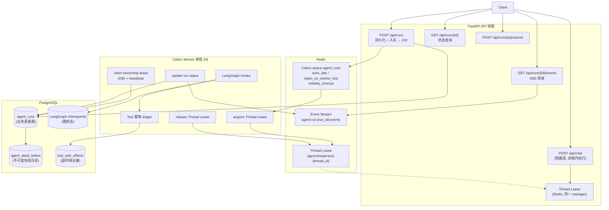

# Agent Runtime 设计（分布式异步执行 + 崩溃恢复）

> 范围：把 LangGraph 多 Agent 从「FastAPI 进程内直接执行」升级为「API 只创建 Run、
> 独立 Worker 执行、状态外部化、崩溃可恢复」的运行时。
> 证据等级与仓库一致：`IMPLEMENTED` / `LOCALLY VERIFIED` / `CI VERIFIED` /
> `PRODUCTION NOT_VERIFIED`。没有证据的能力不写成本文的事实。

---

## 1. 目标与非目标

**目标**

1. 状态外部化：LangGraph checkpoint 落 PostgreSQL，进程重启不丢图状态。
2. 执行解耦：API 进程不执行异步 Run 的图；执行在独立 Celery worker。
3. 单会话串行：同一 `thread_id` 同时只有一个 Run 在改图状态；不同 thread 并行。
4. 崩溃可恢复：worker 被 `kill -9` 后，新 worker 能从持久 checkpoint 续跑。
5. 副作用不重复：消息投递是 at-least-once，因此有副作用的 Tool 必须自身幂等。
6. 失败可运营：retry 有上限，耗尽进 DLQ，人工可重放。

**非目标（明确不做）**：Kafka / RabbitMQ / Temporal / Airflow / Kubernetes /
Service Mesh / Redis Cluster / PostgreSQL HA / 微服务拆仓。理由见
[ADR-009](../decisions/009-distributed-agent-runtime.md)。

---

## 2. 四个 ID（最容易搞混的部分）

| ID | 含义 | 载体 | 生命周期 |
|---|---|---|---|
| `thread_id` | 一条**会话/状态时间线** | LangGraph `configurable.thread_id`（当前 == `session_id`） | 整个会话，多轮复用 |
| `run_id` | 一次**图执行** | `agent_runs.id`（UUID4） | 单次执行 |
| `job_id` | 一次**队列投递** | Celery task id / `agent_runs.task_id` | 可多次（retry、重投、replay 各自一次） |
| `idempotency_key` | 防止**副作用重复** | `tool_side_effects.operation_key = run_id:tool_call_id` | 一次业务操作 |

铁律：

- **同一会话的多个 Run 必须共享同一个 `thread_id`**；一个请求一个新 thread 是错的
  （会丢掉全部对话状态）。
- **`run_id` 与 `job_id` 分离**：一个 Run 可以被投递多次（重试、退避、崩溃后重投），
  `attempt` 记录实际执行了几次。
- **DLQ 重放复用原 `run_id`**：见 §7。

---

## 3. 架构



快路径与异步路径**共用同一 thread lease**：否则同一会话的一个 REST 请求和一个
队列任务可以同时改同一条图状态。共用靠「同一个 manager 单例」保证，不是靠 key
字符串相同（`tests/unit/test_runtime_architecture_contract.py` 断言实例相同且行为
互斥）。

---

## 4. 状态机

```
PENDING ──► QUEUED ──► RUNNING ──┬──► SUCCEEDED            (终态)
                  │               ├──► FAILED               (终态, permanent, 不重试)
                  │               ├──► RETRYING ──► RUNNING (transient, 指数退避)
                  │               └──► DEAD_LETTER          (终态, retry 耗尽)
                  └──► CANCELLED ─┘  (终态, 协作式取消)

RETRYING ──► CANCELLED / DEAD_LETTER
```

- 迁移由 `runtime/statuses.py` 定义，**在数据库层用原子条件更新强制**
  （`UPDATE ... WHERE status IN (...)`），并发 worker 不会互相覆盖。
- `RUNNING` 携带 `worker_id` + `task_id` + `lease_expires_at`；lease 过期可被接管
  （崩溃恢复）。
- `attempt` 在 `mark_running` 时递增，代表"已开始执行次数"。
- 同 thread 竞争**不消耗 attempt**（`defer_run` 保持状态、只推迟 `next_retry_at`）。

---

## 5. 断点续跑（本设计最容易被实现错的地方）

LangGraph 的两种调用方式语义不同（已在 langgraph 1.2.x 上实测）：

```python
await graph.ainvoke(None, config)      # 从 checkpoint 的 next 续跑，不重跑已完成节点
await graph.ainvoke(state, config)     # 从 START 重新执行，并用入参覆盖 channel 值
```

因此崩溃恢复**必须**在检测到未完成 checkpoint（`StateSnapshot.next` 非空）时传
`None`。若照常传 `state`，已完成的上游节点会被重新执行，其工具调用与外部写操作
会被重复触发——"断点续传"退化成"从头重跑"。

统一入口：`runtime/bootstrap.py::invoke_graph_with_resume`（worker 路径）与
`api/app.py::_pending_steps`（快路径）。

判定"是否恢复"的边界：只有 `next` 非空才算恢复。会话历史留存的**已完成**快照
（`next` 为空）走正常执行路径，多轮对话语义不变。

`agent_checkpoint_recovery_total{recovered}` 记录实际发生过几次续跑。

---

## 6. Thread Lease（同 thread 串行）

`runtime/thread_lock.py`，key `agent:thread-lock:{thread_id}`：

- 获取：`SET key <owner_token> NX PX <ttl>`。`owner_token` 是
  `host:pid:rand`，**不是** `locked=true`。
- 续租：Lua `GET == token then PEXPIRE`。
- 释放：Lua `GET == token then DEL`（compare-and-delete）。
  禁止 `GET` + `DEL` 两条独立命令——中间可能被别的 worker 抢锁并被误删。
- 执行期间由 `_heartbeat_loop` 续租，避免长任务执行到一半锁过期。
- TTL 到期兜底：owner 崩溃后锁自动过期，不会永久死锁。

**边界**：单 Redis 互斥，**不是** Redlock；**没有** fencing token。pause 超过 TTL
的旧 worker 不会被强制中止（其 `mark_succeeded` 会被条件更新挡下）。

后端：`redis`（生产）/ `memory`（开发测试，同一进程内单例）。

---

## 7. Queue / Worker / Retry / DLQ

**入队**：`POST /api/runs` 落库 `QUEUED` → `apply_async(args=[run_id])`。
消息**只带 `run_id`**——完整 query/state 由 worker 从数据库读，避免把 prompt/state
塞进 broker payload。无 worker 时 run 保持 `QUEUED`（不会退化成 API 偷偷执行）。

**投递语义**：at-least-once（`task_acks_late=True` +
`task_reject_on_worker_lost=True` + Redis `visibility_timeout`）。
**不是** exactly-once。

**异常分类**（`runtime/errors.py`）：

| 类别 | 例子 | 行为 |
|---|---|---|
| `timeout` | `TimeoutError`、`asyncio.TimeoutError` | retry |
| `transient` | `ConnectionError`、`OSError`、HTTP 429/5xx、APIConnectionError | retry |
| `permanent` | `PermanentError`、HTTP 4xx（401/403/400）、`ValueError`/`TypeError`、`NotImplementedError` | 立即 `FAILED`，不重试 |
| 默认 | 未识别的异常 | `transient`（保守重试；未识别异常可能是网络抖动） |

业务校验失败的工具必须抛 `PermanentError`，否则会被当作 transient 重试。

**Retry 上限**：`AGENT_RUN_MAX_ATTEMPTS`（默认 3）。耗尽 → `DEAD_LETTER` +
写 `agent_dead_letters`（不可变历史：run_id / thread_id / attempt_count /
error_type / error_code / entered_at）。

**重放**：`python scripts/replay_dead_run.py <run_id>`（或
`RunService.requeue_dead_letter`）。

> 重放刻意**复用原 `run_id`**：工具幂等键是 `run_id:tool_call_id`，换新 run_id 会让
> 重放绕过 ledger，把已经成功的退款/改单**再执行一次**。规范里 `job_id` 是"一次队列
> 投递"，重放正是新的一次投递。原始 DLQ 历史不被改写。

---

## 8. 副作用幂等

### 8.0 统一术语口径（全仓一致，禁止漂移）

| 层 | 准确说法 | 不是什么 |
|---|---|---|
| 队列投递 | **at-least-once**（`acks_late` + `reject_on_worker_lost` + `visibility_timeout`） | 不是 exactly-once |
| 副作用处理 | **application-level duplicate suppression / idempotency ledger**（同一 `operation_key` 不重复写外部系统） | 不是 exactly-once 语义 |
| 端到端 exactly-once | **NOT PROVIDED** | 本仓库不提供、不宣称 |

一句话版本：

> 队列投递是 at-least-once；副作用靠 application-level 去重（idempotency ledger）
> 保证同一 `operation_key` 不重复落地；**端到端 exactly-once 不提供**。

去重的**前提条件**必须讲清楚，否则容易被读成 exactly-once：

1. `tool_call_id` 必须在重投后**稳定**（真实系统里来自 LLM tool_call id 或业务操作 id）；
   它不稳定 = 去重失效。
2. 必须在**认领之前**的租约窗口内完成（或崩溃后由接管者重做）；
   `PENDING` 租约过期后接管会**重放**该次写操作 —— 见 §14 限制 3。
3. 下游若已成功但本进程在 `mark_succeeded` 之前崩溃，会重放。
   要端到端去重，下游必须接受 idempotency key。

因此准确的能力描述是「**重复投递下副作用去重**」，而不是「副作用恰好执行一次」
或「副作用 exactly-once」。

### 8.1 机制

at-least-once 投递 ⇒ 不能依赖 exactly-once ⇒ 副作用自身必须幂等。

```
operation_key = hash-free 约定:  run_id + ":" + tool_call_id
指纹           = sha256(canonical_json(arguments))
```

执行路径（`tools/tool_registry.py` → `runtime/side_effects.py`）：

```
ToolRegistry.execute_raw(side_effect=True 的工具, tool_call_id=...)
  └─ 处于 Run 上下文（有 run_id）？
       ├─ 是 → execute_idempotent_operation
       │        claim(operation_key, 指纹)
       │          SUCCEEDED + 指纹一致 → 返回历史结果（**不再执行副作用**）
       │          SUCCEEDED + 指纹不同 → PermanentError（业务冲突）
       │          PENDING 且租约未过期 → TransientError（退避重投，不重复执行）
       │          PENDING 租约过期   → execute（认领者崩溃，接管重放）
       │          不存在 / FAILED   → execute
       │        执行 -> mark_succeeded(结果)
       └─ 否 → 直接执行（快路径 /api/chat 无 Run 上下文，行为与改造前一致）
```

关键点：

- 失败必须冒泡。副作用工具的异常**不能**被吞成"工具暂时不可用"，否则一次失败的写
  操作会被记成成功 Run，retry/DLQ 全部失效。
- 指纹不一致 = 同一个 key 换了参数 = 业务冲突，永久失败，不重试。
- `agent_tool_idempotency_hit_total` 记录去重命中次数（Gate 11 的验收指标）。

当前仓库 ERP 工具**全部只读**（`query_product` / `query_inventory` /
`query_order` / `query_customer`），因此 ledger 目前没有真实写工具消费者；框架已就绪，
新增写工具时必须用 `side_effect=True` 注册。

---

## 9. Crash Recovery

```
Worker A: first 节点完成 → checkpoint 落 PG → 进入 second 节点阻塞
SIGKILL 整个进程组（父 + prefork 子）
  ↓
lease 到期（DB lease_expires_at + Redis TTL）
未 ACK 消息超过 visibility_timeout 后重新可见
  ↓
Worker B: acquire Thread Lease → claim ownership lease（attempt+1）
        → 读到未完成 checkpoint（next = second）→ ainvoke(None)
        → 跳过 first，重做 second → SUCCEEDED
```

验收证据（`make runtime-chaos` 输出结构化 JSON）：

- 崩溃前 `checkpoints` 表非空；
- `first` 节点执行次数 == 1（**不是**从头重跑）；
- `second` 执行次数 >= 2（未完成的那一步重做）；
- 接管 worker_id 与被杀 worker 不同；
- 副作用计数器恰好 == 1，ledger 命中路径被走到。

**不承诺**恢复原 TCP/SSE 连接。客户端通过 `run_id` 重新获取状态/结果/事件。

---

## 10. 事件流与 SSE

```
worker -> XADD agent:run:{run_id}:events -> API XREAD -> SSE -> client
```

事件类型：`queued` / `started` / `status` / `thinking` / `tool_call` /
`tool_result` / `chunk` / `retry` / `completed` / `failed` / `cancelled`。

- `GET /api/runs/{run_id}/events` 支持 `Last-Event-ID`（或 `?last_event_id=`）
  断点续读；`?replay=false` 只看新事件。
- 负载走**字段白名单**（`runtime/events.py::sanitize_payload`）：query、用户标识、
  凭据不进入事件流。
- **投递语义**（由 `test_event_delivery_semantics.py` 实测锁定）：best-effort
  resumable event stream，**不是** exactly-once。单条连接内 cursor 单调前进，
  每个 entry 只转发一次；但用**较旧的** `Last-Event-ID` 重连会**重放已处理过的
  事件**（重复），`replay=false`（`$`）与 idle 超时造成**缺口**，`MAXLEN` 是
  **近似**裁剪（不是硬上界，短流不裁、长流裁后仍可能超出），被裁历史**不可恢复**。
  权威状态永远是 `GET /api/runs/{run_id}`：事件流全丢也不影响 run 终态。

---

## 11. 可观测性

| 指标 | 类型 | 含义 |
|---|---|---|
| `agent_run_total{status}` | counter | 各终态/retry 结果数 |
| `agent_run_duration_seconds` | histogram | RUNNING → 终态耗时 |
| `agent_run_inflight` | gauge | 正在执行的 Run |
| `agent_run_queue_wait_seconds` | histogram | queued_at → started_at |
| `agent_run_retry_total` | counter | retry 调度次数 |
| `agent_run_failed_total` | counter | FAILED + DEAD_LETTER |
| `agent_run_dead_letter_total` | counter | 进入 DLQ |
| `agent_run_dead_letter_replay_total` | counter | 人工重放次数 |
| `agent_thread_lease_acquire_total` | counter | 获得 thread lease |
| `agent_thread_lease_contention_total` | counter | 同 thread 竞争推迟 |
| `agent_thread_lease_wait_seconds` | histogram | 等锁耗时 |
| `agent_thread_lease_renewed_total{outcome}` | counter | 执行期间续租结果 |
| `agent_worker_heartbeat{outcome}` | counter | ownership lease 心跳 |
| `agent_checkpoint_recovery_total{recovered}` | counter | 从 checkpoint 续跑次数 |
| `agent_tool_idempotency_hit_total` | counter | 副作用去重命中 |
| `agent_run_idempotency_hit_total` | counter | HTTP Idempotency-Key 命中 |
| `checkpoint_errors_total` | counter | checkpoint 后端错误 |

**label 基数纪律**：只允许低基数维度（`status` / `mode` / `outcome` /
`error_type` / `agent`）。`tests/unit/test_runtime_metrics_contract.py` 断言任何
`agent_*` 指标都**不得**使用 `run_id` / `thread_id` / `user_id` / `query` /
`session_id` 等每请求唯一字段——否则 Prometheus 时序数会无界增长。

---

## 12. Failure Model

| 故障 | 系统行为 | 用户可见 |
|---|---|---|
| worker 崩溃（中途） | 未 ACK 消息重投；新 worker 从 PG checkpoint 续跑；已完成节点不重跑 | Run 最终成功；不恢复原 SSE 连接 |
| provider/LLM 超时 | `timeout` → `RETRYING` + 退避重投；耗尽 → `DEAD_LETTER` | Run 状态可查；可人工重放 |
| 认证/授权失败（401/403） | `permanent` → 立即 `FAILED`，不重试 | 失败原因（脱敏） |
| Redis 不可用（锁后端） | API 生产 fail-closed（`THREAD_LOCK_UNAVAILABLE`）；worker 退避重调度 | API 返回错误；Run 稍后重试 |
| Redis 不可用（事件流） | 事件发布降级为 no-op，**不影响** Run | 事件流缺事件；状态查询正常 |
| PostgreSQL 不可用 | Checkpoint/Run 写入失败 → `transient` retry；`CHECKPOINT_UNAVAILABLE` | Run 失败或退避 |
| 消息重复投递 | application-level run 幂等（终态 no-op）+ `lease_expires_at` 归属检查 | 不会重复出结果 |
| 工具成功但 worker 崩溃 | ledger `SUCCEEDED` → 重投时返回历史结果 | 副作用**只发生一次** |
| 认领工具时崩溃（PENDING） | 认领租约过期后允许接管重放 | 可能重试该次写操作（不可避免） |

---

## 13. 验证

```bash
# 需要真实 PostgreSQL + Redis；未配置时目标 FAIL（不静默 skip）
make runtime-e2e     # tests/integration/runtime，30 个用例
make runtime-chaos   # 崩溃恢复 + 副作用去重，输出结构化证据 JSON
make runtime-verify  # 生成 artifacts/distributed-runtime/<ts>/report.json
```

CI：`.github/workflows/ci.yml` 的 `runtime-e2e` job（postgres + redis service
container）。

测试文件与 Gate 对照见
[distributed-runtime-runbook](../operations/distributed-runtime-runbook.md)。

---

## 14. 已知限制

1. **无 fencing token**：pause 超过 lease TTL 的旧 worker 不会被强制中止。
2. **单 Redis 互斥**：不是 Redlock；Redis 故障转移期间可能双持有。
3. **认领后崩溃的工具调用会重放**：`PENDING` 租约过期后接管重做，若外部系统当时
   其实已成功，会产生重复写。根治需要下游接受 idempotency key。
4. **事件流仅 best-effort 可续读**（非 exactly-once）：重连可能重复、`$` 与 idle
   超时可能丢、`MAXLEN` 近似裁剪后历史不可恢复。
5. **取消是协作式的**：不打断已在执行的图。
6. **无 DLQ 告警**：`agent_run_dead_letter_total` 只计数，没有接 `alerts/`。
7. **无 backpressure / admission control**：永久锁死的 thread 会持续 5s 重投。
8. **Worker pool 未做自动扩缩**：compose 里是固定 worker 服务。
9. **生产集群未验证**：以上全部为本地 + CI 验证，**PRODUCTION NOT_VERIFIED**。

## 15. 顺带修掉的一个 P0：SSE 与 checkpoint 不可共存

`stream_callback` 原本是 `core/state.py` 声明的一个 LangGraph channel。LangGraph 会把
**每个 channel 的值**交给 checkpointer 序列化，因此开启 checkpoint 后
`POST /api/chat/stream` 必然失败::

    TypeError: Type is not msgpack serializable: function

`MemorySaver` 与官方 `AsyncPostgresSaver` 共用 `JsonPlusSerializer`，两者都失败；而
生产默认 `LANGGRAPH_CHECKPOINT_BACKEND=postgres` —— 也就是说该缺陷在生产是活跃的。

修复：回调移出 channel，改用 contextvar（`core/streaming_context.py`），节点通过
`get_stream_callback(state)` 读取，该函数仍优先从 state 取值以兼容旧调用方。
回调在 `ainvoke` 之前设置，LangGraph 内部创建的 task 继承当时的 context，因此
节点仍能拿到同一个回调。

回归测试：`tests/integration/runtime/test_sse_checkpoint_serialization.py`
（真实 PostgreSQL checkpointer）。