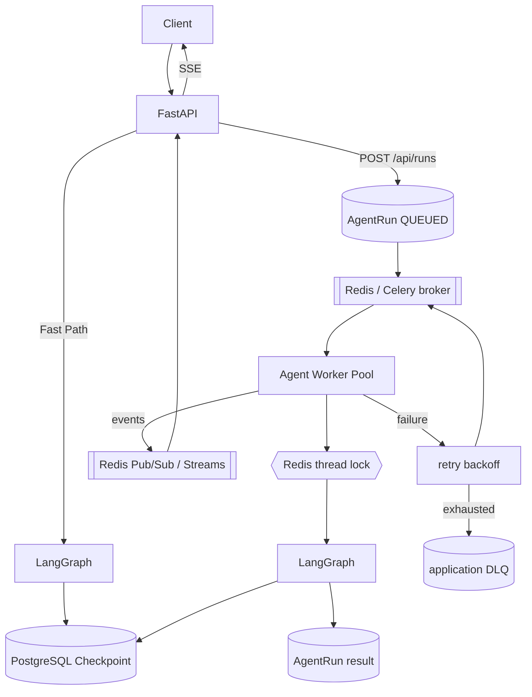

# Async Agent Worker Architecture（设计；部分已实现）

> Status: DESIGN（下一阶段）。本文描述异步 Agent Worker 的目标架构与失败语义。
> **明确区分已实现 / 设计**，不得把设计当成已实现。

## 目标

把长任务从 API 进程解耦到独立 worker pool，支持持久调度、重试、DLQ、取消、
跨进程事件回传，同时保持同步快路径（`/api/chat` + SSE）不变。

## 目标架构

## ID 语义

| ID | 含义 | 生成 |
|---|---|---|
| `thread_id` | 对话级（== session_id == LangGraph thread） | 会话创建时 |
| `run_id` | 单轮 Graph 执行 | 每次请求 |
| `request_id` | 一次 HTTP/WS 请求 | 请求入口 |
| `task_id` | 队列消息 / worker 执行 ID（Celery task id） | 入队时 |
| `idempotency_key` | 有副作用 tool 的业务幂等键 | tool 调用边界 |

## 已实现（第一阶段 foundation）

- `POST /api/runs` 创建 Run + 入队即返回；`GET /api/runs/{id}` 查询；
  `GET /api/runs/dead` 查询 DLQ。
- Celery + Redis worker；`acks_late` + `reject_on_worker_lost` +
  `visibility_timeout`；payload 仅 `run_id`。
- per-thread Redis 锁（worker 路径 + API 执行边界共用同一 key）。
- transient retry（指数退避 + jitter + max attempts）、permanent → FAILED、
  retry 用尽 → `DEAD_LETTER` + `agent_dead_letters`。
- tool 幂等 ledger + `execute_idempotent_operation`。
- worker crash → broker redelivery → lease 接管（集成测试验证）。

## 设计（下一阶段，未实现）

### Worker Pool 与扩缩容
- 多队列（按 run 优先级/类型）、worker 并发度、独立 worker deployment。
- 队列深度 / active run / queue wait 指标驱动 HPA（未来）。

### Retry / DLQ 深化
- retryable error taxonomy（provider 429/5xx/timeout vs 4xx/permanent）。
- 每类错误独立退避策略；DLQ 支持人工 replay / 丢弃 / 导出。

### Cancellation
- `CANCELLED` 状态 + 协作式取消（worker 检查取消标志 + LangGraph interrupt）。
- 取消传播到锁释放与副作用 ledger。

### Cross-process SSE Event Bridge
- worker 发布 `run_started / chunk / tool_call / run_completed` 到
  Redis Streams；API 读取转 SSE，支持 `Last-Event-ID` 断线续读。
- 过期 stream 回退到 `agent_runs` 最终状态。

### 长任务 / graceful shutdown / backpressure
- 长任务心跳续租 + 软/硬超时；worker `SIGTERM` 优雅停机等待当前任务。
- 队列背压：入队限流、最大 in-flight、拒绝策略（`429/503`）。

### Worker crash
- broker redelivery + lease 过期接管（已实现基础）；
- 失败节点重执行 → 节点副作用必须幂等（ledger）。

## 不在本阶段

Kafka / RabbitMQ / Kubernetes 真集群 / Temporal / Saga / Outbox / Service Mesh /
分布式事务。当前 Redis + PostgreSQL + Celery 已覆盖需求。

## 相关

- [ADR-009](../decisions/009-distributed-agent-runtime.md)
- [docs/design/distributed-agent-runtime.md](distributed-agent-runtime.md)
- [docs/design/runtime-state-ownership.md](runtime-state-ownership.md)
