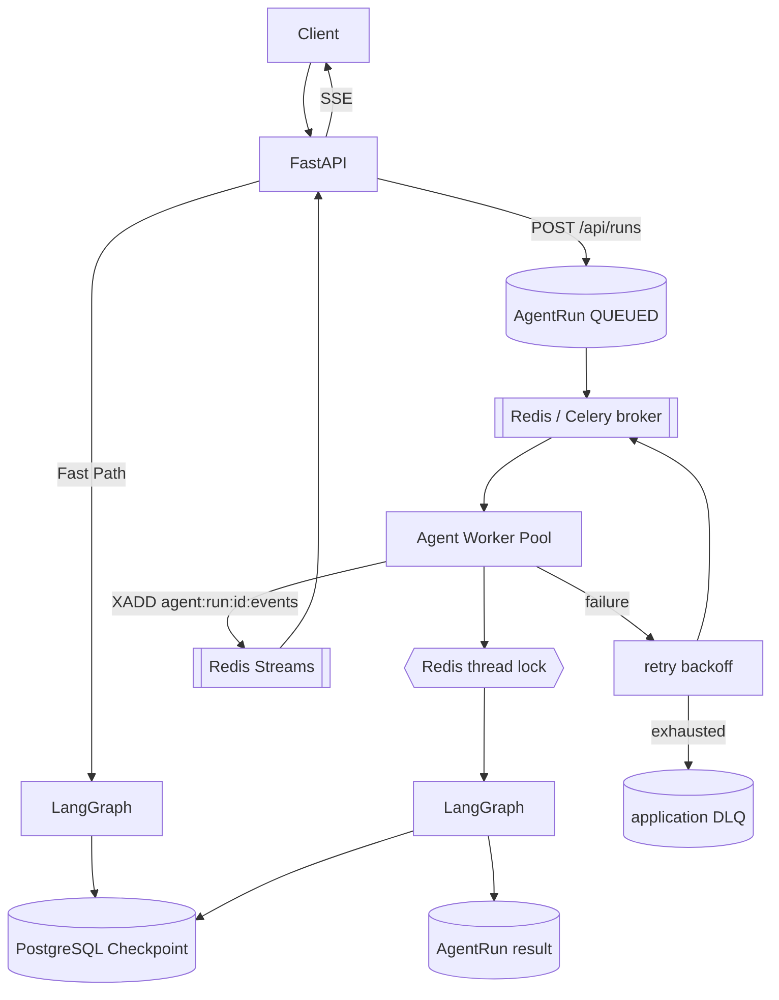

# Async Agent Worker Architecture（基础已实现；深化为设计）

> Status: 基础链路 **IMPLEMENTED**；本文"深化设计"部分为 DESIGN（下一阶段）。
> **明确区分已实现 / 设计**，不得把设计当成已实现。
> 当前实现的事实权威是 [distributed-agent-runtime.md](distributed-agent-runtime.md)
> 与 [docs/reference/current-state.md](../reference/current-state.md)；本文只描述
> "接下来还想做什么"，凡是已实现的能力都只出现在下面的"已实现"清单里。
>
> 已实现基础：Celery + Redis broker、`runtime/tasks.py`、`runtime/dispatch.py`、
> `POST/GET /api/runs`、`POST /api/runs/{run_id}/cancel`、
> `GET /api/runs/{run_id}/events`、`GET /api/runs/dead`、AgentRun 真相源、
> worker 消费 `run_id`、`acks_late` / `reject_on_worker_lost` / `visibility_timeout`、
> retry 基础、dead-letter state + 人工重放 CLI、Redis Stream 事件回传、
> 执行期间 lease 续租、软/硬超时。
> 本文的 **worker pool autoscaling / 多队列 / backpressure / fencing token /
> 优雅停机 / K8s** 为设计。

## 目标

把长任务从 API 进程解耦到独立 worker pool，支持持久调度、重试、DLQ、取消、
跨进程事件回传，同时保持同步快路径（`/api/chat` + SSE）不变。

## 目标架构

## ID 语义

四个概念严格区分（`thread_id` / `run_id` / `task_id` / `AgentRun`），另外工具侧
还有一个业务幂等键：

| 概念 | 含义 | 生成 |
|---|---|---|
| `thread_id` | 对话级（== session_id == LangGraph thread） | 会话创建时 |
| `run_id` | 单轮 Graph 执行（== `agent_runs.id`） | 每次请求 |
| `task_id` | 队列消息 / worker 执行 ID（Celery task id） | 入队时 |
| `AgentRun` | 业务运行记录（`agent_runs` 行），状态真相源 | 落库时 |
| `idempotency_key`（工具侧） | 有副作用 tool 的幂等键，`operation_key = run_id:tool_call_id` | tool 调用边界 |

## 已实现（第一阶段 foundation）

- `POST /api/runs` 创建 Run + 入队即返回；`GET /api/runs/{id}` 查询；
  `GET /api/runs/dead` 查询 DLQ；`POST /api/runs/{id}/cancel` 协作式取消；
  `GET /api/runs/{id}/events` 事件流转 SSE。
- Celery + Redis worker；`acks_late` + `reject_on_worker_lost` +
  `visibility_timeout`；payload 仅 `run_id`。
- per-thread Redis 锁（worker 路径 + API 执行边界共用同一 key）。
- transient retry（指数退避 + jitter + max attempts）、permanent → FAILED、
  retry 用尽 → `DEAD_LETTER` + `agent_dead_letters`。
- **DLQ 人工重放闭环**：`RunService.requeue_dead_letter` +
  `scripts/replay_dead_run.py`（复用原 `run_id`，保持工具幂等键有效）。
- tool 幂等 ledger + `execute_idempotent_operation`。
- worker crash → broker redelivery → lease 接管 → **从 checkpoint 续跑**
  （集成测试 + `make runtime-chaos` 验证）。
- **Cross-process 事件回传**：worker `XADD` 到 Redis Stream
  `agent:run:{run_id}:events`，API `XREAD` 转 SSE，支持 `Last-Event-ID` 续读；
  过期 stream 时以 `agent_runs` 最终状态为准（事件流不是业务真相源）。
- **执行期间 lease 续租**（`_heartbeat_loop` 续 DB lease + Redis lock TTL）；
  软/硬超时（`AGENT_RUN_TASK_SOFT_TIME_LIMIT` / `AGENT_RUN_TASK_TIME_LIMIT`）。
- `CANCELLED` 状态 + 协作式取消；未开始的 run 不再执行，已 `RUNNING` 的不强杀，
  调用方轮询确认终态。

## 深化设计（下一阶段，未实现）

### Worker Pool 与扩缩容
- 多队列（按 run 优先级/类型）、worker 并发度、独立 worker deployment。
- 队列深度 / active run / queue wait 指标驱动 HPA。

### Retry / DLQ 深化
- 每类错误独立退避策略；DLQ 支持批量 replay / 丢弃 / 导出。
- DLQ 运营指标告警（当前只有 `agent_run_dead_letter_total` 与
  `agent_run_dead_letter_replay_total` 计数）。

### Fencing token（关键缺口）
- 见 [distributed-agent-runtime.md §5.1](distributed-agent-runtime.md)：lease 续租
  已实现，但**没有** fencing token / DB version check。pause 超过 TTL 的旧 worker
  不会被强制中止。加 fencing token 是下一步。

### Backpressure 与优雅停机
- 队列背压：入队限流、最大 in-flight、拒绝策略（`429/503`）。
- worker `SIGTERM` 优雅停机等待当前任务（当前依赖 Celery 软/硬超时）。

## 不在本阶段

Kafka / RabbitMQ / Kubernetes 真集群 / Temporal / Saga / Outbox / Service Mesh /
分布式事务。当前 Redis + PostgreSQL + Celery 已覆盖需求。

## 相关

- [ADR-009](../decisions/009-distributed-agent-runtime.md)
- [docs/design/distributed-agent-runtime.md](distributed-agent-runtime.md)
- [docs/design/runtime-state-ownership.md](runtime-state-ownership.md)
