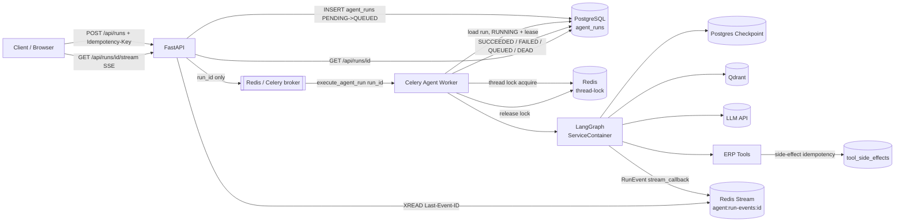
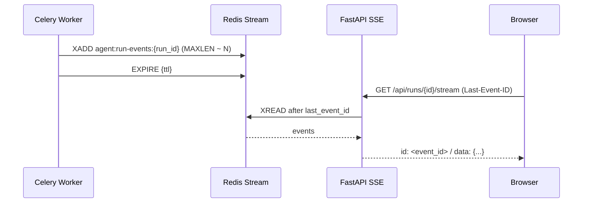
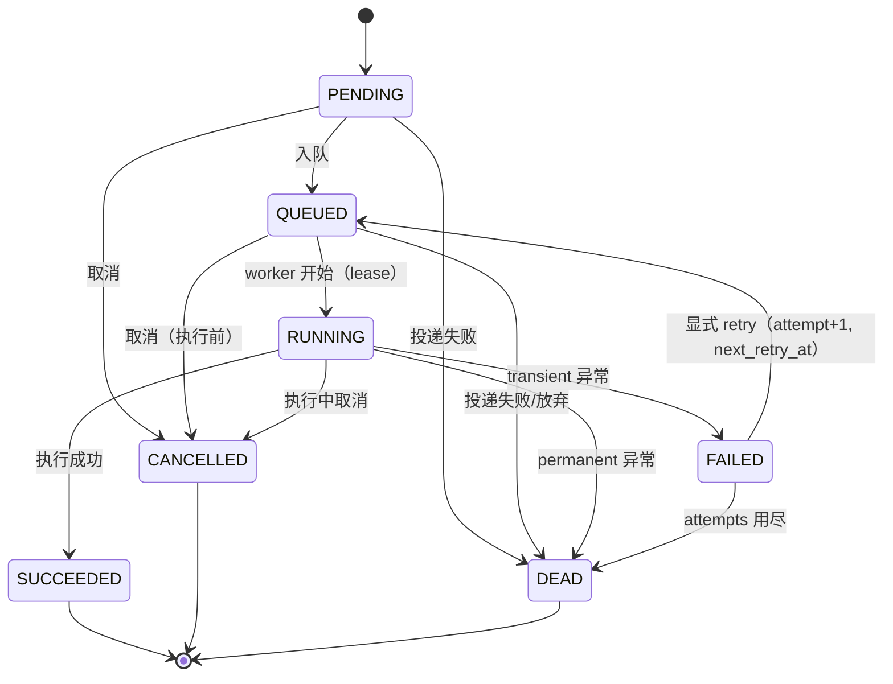

# 分布式 Agent Runtime（异步 Run + Celery Worker）

> 状态：`IMPLEMENTED / LOCALLY VERIFIED`（本地单测 + 集成测试）。
> 未在 Kubernetes 或真实生产 HA 环境验证；不得宣称生产级高可用已验证。

## 1. 目标

把长耗时 LangGraph Run 从 FastAPI 进程解耦到独立 worker：

- API 重启不再杀死正在执行的 Agent；
- API 与 Agent workload 可分别扩缩；
- 长任务不再占用 Web 进程；
- Run 生命周期持久化（PostgreSQL `agent_runs`），有独立调度能力。

可靠性目标（本文件重点）：thread 串行、HTTP/投递/副作用幂等、错误分类与
有界重试、DEAD 兜底。

## 2. 架构

- **API**：只创建 run 并入队（`202 Accepted`），不拥有执行生命周期；SSE 端点
  从 Redis Stream 读取事件转发给浏览器。
- **Redis/Celery**：仅调度。队列消息只携带 `run_id`，不携带 prompt/state。
- **Worker**：从 PostgreSQL 加载 run，复用与 API 相同的 `ServiceContainer`
  （LLM / RAG / Tool Registry / Checkpointer / Orchestrator），执行 `graph.ainvoke`，
  并把 graph 的 `stream_callback` 事件写入 Redis Stream。
- **PostgreSQL `agent_runs`**：业务状态真相源。
- **Postgres Checkpoint**：LangGraph 图状态（thread_id == session_id），跨 worker/重启恢复。
- **Redis thread-lock**：同一 thread 的 Run 串行；不同 thread 并行。
- **`tool_side_effects`**：写操作工具的应用层幂等记录。
- **Redis Stream（`agent:run-events:{run_id}`）**：临时流式通道，非真相源。

### 2.1 跨进程 Agent 事件流（Worker → Redis Stream → API SSE）

背景：Graph 搬到 Celery Worker 后，API 与 Graph 不在同一进程，
`api/routes/chat.py` 的进程内 `asyncio.Queue` 无法继续工作。

事件模型（`runtime/events.py`）：`event_id` / `run_id` / `thread_id` / `type` /
`timestamp` / `sequence` / `payload`；类型含 `run_queued`、`run_started`、`status`、
`thinking`、`rag_status`、`agent_switch`、`tool_call`、`tool_result`、`chunk`、
`content_complete`、`run_completed`、`run_failed`、`run_cancelled`，保留现有
前端 SSE 语义（顶层 `type`/`content`）。

- **发布（worker）**：`RunEventPublisher` 协议 + `StreamRunEventPublisher`；
  graph 继续用 `stream_callback` 抽象，由 worker 经 contextvar 注入 publisher，
  Agent node 不直接 import redis。发布失败 best-effort，不影响 run 执行。
- **读取（API）**：`GET /api/runs/{run_id}/stream` 读取 Stream → SSE；
  支持 `Last-Event-ID`（浏览器 EventSource 断线自动携带）从上次 event_id 续读。
- **Stream 限制**：`XADD MAXLEN ~`（`RUN_EVENT_STREAM_MAXLEN`）+ `EXPIRE`
  （`RUN_EVENT_STREAM_TTL_SECONDS`）+ 单事件大小上限（`RUN_EVENT_MAX_BYTES`，
  超限截断 content）+ 敏感字段过滤（api_key/password/token/...）。
- **慢消费者 / 断线**：客户端断开时生成器退出；每批 `XREAD COUNT` 限制 backlog；
  idle 超时（`RUN_EVENT_SSE_IDLE_TIMEOUT_SECONDS`）关闭；周期性查 DB 终态。
- **安全**：SSE 端点与 `GET /api/runs/{id}` 一样校验 run ownership / RBAC，
  猜 `run_id` 不能读取他人事件。
- **最终状态**：Redis Stream 不是真相源。Stream 过期/缺失时，SSE 回退
  `GET /api/runs/{id}` 的 PostgreSQL 最终状态（`source=db_final`）。
- **兼容性**：`/api/chat/stream`（legacy 进程内直连）保持不变；分布式路径是
  `/api/runs` + `/api/runs/{id}/stream`，不在一个 PR 强制重写前端。

三者职责不同：

| 组件 | 角色 | 生命周期 |
|------|------|---------|
| Redis Stream | ephemeral streaming channel | TTL / MAXLEN |
| PostgreSQL AgentRun | durable run state | 持久 |
| PostgreSQL LangGraph Checkpoint | durable graph execution state | 持久 |

## 3. 四个不同概念（不要混用）

| 概念 | 存储 | 键 | 作用 |
|------|------|----|------|
| **AgentRun** | `agent_runs` 表 | `run_id` | 一次异步执行请求的业务生命周期 |
| **LangGraph Thread** | 官方 checkpoint 表 | `thread_id`（== `session_id`） | 图状态快照 / 断点续传 |
| **Celery Task Result** | 未启用（`task_ignore_result=True`） | Celery task id | 调度结果，**不是真相源** |
| **Session** | SessionManager（memory/file/Redis） | `session_id` | 服务端对话窗口/摘要 |

AgentRun != LangGraph Thread != Celery Task Result != Session。

## 4. 状态机

- 终态：`SUCCEEDED` / `CANCELLED` / `DEAD`。
- **禁止** `SUCCEEDED -> RUNNING`、`FAILED -> RUNNING`；重试只能走
  `FAILED -> QUEUED` 且 `attempt += 1`。
- 迁移由 `runtime/statuses.py` 定义，`runtime/run_service.py` 通过
  **原子条件更新**（`UPDATE ... WHERE status IN (...)`）强制，避免并发
  cancel 与 worker 互相覆盖。

### 4.1 Thread 并发语义

- 不同 thread 可并发。
- 同一 thread 默认串行：`runtime/thread_lock.py` 以 `agent:thread-lock:{thread_id}`
  为 key 加锁；worker 执行期间持有，`finally` 释放。
- **安全锁语义**：owner token + TTL（lease）+ Redis Lua compare-and-delete /
  compare-and-expire；只能 owner 解锁，禁止 `SETNX ... DEL key`（会误删其他
  worker 重新获得的锁）。
- 后端：`redis`（生产，跨 worker/副本）/ `memory`（开发/测试，仅单进程）/
  关闭时 no-op（显式回滚）。
- **等待策略（不 busy-loop）**：同 thread 被占用时 run 保持 `QUEUED`，
  写 `next_retry_at` 并以 `countdown` 延迟重新投递；竞争不消耗 attempt，
  不计为失败。

## 5. 失败分类、重试与 DEAD

### 5.1 错误分类（`runtime/errors.py`）

| 类别 | 例子 | 是否 retry |
|------|------|-----------|
| `transient` | 网络抖动、连接错误、部分 5xx | 是 |
| `timeout` | 执行超时 | 是 |
| `lock_backend` | Redis 锁后端不可用 | 是 |
| `permanent` | 参数错误、权限错误、业务拒绝、4xx | 否 |
| `cancelled` | 取消信号 | 否 |

未知异常默认按 `transient` 处理，但受 `max_attempts` 硬上限约束，不会无限重试。

### 5.2 Retry（指数退避 + jitter，有界）

Worker 异常时（`runtime/executor.py`）：

| 条件 | 结果 |
|------|------|
| transient 且 `attempt + 1 < max_attempts` | `FAILED -> QUEUED(attempt+1)`，写 `next_retry_at`，按退避 `countdown` 重新投递 |
| transient 且 `max_attempts <= 1`（未配置重试） | 保持 `FAILED`（终态） |
| transient 且 attempts 用尽 | `FAILED -> DEAD`（终态） |
| permanent | `RUNNING -> DEAD`（不 retry） |
| cancelled | `RUNNING -> CANCELLED` |

退避：`AGENT_RUN_RETRY_BASE_DELAY * 2**attempt`，封顶 `AGENT_RUN_RETRY_MAX_DELAY`，
叠加 `AGENT_RUN_RETRY_JITTER` 全抖动。记录 `attempt` / `last_error` / `error_type` /
`next_retry_at`。

### 5.3 DEAD task

attempts 用尽或 permanent 时 `status=DEAD`，保存 `error_type`、脱敏
`error_message`（截断 2000 字符，绝不存 secret）、`attempt`、`finished_at`。
管理员可经 `GET /api/runs/dead` 观测。

## 6. 幂等（三层）

### 6.1 HTTP Idempotency

- `POST /api/runs` 接受 `Idempotency-Key` header（兼容 body `idempotency_key`）。
- 作用域：`user + endpoint + idempotency_key`（`build_idempotency_scope`），
  不同用户/端点可复用同一原始 key。
- **数据库唯一约束**（`agent_runs.idempotency_key` unique）保证只创建一个 run，
  不依赖 Redis；重复请求返回原 `run_id`（`202`）。

### 6.2 Celery Delivery Idempotency

- Worker 收到 `run_id` 先查 AgentRun；`SUCCEEDED/CANCELLED/DEAD` 直接返回，不重复执行。
- `RUNNING` 结合 worker ownership + lease：`mark_running` 写入 `worker_id` +
  `lease_expires_at` + `heartbeat_at`；执行期间后台心跳续租。
  - lease 有效且归属其他 worker -> 不执行（重复投递）；
  - lease 过期 -> 接管（崩溃恢复），避免"看到 RUNNING 就永久卡死"。

### 6.3 Tool Side Effect Idempotency

- 写操作工具在注册时标 `side_effect=True`，可提供业务 `operation_key`
  （如 `refund:{user}/{order}/refund-action`）。
- 执行前在 `tool_side_effects`（唯一约束 `tool_name + operation_key`）声明：
  - 已 `SUCCEEDED` 且请求指纹一致 -> 返回已存结果，**不再次执行**；
  - 已 `SUCCEEDED` 但指纹不同 -> `PermanentError`（业务冲突）；
  - 不存在/`PENDING`/`FAILED` -> 执行，成功后立即落库。
- 无 run 上下文时 fail closed（拒绝执行写操作）。
- 只读工具不经过此路径（避免无意义复杂度）。

## 7. API

| 方法 | 路径 | 说明 |
|------|------|------|
| POST | `/api/runs` | 创建并入队，`202 {run_id,status,thread_id}`；支持 `Idempotency-Key` |
| GET | `/api/runs/dead` | 管理员观测 DEAD run（需 admin/supervisor） |
| GET | `/api/runs/{run_id}` | 查询状态与结果（非 dev 模式校验归属） |
| GET | `/api/runs/{run_id}/stream` | 跨进程事件流 SSE；支持 `Last-Event-ID`，校验归属 |
| POST | `/api/runs/{run_id}/cancel` | 取消 `PENDING/QUEUED`；已 `RUNNING` 返回 `409` |

现有 `POST /api/chat`、SSE、WebSocket、多模态保持不变；异步 Run API 是新生产路径。

## 8. Worker 与优雅关闭

- Celery 配置：`task_acks_late=True`、`worker_prefetch_multiplier=1`、
  `task_reject_on_worker_lost=True`（worker 崩溃任务可重投递）。
- shutdown：`worker_shutting_down` 停止消费新任务；`worker_process_shutdown`
  关闭 runtime（checkpoint pool / httpx / Redis / thread lock），不破坏
  PostgreSQL Run 状态。
- worker 使用进程内持久事件循环（`runtime/async_support.py`），避免每个任务
  重建 loop 导致 async 客户端绑定失效。

## 9. 配置

| 变量 | 默认 | 说明 |
|------|------|------|
| `AGENT_RUN_DISPATCH` | `celery` | `celery` / `inline`（dev fallback） |
| `AGENT_RUN_QUEUE` | `agent_runs` | Celery 队列 |
| `AGENT_RUN_MAX_ATTEMPTS` | `3` | 最大尝试次数（硬上限） |
| `AGENT_RUN_TASK_SOFT_TIME_LIMIT` / `_TIME_LIMIT` | `120` / `180` | 任务超时（秒） |
| `AGENT_RUN_THREAD_LOCK_ENABLED` | `true` | thread 串行锁开关 |
| `AGENT_RUN_THREAD_LOCK_BACKEND` | `redis` | `redis` / `memory` |
| `AGENT_RUN_THREAD_LOCK_TTL_SECONDS` | `300` | 锁 lease |
| `AGENT_RUN_THREAD_LOCK_RETRY_DELAY_SECONDS` | `5` | 竞争延迟重调度 |
| `AGENT_RUN_LEASE_SECONDS` | `180` | worker ownership lease |
| `AGENT_RUN_HEARTBEAT_SECONDS` | `30` | 心跳间隔 |
| `AGENT_RUN_RETRY_BASE_DELAY` / `_MAX_DELAY` / `_JITTER` | `2` / `60` / `0.3` | 退避 |
| `CELERY_BROKER_URL` | 复用 `REDIS_URL` | broker |
| `CELERY_RESULT_BACKEND` | 空 | 不落结果（真相源是 `agent_runs`） |

Docker Compose 增加 `worker` 服务（与 API 共享 `DATABASE_URL` / `REDIS_URL` /
checkpoint / LLM 配置），`docker-compose.scale.yml` 可独立扩缩 worker。

## 10. Metrics

`agent_run_total{status}` / `agent_run_retry_total` / `agent_run_dead_total` /
`agent_run_duration_seconds` / `agent_run_queue_wait_seconds` /
`agent_worker_active` / `agent_worker_task_total` / `thread_lock_wait_seconds` /
`checkpoint_operation_seconds` /
`thread_lock_contention_total` / `idempotency_hit_total` /
`tool_idempotency_hit_total` / `run_event_publish_total` /
`run_event_publish_error_total` / `sse_connections` / `sse_reconnect_total` /
`run_event_lag_seconds`（`core/monitoring.py`）。

## 11. 投递语义（重要，不得夸大）

本实现是 **at-least-once delivery + application-level idempotency**：

- Celery 可能重复投递（`acks_late` + worker 崩溃重投递），也可能延迟投递；
- 我们不实现、也不声称端到端 **exactly-once delivery**；
- 重复投递由三层幂等收敛：终态直接返回、RUNNING+lease 防并发、写操作副作用
  表去重；
- 远程副作用成功与本地记录提交之间仍存在极小窗口（崩溃恰好发生在两者之间时
  无法 100% 去重）。要完全消除需要分布式事务或上游幂等 API。

## 12. 证据边界

- 本地单测覆盖：状态迁移、thread 串行/并行、重复投递、锁 owner/TTL、错误分类、
  retry/DEAD、HTTP 幂等、副作用崩溃重放；集成测试覆盖 API→DB→executor 全链路
  与真实 Redis Lua 锁。
- `docker compose up` 的双进程行为需在目标环境验证；本仓库未验证。
- **不宣称** Kubernetes / 真实生产 HA / 端到端 exactly-once / 生产级调度已验证。

## 13. 面试题与项目答案

**Q1：Celery 消息被重复消费怎么办？**

A：我们把 Celery 当 at-least-once 调度器，不依赖它去重。业务真相源是 PostgreSQL
的 `agent_runs`：worker 收到 `run_id` 先查状态，`SUCCEEDED/CANCELLED/DEAD` 直接
返回；`RUNNING` 用 worker_id + lease + heartbeat 判断归属，lease 有效时重复投递
不执行、过期才接管；同一 thread 由 Redis 分布式锁（owner token + TTL + Lua
compare-and-delete）串行化。HTTP 入口另有 `Idempotency-Key`（user+endpoint 作用域）
+ DB 唯一约束防重复建单。所以重复消费是收敛的，而不是靠"消息只来一次"。

**Q2：Worker 在退款成功之后宕机怎么办？**

A：退款属于写操作工具，执行前会在 `tool_side_effects` 以
`(tool_name, operation_key)` 唯一约束声明，成功后立即落库；worker 若在
checkpoint/run commit 前宕机，Celery 重投同 `run_id`，工具层发现该
operation_key 已 `SUCCEEDED` 且请求指纹一致，就直接返回已存结果，**不会再次退款**。
我们明确这是应用层幂等 + at-least-once：远程成功与本地记录提交之间的极小窗口
仍可能重复，需上游退款 API 支持幂等键才能完全消除，我们不声称端到端 exactly-once。
