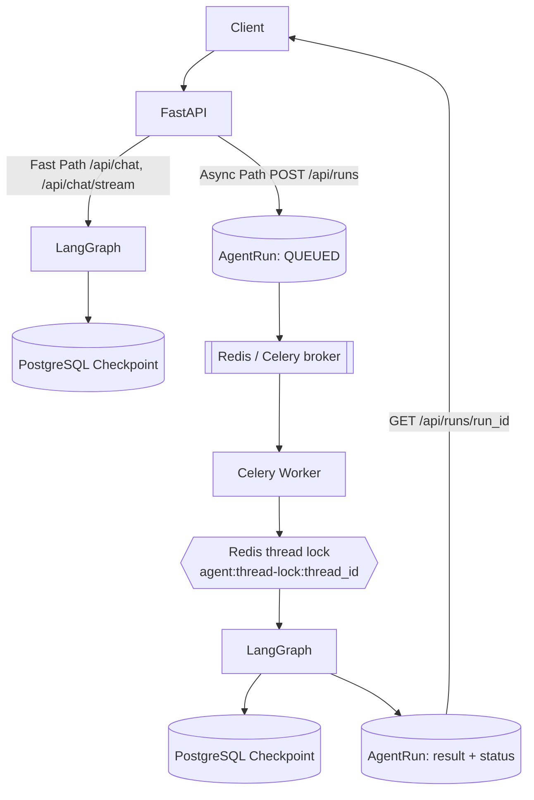

# 分布式 Agent Runtime（异步 Run + Celery Worker）

> Status: CURRENT（随 `runtime/` 实现同步）。本文描述**已实现并本地验证**的能力，
> 以及明确的能力边界。历史报告不得覆盖本文。

## 1. 目标与非目标

**目标**：在低改动成本下，把单进程内的 LangGraph Runtime 补强为
可横向扩展、可恢复、可验证、可解释的最小生产架构。

**非目标（Out of Scope，见 §9）**：Kafka / RabbitMQ / Kubernetes / HPA /
Temporal / Service Mesh / Redis Cluster / Postgres HA / Multi-region /
Saga / Outbox / Event Sourcing / CQRS / 全量微服务拆分 / SSE Redis Streams replay。

## 2. 架构

### Hybrid Architecture

- **Fast Path（保留）**：`POST /api/chat`、`POST /api/chat/stream`
  （FastAPI → LangGraph → SSE），适合低延迟客服问答。
- **Async Path（新增）**：`POST /api/runs` 创建 RunRecord 并立即入队（不等待
  Graph 完成）→ Celery worker 执行 → `GET /api/runs/{run_id}` polling。



### 三个 ID

| 概念 | 含义 | 生命周期 |
|---|---|---|
| `thread_id` | 对话级 ID（当前 == `session_id` == LangGraph thread） | 多轮会话复用 |
| `run_id` | 单轮 Graph 执行 ID（`agent_runs.id`） | 每次请求唯一 |
| `task_id` | 队列消息 / Worker 执行 ID（Celery task id） | 进入异步执行后存在 |

## 3. 状态机

`runtime/statuses.py` 定义合法迁移，`runtime/run_service.py` 在数据库层用
原子条件更新强制。

```text
QUEUED ──► RUNNING ──┬──► SUCCEEDED        (终态)
                     ├──► FAILED           (终态，permanent error，不重试)
                     ├──► RETRYING ──► RUNNING (transient error，退避后重试)
                     └──► DEAD_LETTER      (终态，retry 用尽)
```

- `attempt` 在 `mark_running` 时递增（已开始的执行次数）。
- `RUNNING` 携带 `worker_id` + `task_id` + `lease_expires_at`（ownership）。
- lease 过期可被其他 worker 接管（崩溃恢复）。

## 4. 数据模型

- `agent_runs`：Run 真相源。字段含 `thread_id / session_id / user_id / status /
  query / result / error_type / attempt / max_attempts / worker_id / task_id /
  lease_expires_at / heartbeat_at / next_retry_at / idempotency_key / trace_id`。
- `agent_dead_letters`：application-level DLQ（`run_id` 唯一，记录
  `attempt_count / max_attempts / error_type / error_code / error_message /
  worker_id / entered_at`）。
- `tool_side_effects`：写操作工具幂等 ledger（`(tool_name, operation_key)`
  DB 唯一约束）。

迁移：`alembic/versions/004_distributed_agent_runtime.py`。

## 5. 可靠性语义（诚实边界）

| 维度 | 保证 | 不保证 |
|---|---|---|
| Delivery | at-least-once（`task_acks_late` + `task_reject_on_worker_lost` + Redis `visibility_timeout`） | exactly-once |
| Idempotency | application-level run 幂等（终态重复投递 no-op；`idempotency_key` 唯一约束） | 端到端 exactly-once |
| Locking | 单 Redis 上的 per-thread 跨进程互斥（owner + TTL + 原子释放） | Redlock 集群 / 多 Redis 容灾 |
| Retry | transient/timeout 指数退避 + jitter + max_attempts 上限 | 无上限重试 |
| Checkpoint | external PostgreSQL 持久化；node/checkpoint-boundary 恢复 | 任意 Python 指令级无损恢复 |
| DLQ | application-level **dead-letter state / terminal failure foundation**（`agent_dead_letters` 可查询） | broker-native DLX；replay/requeue 运维闭环（未实现） |
| 工具副作用 | 同 Agent 不重复发起同一副作用（ledger 去重） | 下游系统端到端幂等（需下游接受 idempotency key） |

### 5.1 锁 TTL 过期边界（重要）

当前机制：Redis lock + owner token + TTL + Lua compare-and-delete。

- **能解决**：A 的锁超时被 B 获取后，A 的释放**不会**误删 B 的锁（owner-safe release）。
- **不能严格解决**：A 长时间 pause（GC/网络/宿主机卡顿）超过 TTL → B 获取锁 → A 恢复
  继续执行 → A 与 B 可能同时修改同一 thread。当前**没有** lease renewal / heartbeat /
  fencing token / DB version check。

当前缓解：`AGENT_RUN_THREAD_LOCK_TTL_SECONDS > AGENT_RUN_TASK_TIME_LIMIT + safety
margin`（启动校验，`core/config.py::validate_distributed_runtime_settings`）+
checkpoint/idempotency + 任务超时。若进入更严格生产场景，应增加 lease renewal 或
fencing token（下一阶段设计，不在本 Foundation 实现）。

## 6. 执行流程（Worker）

```text
consume task(run_id)
  ↓ load AgentRun
  ↓ terminal? → no-op（幂等）
  ↓ acquire thread lock（同 thread 互斥；拿不到 → 延迟重调度，不 busy-loop）
  ↓ RUNNING（attempt+1, worker lease）
  ↓ execute LangGraph（外部 checkpoint）
  ↓ success → SUCCEEDED
    transient → RETRYING + 退避重投递
    permanent → FAILED
    retry 用尽 → DEAD_LETTER + DLQ record
  ↓ release lock → ACK
```

## 7. 崩溃恢复

- Worker 崩溃：未 ACK 任务经 Redis `visibility_timeout` 重新可见，被另一
  worker 消费；lease 过期后 `mark_running` 接管（attempt+1），最终 `SUCCEEDED`。
- 失败节点可能重新执行，因此节点副作用必须幂等。
- 复现：
  `TEST_DISTRIBUTED_DB_URL=... TEST_REDIS_URL=... pytest tests/integration/test_worker_crash_recovery.py`
  或 `scripts/repro_worker_crash_recovery.sh`（SIGKILL worker → redelivery → success）。

## 8. 指标 / 日志

Prometheus（`core/monitoring.py`）：

```text
agent_runs_total{status}
agent_run_duration_seconds
agent_run_retry_total
agent_run_dead_letter_total
agent_thread_lock_contention_total
agent_worker_task_total{status}
```

日志携带 `trace_id / thread_id / run_id / task_id / attempt`；不记录 token /
API key / password / 完整敏感客户数据。

## 9. Future Work（不在本 PR）

- Redis Streams + resumable SSE（断线续读 / replay）。
- Kubernetes / HPA。
- 更强的 tool-side 幂等（下游 API 接受 idempotency key / operation ledger 对账）。
- 未来规模需要时再考虑 broker 升级。
