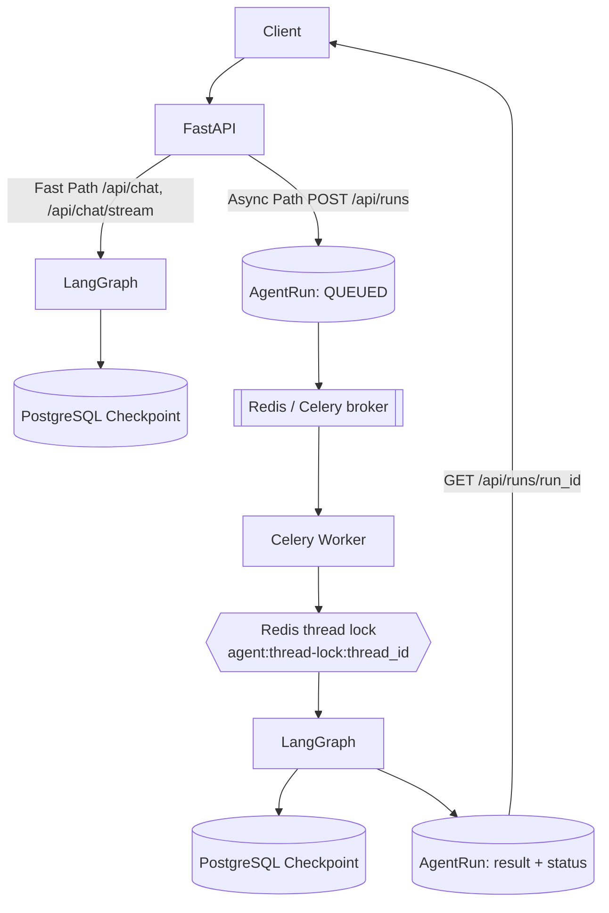

# 分布式 Agent Runtime（异步 Run + Celery Worker）

> Status: CURRENT（随 `runtime/` 实现同步）。本文描述**已实现并本地验证**的能力，
> 以及明确的能力边界。历史报告不得覆盖本文。

## 1. 目标与非目标

**目标**：在低改动成本下，把单进程内的 LangGraph Runtime 补强为
可横向扩展、可恢复、可验证、可解释的最小生产架构。

**非目标（Out of Scope，见 §10）**：Kafka / RabbitMQ / Kubernetes / HPA /
Temporal / Service Mesh / Redis Cluster / Postgres HA / Multi-region /
Saga / Outbox / Event Sourcing / CQRS / 全量微服务拆分 / fencing token。

## 2. 架构

### Hybrid Architecture

- **Fast Path（保留）**：`POST /api/chat`、`POST /api/chat/stream`
  （FastAPI → LangGraph → SSE），适合低延迟客服问答。
- **Async Path（新增）**：`POST /api/runs` 创建 RunRecord 并立即入队（不等待
  Graph 完成）→ Celery worker 执行 → `GET /api/runs/{run_id}` polling。



### 三个 ID

| 概念 | 含义 | 生命周期 |
|---|---|---|
| `thread_id` | 对话级 ID（当前 == `session_id` == LangGraph thread） | 多轮会话复用 |
| `run_id` | 单轮 Graph 执行 ID（`agent_runs.id`） | 每次请求唯一 |
| `task_id` | 队列消息 / Worker 执行 ID（Celery task id） | 进入异步执行后存在 |

### 2.1 多 Worker / 多副本部署的三个跨进程不变量

多 worker（`GUNICORN_WORKERS>1`）或多副本部署时，进程内状态**每 worker 一份**，
因此下列三项必须同时成立，否则 `core/config.py::validate_distributed_runtime_settings`
在生产启动时 fail-fast：

| # | 不变量 | 配置 | 承担的跨进程语义 |
|---|---|---|---|
| 1 | PostgreSQL checkpoint | `LANGGRAPH_CHECKPOINT_BACKEND=postgres` | LangGraph 图状态跨 worker/副本共享，重启可从 checkpoint 续跑（官方 `AsyncPostgresSaver`，生产 fail closed，绝不静默回退 `MemorySaver`） |
| 2 | Redis session | `SESSION_STORAGE_BACKEND=redis` | 会话滑动窗口/摘要跨 worker 共享，避免多副本分片与重启丢失 |
| 3 | Redis per-thread 锁 | `AGENT_RUN_THREAD_LOCK_ENABLED=true` + `AGENT_RUN_THREAD_LOCK_BACKEND=redis` | 同一 `thread_id` 跨进程串行（不同 thread 并行），key namespace `agent:thread-lock:{thread_id}`，owner token + TTL + Lua 原子 compare-and-delete |

异步路径另有 `AGENT_RUN_DISPATCH=celery`（生产必须；`inline` 仅开发/测试），
worker 与 API 进程**共用同一套 key namespace**，见
[runtime-state-ownership.md](runtime-state-ownership.md) 与
[distributed-runtime-runbook.md](../operations/distributed-runtime-runbook.md)。

## 3. 状态机

`runtime/statuses.py` 定义合法迁移，`runtime/run_service.py` 在数据库层用
原子条件更新强制。

```text
PENDING ──► QUEUED ──► RUNNING ──┬──► SUCCEEDED        (终态)
                                 ├──► FAILED           (终态，permanent error，不重试)
                                 ├──► RETRYING ──► RUNNING (transient error，退避后重试)
                                 └──► DEAD_LETTER      (终态，retry 用尽)
                └──► CANCELLED                     (终态，任意未终态均可迁入)
```

- 终态集合：`SUCCEEDED | FAILED | DEAD_LETTER | CANCELLED`；终态不可再迁出。
- `PENDING` 表示"已落库、尚未投递到队列"；默认创建路径直接写 `QUEUED`
  （保持 `POST /api/runs` 既有语义），两阶段流程可用
  `create_run(status=PENDING)` + `mark_queued()`。
- `CANCELLED` 由 `POST /api/runs/{run_id}/cancel` 写入，**协作式**：已进入 `RUNNING`
  的执行不会被强行中断，调用方需轮询确认终态。
- `attempt` 在 `mark_running` 时递增（已开始的执行次数）。
- `RUNNING` 携带 `worker_id` + `task_id` + `lease_expires_at`（ownership）。
- lease 过期可被其他 worker 接管（崩溃恢复）。

## 4. 四个 ID / 概念（严格区分）

| 概念 | 含义 | 生命周期 |
|---|---|---|
| `thread_id` | 对话级 ID（当前 == `session_id` == LangGraph thread） | 多轮会话复用 |
| `run_id` | 单轮 Graph 执行 ID（`agent_runs.id`） | 每次请求唯一 |
| `task_id` | 队列消息 / Worker 执行 ID（Celery task id，`agent_runs.task_id`） | 进入异步执行后存在 |
| `AgentRun` | 业务运行记录（`agent_runs` 行的整体），状态真相源 | 落库后永久可查 |

## 4. 数据模型

- `agent_runs`：Run 真相源。字段含 `thread_id / session_id / user_id / status /
  query / result / error_type / attempt / max_attempts / worker_id / task_id /
  lease_expires_at / heartbeat_at / next_retry_at / idempotency_key / trace_id`。
- `agent_dead_letters`：application-level DLQ（`run_id` 唯一，记录
  `attempt_count / max_attempts / error_type / error_code / error_message /
  worker_id / entered_at`）。
- `tool_side_effects`：写操作工具幂等 ledger（`(tool_name, operation_key)`
  DB 唯一约束）。

迁移：`alembic/versions/004_distributed_agent_runtime.py`。

## 5. 可靠性语义（诚实边界）

| 维度 | 保证 | 不保证 |
|---|---|---|
| Delivery | at-least-once（`task_acks_late` + `task_reject_on_worker_lost` + Redis `visibility_timeout`） | exactly-once |
| Idempotency | application-level run 幂等（终态重复投递 no-op；`idempotency_key` 唯一约束） | 端到端 exactly-once |
| Locking | 单 Redis 上的 per-thread 跨进程互斥（owner + TTL + 原子释放） | Redlock 集群 / 多 Redis 容灾 |
| Retry | transient/timeout 指数退避 + jitter + max_attempts 上限 | 无上限重试 |
| Checkpoint | external PostgreSQL 持久化；node/checkpoint-boundary 恢复 | 任意 Python 指令级无损恢复 |
| DLQ | application-level **dead-letter 闭环**：`agent_dead_letters` 不可变历史 + `GET /api/runs/dead` + `RunService.requeue_dead_letter` + `scripts/replay_dead_run.py` 人工重放（**复用原 run_id**，避免绕过工具幂等键） | broker-native DLX |
| 工具副作用 | 同 Agent 不重复发起同一副作用（ledger 去重） | 下游系统端到端幂等（需下游接受 idempotency key） |

### 5.1 锁 TTL 过期边界（重要）

当前机制：Redis lock + owner token + TTL + Lua compare-and-delete。

- **能解决**：A 的锁超时被 B 获取后，A 的释放**不会**误删 B 的锁（owner-safe release）。
- **已实现的缓解**：执行期间 lease **续租** —— `runtime/executor.py::_heartbeat_loop`
  按 `AGENT_RUN_HEARTBEAT_SECONDS` 周期同时续 DB ownership lease 与 Redis lock TTL，
  观测指标为 `agent_thread_lease_renewed_total` 与 `agent_worker_heartbeat`。
  另有启动校验强制
  `AGENT_RUN_THREAD_LOCK_TTL_SECONDS > AGENT_RUN_TASK_TIME_LIMIT + safety margin`。
- **仍不能严格解决**：A 长时间 pause（GC / 网络 / 宿主机卡顿）**超过 TTL** → B 获取锁 →
  A 恢复继续执行 → A 与 B 可能同时修改同一 thread。当前**没有 fencing token /
  DB version check**。生产级 fencing 仍是未来工作，不假装已解决。
  A 的最终写入会被 `from_statuses={RUNNING}` 条件更新挡下（租约已被 B 接管后 A 不再
  是 owner），因此终态不会被旧 worker 覆盖，但**节点级副作用**仍依赖工具幂等 ledger。

设计文档：[async-agent-worker-architecture.md](async-agent-worker-architecture.md)
（fencing token 属于该文档的"设计/未来"部分）。

## 6. 执行流程（Worker）

```text
consume task(run_id)
  ↓ load AgentRun
  ↓ terminal? → no-op（幂等）
  ↓ acquire thread lock（同 thread 互斥；拿不到 → 延迟重调度，不 busy-loop）
  ↓ RUNNING（attempt+1, worker lease）
  ↓ execute LangGraph（外部 checkpoint）
  ↓ success → SUCCEEDED
    transient → RETRYING + 退避重投递
    permanent → FAILED
    retry 用尽 → DEAD_LETTER + DLQ record
  ↓ release lock → ACK
```

## 7. 崩溃恢复

- Worker 崩溃：未 ACK 任务经 Redis `visibility_timeout` 重新可见，被另一
  worker 消费；lease 过期后 `mark_running` 接管（attempt+1），最终 `SUCCEEDED`。
- 失败节点可能重新执行，因此节点副作用必须幂等。
- 复现：
  `TEST_DISTRIBUTED_DB_URL=... TEST_REDIS_URL=... pytest tests/integration/test_worker_crash_recovery.py`
  或 `scripts/repro_worker_crash_recovery.sh`（SIGKILL worker → redelivery → success）。

## 8. 指标 / 日志

Prometheus 指标在 `core/monitoring.py` 注册，`runtime/metrics.py` 只做安全转发
（monitoring 不可用时静默 no-op，绝不影响执行路径）。**下列名称与
`tests/unit/test_runtime_metrics_contract.py` 的契约断言一致**，不要凭印象改写：

```text
agent_run_total{status}                      # 按终态计数
agent_run_duration_seconds                   # 执行耗时 histogram
agent_run_queue_wait_seconds                 # queued_at -> started_at 排队等待
agent_run_retry_total
agent_run_failed_total
agent_run_dead_letter_total
agent_run_dead_letter_replay_total           # DLQ 人工重放
agent_run_idempotency_hit_total              # run 级终态重复投递 no-op
agent_run_inflight                           # 当前在执行 run 数
agent_thread_lease_acquire_total
agent_thread_lease_contention_total          # 同 thread 竞争
agent_thread_lease_wait_seconds
agent_thread_lease_renewed_total{outcome}    # 执行期间续租结果
agent_worker_active
agent_worker_task_total{status}
agent_worker_heartbeat{outcome}              # 心跳续租结果
agent_checkpoint_recovery_total{mode}        # 是否从已有 checkpoint 恢复
agent_tool_idempotency_hit_total             # 工具副作用 ledger 命中
checkpoint_errors_total
```

> 高基数约束：`agent_*` 指标**不得**带 `run_id` / `thread_id` / `user_id` / `query` /
> `session_id` / `idempotency_key` / `tool_call_id` / `error_message` 标签，由
> `test_no_high_cardinality_labels_on_agent_metrics` 断言。

日志携带 `trace_id / thread_id / run_id / task_id / attempt`；不记录 token /
API key / password / 完整敏感客户数据。

## 9. Run 事件流（已实现）

worker 把 run 生命周期事件写入 Redis Stream `agent:run:{run_id}:events`
（`runtime/events.py`），API 通过 `GET /api/runs/{run_id}/events` 转 SSE，支持
`Last-Event-ID` 断点续读。

**诚实的投递语义**：best-effort resumable，**不是** exactly-once，也不是
at-most-once。单连接内 cursor 单调前进因此不重复；但用较旧 `Last-Event-ID` 重连会
**重放已处理事件**（重复）；`replay=false`（cursor `$`）跳过历史与 idle 超时会造成
缺口；`XADD ... MAXLEN ~ N` 是**近似**裁剪，被裁掉的历史不可恢复，且近似裁剪**不是
硬上界**（可能仍多于 N 条）。

定位上它**不是业务真相源**：run 权威状态永远是 `agent_runs` 表
（`GET /api/runs/{run_id}`）。事件负载走字段白名单，query / 用户标识 / 凭据不入流。
上述语义由 `tests/integration/runtime/test_event_delivery_semantics.py` 实测锁定。

## 10. Future Work（确实未实现）

- Kubernetes / HPA 与 worker pool autoscaling。
- **Fencing token / DB version check**（见 §5.1：lease 续租已实现，fencing 未实现）。
- 更强的 tool-side 幂等（下游 API 接受 idempotency key / operation ledger 对账）。
- 队列背压（入队限流、最大 in-flight、拒绝策略）、worker `SIGTERM` 优雅停机。
- broker 升级（当前 Redis 单实例满足需求）。
- 真实生产集群 / 多副本长期运行的证据（见 Level 3 边界）。
