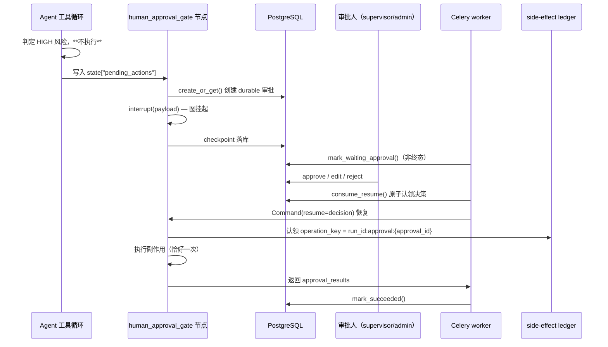

# Human-in-the-Loop：高风险工具副作用的人工审批治理

> Status: CURRENT。本文的每条能力声明都对应可执行测试；**证据等级见 §9**，
> 未验证项一律标注 `NOT_VERIFIED`，不因"看起来合理"而升级措辞。

## 1. 问题：为什么需要它

多智能体客服系统会调用**写操作**工具（退款、改单、建工单、发消息、ERP 写入）。
这些副作用一旦执行，外部世界的状态就变了。对低风险动作（查订单、查产品），
自动执行是对的；对高风险动作（退款、赔付、投诉升级），"自动执行"的代价是
**真实的金钱与合规风险**，且事后无法撤销。

业界通行的失败模式是"加一个人工确认弹窗"——但那只解决了一半：

- 弹窗可以被绕过（Agent 直接调工具，不经过 UI）；
- 弹窗状态活不过进程重启（点了"是"但 worker 崩了，没人知道）；
- 弹窗无法证明"谁批的"（审计缺失）；
- 弹窗管不住"点了是之后被执行两次"（at-least-once 投递）。

因此本模块**不是**一个 UI 组件，而是一条**服务端治理边界**：判定在服务端、
留痕在服务端、执行受服务端幂等账本约束。

## 2. 风险模型

风险分级是治理的输入。分错的后果是双向的：

- 把 LOW 当 HIGH → 普通问答被拖进审批流程，客服人效崩塌（治理误伤）；
- 把 HIGH 当 LOW → 高风险写操作静默放行（治理失效）。

### 分级维度

`core/hitl/risk.py::classify_risk`，优先级从高到低：

1. **工具显式声明**（`ToolRegistry.register(..., risk_level="high")`）——
   风险语义写在工具定义处，而不是散落在环境变量里；
2. **工具名白名单**（`HITL_HIGH_RISK_TOOLS` / `HITL_MEDIUM_RISK_TOOLS`）——
   逗号分隔、大小写不敏感；
3. **金额阈值**（`HITL_HIGH_AMOUNT_THRESHOLD`）——提案参数中任一金额字段
   ≥ 阈值即判 HIGH。**覆盖白名单之外的大额写操作**：一个没被列入白名单的工具，
   改一次订单只退 50 元是 MEDIUM，改成退 50000 元就是 HIGH；
4. **默认 LOW**。

### 三档语义

| 等级 | 语义 | 治理动作 |
|---|---|---|
| `LOW` | 只读查询 | 直接执行，不记录审批 |
| `MEDIUM` | 低风险写（如建工单） | 直接执行，**可**由白名单提升为 HIGH |
| `HIGH` | 退款 / 改单 / 大额赔付 / 投诉升级 / ERP 写 | **必须**人工审批 |

### 只对 HIGH 设闸

`requires_approval()` 只认 HIGH。`HITL_ENABLED=false` 或没有 run 上下文
（`/api/chat` 实时快路径）时**不拦**——快路径没有 durable checkpoint，
拦了也无法挂起与恢复，假装覆盖反而是虚假的安全感。

### 一处刻意的 fail-closed

`agents/base_agent.py::_should_gate_tool` 在**无法判定**时返回 `True`
（挂起），而不是 `False`（放行）。理由：判定失败时，"挂起等人看一眼"的代价
远低于"静默放行一笔退款"。这不是"更安全"的姿态问题，而是明确选了
**错误方向的默认值**。

## 3. 架构

### 执行流



### 图的位置

闸门节点插在**协作模式与 `final_response` 之间**：

```
sequential/parallel/consultation/hierarchical/react
        └─► human_approval_gate ─► final_response
```

- 必须在协作节点**之后**：工具副作用由 Agent 工具循环发起（发生在协作节点内）；
- 必须在 `final_response` **之前**：被拒绝时不能让 Agent 对客户宣称"已退款"。

### 新增非终态 `WAITING_APPROVAL`

`runtime/statuses.py`。它**不是**成功也**不是**失败——副作用还没发生，
等待人也不是重试预算的一部分。两个关键取舍：

- **不进 `EXECUTABLE_STATUSES`**：通用队列轮询不会把没人处理的审批捞起来
  （否则变成忙循环，持续占用 worker 并刷 checkpoint）。只有审批 API
  显式 dispatch 才能恢复；
- **`WAITING_APPROVAL → RUNNING` 不递增 `attempt`**：走
  `RunService.mark_resumed_running()` 而非 `mark_running()`。若复用后者，
  `AGENT_RUN_MAX_ATTEMPTS`（默认 3）会被"等人审批"消耗掉——人等 3 小时，
  审批还没落地 run 就 `DEAD_LETTER` 了。

保留 `→ DEAD_LETTER` / `→ CANCELLED` 逃生口，避免审批被永久搁置时 run 无处可去。

## 4. 持久化

`human_approvals` 表（`alembic 006_add_human_approvals`），与 `agent_runs`、
`tool_side_effects` 同属 durable 业务真相。

### 状态机

```
PENDING ──► APPROVED   (approve / edit)
        ├─► REJECTED   (reject)
        └─► EXPIRED    (TTL 到期，按拒绝处理但可区分统计)
```

三者皆终态。

### 幂等基础

唯一约束 `uq_human_approvals_proposal (run_id, action, proposal_fingerprint)`：

- `create_or_get()` 按同一三元组**复用**同一条审批 → at-least-once 重投递
  不会重复打扰审批人；
- 换参数 = 换提案 = 新审批 → 不能借旧审批蒙混过关。

### 脱敏留痕

`proposal` 存的是**脱敏后**的提案（`core/hitl/sanitize.py`）。审批表是长期
留痕，若不脱敏，它同时是凭据泄漏通道和超大载荷放大器。

刻意**不用** `runtime/events.py` 的事件白名单语义：事件流只保留 run_id/status
这类低基数运维字段，而审批要留存的恰恰是 `proposal`——审批人必须看到
"退多少、哪个订单号、改成什么"，白名单会把提案整个抹掉，审批退化成盲批。
因此这里是**黑名单 + 定长截断**：保留业务可判定字段，凭据类字段替换为掩码，
并**保留 key**（让人看得出"这里原本有值、已被隐藏"）。

> 掩码是纵深防御，不是加密。`proposal` 不含完整卡号/密钥，但含订单号与金额，
> 仍按敏感业务数据对待（表访问受控、日志不打印原文）。

## 5. 安全

### 三层，缺一不可

| 层 | 强制内容 | 位置 |
|---|---|---|
| RBAC | 只有 `admin` / `supervisor` 可读可决策；`customer` / `agent` 永无审批权 | `api/routes/approvals.py::_require_reviewer` |
| 职责分离 | `reviewer_id != user_id`（发起人） | `core/hitl/approval_service.py::_guard_reviewer`（**service 层**） |
| 审批人身份 | 拿不到身份 → 401 | `_reviewer_id` |

**职责分离在 service 层强制而非只在 API 层**：内部脚本、定时任务等非 HTTP
调用方同样受约束，API 层不能是唯一防线。

> 历史上 snapshot 版本的 API 层职责分离是 **fail-open** 的：它去查 *run* 的
> `user_id` 再比对，run 查不到就等于没检查。本实现直接用**审批记录自身的**
> `user_id` 比对，无间接依赖。

**审批人身份不可退化成固定串**：admin-token 路径没有 user 对象，此时要求显式
`X-Reviewer-Id`；否则所有 admin-token 决策会共享同一个 `reviewer_id="admin-token"`，
审计与职责分离同时失效。

### 审批 TTL：到期按拒绝，绝不默认放行

`HITL_APPROVAL_TTL_SECONDS`（默认 3600s）。到期落 `EXPIRED` 并按拒绝处理——
"等太久就默认批准"等于把审批变成无人值守的写操作。`EXPIRED` 与显式 `REJECTED`
分开统计，因为二者的运营含义不同（前者是积压，后者是业务否决）。

TTL 在三个位置收敛：决策时（`decide`）、读取时（`list_pending` 顺带收敛）、
恢复时（`consume_resume` 顺带收敛并作为拒绝返回，图不会死等）。

## 6. 幂等：两条独立防线

这是本模块最容易被做错、也最值得说清楚的部分。

| 防线 | 回答的问题 | 机制 |
|---|---|---|
| **审批** | 「该不该做」 | 未获批准不执行 |
| **side-effect ledger** | 「会不会做两次」 | 同一 `operation_key` 只真正触发一次 |

**缺一不可**：只有审批 → worker 崩溃后重投会重复扣款；只有 ledger → 无人
批准也会扣款。

### operation_key 由 approval_id 派生

```python
tool_call_id  = f"approval:{approval_id}"
operation_key = f"{run_id}:approval:{approval_id}"   # 经 build_tool_idempotency_key
```

关键在**为什么不用 LLM 的 `tool_call_id`**：审批恢复会让图从 checkpoint 重放，
`tool_call_id` 不保证稳定；而 `approval_id` 由 `create_or_get` 幂等产生，
在同一次审批的任意次重试中恒定。因此 ledger 能正确去重，且不同审批的 key
天然不同——两次独立审批的两次合法退款不会被误伤成一次。

历史 snapshot 实现在这里调 `execute_raw(name, args)` **不传** `tool_call_id`，
于是 `ToolRegistry._idempotent_operation` 的条件不满足，会**静默降级为非幂等
直调**——而当时的 docstring 却声称"仍经 Tool idempotency"。本实现在此处显式
传确定性 `tool_call_id`，并对"未声明 `side_effect`"的审批工具**显式拒绝执行**
（否则没有 ledger 保护，等于放行了一个不可去重的写操作）。

### 三重消费保护

| 保护 | 作用 |
|---|---|
| `resumed_at IS NULL` 原子认领 | 同一审批决策只被恢复一次 |
| `WAITING_APPROVAL → RUNNING` 条件更新 | 多 worker 同时恢复只有一个成功 |
| ledger `claim` 租约 | 同 key 并发认领只有一个拿到执行权 |

> `runtime/side_effects.py` 的原子 `claim`（`INSERT ... ON CONFLICT DO NOTHING`
> + `SELECT ... FOR UPDATE` + owner token）来自 PR #28。本 PR **复用**它，
> 不重新实现。若基于修复前的版本，审批路径会重新引入"并发重复执行"缺陷。

## 7. 失败语义

| 情形 | 行为 | 理由 |
|---|---|---|
| 审批仍在 PENDING 未过期 | run 保持 `WAITING_APPROVAL` | 没人处理 ≠ 可以放行 |
| 审批已过期 | 落 `EXPIRED`，按拒绝恢复 | 不默认放行；图必须能收敛 |
| 决策已被他人消费 | 本次不恢复，不改 run 状态 | 幂等 no-op |
| 恢复投递（dispatch）失败 | **不回滚**已落库的决策 | 决策是事实；投递可重投，执行受 ledger 保护 |
| 注入的 runtime 不支持 `resume_command` | 显式 `TypeError` → permanent failure | 静默忽略会把"审批已决策"吞掉，run 卡死 |
| 审批工具未声明 `side_effect` | 拒绝执行，返回 `ToolNotDeclaredSideEffect` | 没有 ledger 保护就不放行写操作 |
| 容器内无 `ToolRegistry` | 全部返回 `ToolRegistryUnavailable` | 显式失败，不静默跳过 |
| 审批服务不可用 | 不恢复，保持等待 | 读不到决策时恢复 = 盲执行 |

**副作用工具执行失败会向上冒泡**（`ToolRegistry.execute_raw` 对 side_effect
工具不吞异常），由上层决定 retry / DLQ——否则"写失败"会被伪装成"run 成功"。

## 8. 测试与证据

### 单元测试（无外部依赖）

| 文件 | 覆盖的治理不变量 |
|---|---|
| `test_hitl_risk.py` | 只对 HIGH 设闸；LOW/MEDIUM 不得被拦；金额阈值；脏参数不致崩 |
| `test_hitl_sanitize.py` | 凭据不泄漏且 key 可见；深度/长度/条目截断；不改动入参 |
| `test_hitl_approval.py` | 状态机、TTL→EXPIRED、职责分离、决策/创建/消费三重幂等 |
| `test_hitl_gate.py` | 拦在执行**之前**；已批准副作用经 ledger 去重；非 approve 零执行 |
| `test_hitl_api.py` | RBAC、身份不可空、自审 403、过期 409、重复决策幂等、投递失败不回滚 |
| `test_hitl_run_status.py` | `WAITING_APPROVAL` 非终态、不进轮询、无 `→ QUEUED` 边 |
| `test_hitl_executor.py` | 挂起非成功非失败、lease 清空、恢复不递增 attempt |

### 真实基础设施测试（真实 PostgreSQL + Redis + 真实 LangGraph）

`tests/integration/runtime/test_hitl_approval_flow.py`、
`test_hitl_langgraph_interrupt.py`。用真 PG 而非 SQLite 的三个理由：

1. `expires_at` 是 `TIMESTAMPTZ`，SQLite 丢 tzinfo，TTL 的时区缺陷在 SQLite 上看不出来；
2. `consume_resume` / `claim` 的正确性依赖 PG 的**原子**语义，SQLite 走的是
   "先查再插"分支，测不到；
3. `Command(resume=...)` **必须**有 checkpointer——审批恢复依赖 durable
   checkpoint 跨 worker/跨进程续跑，`MemorySaver` 证明不了这一点。

真 LangGraph 上钉住的语义（langgraph 1.2.12 / Python 3.10 实测）：

- `interrupt()` 不抛异常，返回值注入 `__interrupt__`；
- `ainvoke(None, cfg)` **解除不了** interrupt（原样再次返回 `__interrupt__`）
  → 崩溃恢复与审批恢复必须是两条路径；
- `Command(resume=...)` 需要 checkpointer；
- 恢复后副作用**恰好一次**（重复投递同一决策也不重复扣款）；
- 已完成的 run 返回值**不得**再带 `__interrupt__`——否则 executor 会把
  已跑完的 run 重新挂成 `WAITING_APPROVAL`。这依赖图状态声明为 TypedDict
  （生产用 `AgentState`）；若改成裸 `dict`，`__interrupt__` 会变成 state
  channel 并被 checkpoint 持久化后合并回来。测试用同形状的 TypedDict 钉死
  该前提。

### 已执行验证命令

```bash
python3 -m pytest tests/unit -q                        # 1853 passed
TEST_DISTRIBUTED_DB_URL=... TEST_REDIS_URL=... \
  python3 -m pytest tests/integration/runtime -q       # 73 passed（真实 PG + Redis）
python3 -m ruff check .                                # 与 #28 baseline 持平（17，均为既有）
python3 -m mypy runtime --ignore-missing-imports        # 与 #28 baseline 持平
python3 -m alembic heads                               # 006_add_human_approvals (head)，单头无分叉
python3 -m alembic upgrade head / downgrade 005        # 真实 PG 上可升可降
```

## 9. 证据边界

| 层级 | 含义 | 本 PR 状态 |
|---|---|---|
| **IMPLEMENTED** | 代码存在且被单元测试覆盖 | 风险分级、审批状态机、TTL、职责分离、脱敏留痕、RBAC、interrupt/resume、ledger 复用、Prometheus 指标 |
| **CI VERIFIED** | 真实基础设施 + 命令 + artifact | `tests/integration/runtime/` 在真实 PostgreSQL + Redis + 真实 LangGraph 上通过（含并发、时区、checkpoint 持久化）；alembic 链在真实 PG 上可升可降 |
| **NOT_VERIFIED** | 明确未验证 | 见下 |

### 明确未验证（不得表述为已验证）

1. **真实 ERP / 金蝶退款与改单未验证。** 本仓库没有企业 staging 环境，
   也没有真实写权限。所有副作用验证都通过
   `tools/hitl_staging_tools.py`（确定性本地 staging 账本）完成——它验证的是
   **治理机制**（拦在执行前、恰好一次、拒绝零执行），**不是** ERP 集成正确性。
2. **生产集群行为未验证。** 真实生产多副本、真实用户流量、真实队列积压、
   审批人实际分布下的等待时长分布，均未测量。
3. **`/api/chat` 实时快路径不在本治理边界内。** 它没有 run 上下文与 durable
   checkpoint，闸门明确不拦。若该路径能触达高风险工具，则它需要一个**不同的**
   治理机制（同步阻塞确认），本 PR 未提供，也未声称覆盖。
4. **审批 SLA 未测量。** `agent_approval_wait_seconds` 直方图已埋点，但没有
   真实数据，因此**没有**任何关于审批时长的数字声明。
5. **通知链路未实现。** 审批人不会收到主动通知（无邮件/IM/webhook），
   需要轮询 `GET /api/approvals?status=PENDING`。积压风险因此更高。

## 10. 已知限制

1. **TTL 默认 1 小时对"隔夜退款"偏短**，会导致 EXPIRED（按拒绝）而非挂起。
   这是刻意的保守默认；调整需同时评估 `AGENT_RUN_MAX_ATTEMPTS` 与积压。
2. **无 `WAITING_APPROVAL → QUEUED` 边**，因此审批 API 不能通过"改回 QUEUED
   让轮询接手"来恢复。恢复完全依赖审批 API 显式 dispatch；dispatch 失败需要
   人工重投（`scripts/reconcile_stuck_runs.py` 不覆盖 `WAITING_APPROVAL`）。
3. **一个 thread 同时只能有一个待审批动作在图里挂起**（逐个 `interrupt`），
   多个高风险动作需要多次人工决策，不会合并成一次批量审批。
4. **审批不校验"提案是否仍然有效"**。从审批到执行之间，订单状态可能已变化
   （例如订单已发货）。执行前的最终校验仍由工具自身负责。
5. **`edit` 决策的编辑参数只做脱敏，不做业务校验**。审批人可以把退款金额改成
   任意合法数字——这是设计意图（人的判断优先），但意味着审批人是最后一道防线，
   其权限必须严格限制。
6. **脱敏是黑名单**：新增的凭据类字段名若不在 `SENSITIVE_KEY_PARTS` 中不会被
   掩码。掩码降低风险但不构成保证，`proposal` 仍按敏感业务数据对待。
7. **单审批单动作**：`operation_key` 含 `approval_id`，因此同一订单的两次
   合法退款会产生两个 key、两次执行——这是正确的（它们本就是两次独立审批），
   但也意味着 ledger **不会**在业务层面阻止"一个人连续批两笔同额退款"。

## 11. 配置

| 变量 | 默认 | 说明 |
|---|---|---|
| `HITL_ENABLED` | `false` | 总开关。生产建议 `true`；关闭等于主动放弃该治理边界 |
| `HITL_HIGH_RISK_TOOLS` | 空 | 强制审批的工具名（逗号分隔，大小写不敏感） |
| `HITL_MEDIUM_RISK_TOOLS` | 空 | 只记录不拦截的工具名 |
| `HITL_HIGH_AMOUNT_THRESHOLD` | `0.0` | 金额阈值；`0` = 关闭金额维度 |
| `HITL_APPROVAL_TTL_SECONDS` | `3600.0` | 审批有效期；到期按拒绝 |
| `HITL_REVIEWER_ROLES` | `admin,supervisor` | 可审批角色 |

> `HITL_ENABLED` 默认 `false`：开启会让原本自动执行的高风险调用转为阻塞式人工
> 流程，属于行为变更，应在明确配置工具风险声明后再开启。
