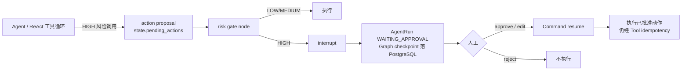

# Human-in-the-loop：高风险操作人工审批

> 状态：`IMPLEMENTED / LOCALLY VERIFIED`（单测 + 真实 LangGraph interrupt/Command 集成）。
> 真实多副本 PostgreSQL 跨进程 resume 未验证（`NOT_VERIFIED`）。

## 0. 目的

HITL 的目的**不是展示 LangGraph API**，而是建立**高风险 Tool 的业务控制边界**：
退款、订单修改、高额赔付、投诉升级、ERP 写操作必须由人审批后才执行。
普通问答（LOW 风险）不经过任何审批。

## 1. 风险策略

| 等级 | 例子 | 处理 |
|------|------|------|
| LOW | 查询订单、产品信息 | 直接执行 |
| MEDIUM | 创建售后工单 | 记录，不强制人工审批 |
| HIGH | 退款 / 改单 / 高额赔付 / 投诉升级 / ERP 写操作 | **必须人工审批** |

- 工具可声明 `risk_level`；否则按 `HITL_HIGH_RISK_TOOLS` / `HITL_MEDIUM_RISK_TOOLS`
  名称 allowlist 分类；
- 参数含金额且 `>= HITL_HIGH_AMOUNT_THRESHOLD` 时也升级为 HIGH（高额赔付）。

## 2. Graph 流程

- Agent 工具循环发现 HIGH 风险调用时**不直接执行**，写入 `state["pending_actions"]`；
- collaboration 节点之后条件路由到 `human_approval_gate`（仅当有 pending actions）；
- 闸门节点 `interrupt(payload)` 暂停图，LangGraph 把 checkpoint 写入 PostgreSQL
  Checkpointer；
- 审批后 worker 用 `Command(resume=decision)` 恢复图，闸门执行已批准动作；
- 拒绝则不执行。

> 注：Python 3.10 + 当前 langgraph 版本不会把 runnable config 自动传入深层 async
> 节点，闸门节点显式设置 `var_child_runnable_config`（已用真实 interrupt/Command
> 测试验证）。

## 3. 状态持久化（durable）

- Graph 状态经 **PostgreSQL Checkpointer**（`LANGGRAPH_CHECKPOINT_BACKEND=postgres`）
  持久化；`AgentRun.status = WAITING_APPROVAL`（`runtime/statuses.py`）。
- Agent 暂停后，API/Worker 全部重启，第二天审批仍能 resume（checkpoint 在 PG）。
- 审批记录本身也是 durable（`human_approvals` 表，migration 006）。

## 4. 审批数据

`human_approvals`：`approval_id` / `run_id` / `thread_id` / `user_id`(请求人) /
`action` / `risk_level` / `proposal`(脱敏) / `proposal_fingerprint` / `status` /
`requested_at` / `reviewed_at` / `reviewer_id` / `decision` / `reason` / `resumed_at`。

状态机：`PENDING -> APPROVED | REJECTED | EXPIRED`（终态）。
唯一约束 `(run_id, action, proposal_fingerprint)` 让 resume 重新 interrupt 时幂等复用。

## 5. 安全

- 审批 API 必须 RBAC：仅 `supervisor` / `admin`（或 admin token）可审批；
- 普通 `customer` 不能审批；且**不能审批自己发起的操作**（`reviewer != requester`）；
- 审计：记录谁审批、审批什么（脱敏 proposal）、何时、结果；不记录敏感字段
  （proposal 经 `sanitize_event` 过滤 api_key/token/password 等）。

## 6. Side-effect 幂等

approve 之后仍必须经过既有 **Tool idempotency**（`tool_side_effects` 唯一约束 +
请求指纹）：resume/retry/重复审批都不会重复退款/改单。

## 7. API

| 方法 | 路径 | 说明 |
|------|------|------|
| GET | `/api/approvals?status=PENDING` | 待审批列表（supervisor/admin） |
| GET | `/api/approvals/{approval_id}` | 审批详情 |
| POST | `/api/approvals/{approval_id}/approve` | 通过（可带 `edited_args`）→ resume |
| POST | `/api/approvals/{approval_id}/reject` | 拒绝 → resume（闸门不执行） |

## 8. 配置

| 变量 | 默认 | 说明 |
|------|------|------|
| `HITL_ENABLED` | `true` | 总开关（关闭则不做审批拦截） |
| `HITL_HIGH_RISK_TOOLS` | 退款/改单/... | HIGH 风险工具 allowlist |
| `HITL_MEDIUM_RISK_TOOLS` | 工单/投诉 | MEDIUM 风险工具 allowlist |
| `HITL_HIGH_AMOUNT_THRESHOLD` | `1000` | 金额阈值升级 HIGH |
| `HITL_APPROVAL_TTL_SECONDS` | `604800` | 审批有效期 |

## 9. Metrics

`human_approval_requested_total{risk_level,action}` /
`human_approval_decided_total{decision}` / `human_approval_pending` /
`human_approval_wait_seconds`（`core/monitoring.py`）。

## 10. 测试与证据

- 单测：风险分级、审批服务（幂等 create/decide、脱敏、resume 生命周期）、审批 API
  （RBAC、approve/reject、重复审批幂等、不能自审）。
- 集成：真实 LangGraph `interrupt()`/`Command(resume=...)` + Checkpointer：
  `high_risk_interrupts` / `low_risk_does_not_interrupt` / `approval_resumes` /
  `rejection_does_not_execute_tool` / `restart_then_resume` /
  `duplicate_approval_is_idempotent`；executor 级 run `WAITING_APPROVAL` -> approve
  -> `SUCCEEDED`。
- **未验证**：真实多副本 PostgreSQL 跨进程第二天审批 resume（用 MemorySaver 模拟
  graph 重启；PG gated 测试覆盖 checkpoint 跨进程，但 HITL 全链路跨进程 `NOT_VERIFIED`）。
