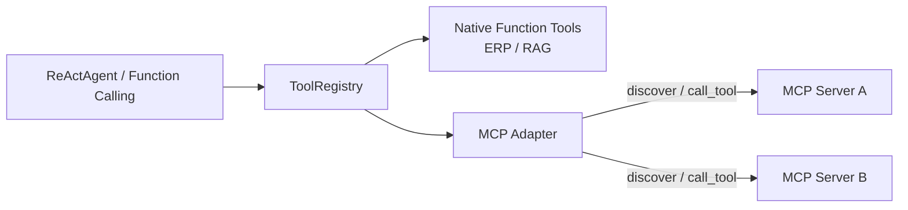

# MCP 外部工具适配（在 ToolRegistry 上叠加，而非替代 Function Calling）

> 状态：`IMPLEMENTED / LOCALLY VERIFIED`（单测 + 真实 MCP stdio server 集成测试）。
> 真实第三方 MCP server / 生产连通性 `NOT_VERIFIED`。

## 1. 为什么保留 native Function Calling

系统内建工具（ERP 查询、RAG 等）走 native Function Calling，因为：

- **零额外网络跳转**：同进程调用，延迟与故障面更小；
- **可注入应用级幂等**：`ToolRegistry` 已支持 `side_effect=True` +
  `tool_side_effects`（退款/改单等写操作崩溃重放不重复）；
- **可控的缓存策略**：`ToolCachePolicy`（TTL / scope / authorization_required）；
- **离线可测**：不依赖外部进程。

## 2. 为什么 MCP 是标准化外部工具接口

MCP（Model Context Protocol）用于把**外部/第三方/跨语言**工具以统一协议暴露：
discover → schema → invoke。它是**增量能力**，不是要拿 MCP 重写所有内建工具。

判断标准（哪些适合 MCP 化）：

| 维度 | 适合 MCP | 保留 native |
|------|---------|------------|
| 部署边界 | 独立进程/团队/第三方 | 同进程、系统内建 |
| 语言 | 非 Python / 异构 | Python 同栈 |
| 写操作 | 需上游幂等键 + 风险评审 | 已有应用级幂等 |
| 延迟敏感 | 可接受 IPC/网络 | 要求极低延迟 |

## 3. 架构

Agent / ReAct / FC 只看到**统一的 ToolDefinition**，不关心来源：

| 字段 | 说明 |
|------|------|
| `name` | 统一名称（MCP 工具命名空间化为 `mcp__{server}__{tool}`，避免冲突） |
| `description` | 供 LLM 选择 |
| `parameters` (`input_schema`) | 归一化后的 JSON Schema object |
| `invoke()` | 统一执行入口（native handler / MCP `call_tool`） |
| `risk_level` | `read` / `write`（第一版只注册 `read`） |
| `timeout` | 单次调用超时 |

## 4. 适配器实现（`tools/mcp_adapter.py`）

- `MCPServerConfig`：server allowlist 配置（transport/url/command/allowed_tools/
  timeout/max_payload/risk_level/enabled）。
- `MCPClientProtocol`：最小 client 接口（`list_tools` / `call_tool` / `close`）。
- `McpSdkClient`：官方 `mcp` SDK 的最小实现（stdio / sse），懒加载，长连接生命周期
  由 adapter 管理。
- `MCPToolAdapter`：
  - `discover_tools()`：`list_tools` → allowlist 过滤 → `inputSchema` 归一化；
  - `invoke(name, args)`：allowlist 校验 → payload 大小限制 → `asyncio.wait_for`
    timeout → 结果归一化 / 错误映射；
  - 错误映射：超时 → `MCPTimeoutError`；连接错误 → `MCPUnavailableError`；
    非法 schema → `MCPInvalidSchemaError`；非 allowlist → `MCPUnauthorizedToolError`。
- `register_mcp_tools(registry, adapter)`：把归一化工具注册进**现有** `ToolRegistry`
  （不新建 registry），`side_effect=False`；`risk_level=write` 默认跳过。
- `load_mcp_server_configs(raw)`：解析 `MCP_SERVERS` JSON，任何非法输入 **fail closed**
  返回 `[]`。

## 5. 安全（fail closed）

- **server allowlist**：只连接 `MCP_SERVERS` 中的 server；禁止任意连接未知服务器。
- **tool allowlist**：`allowed_tools` 为空 = 不允许任何工具；非 allowlist 调用拒绝。
- **transport 白名单**：仅 `stdio` / `sse`。
- **timeout**：`MCP_DEFAULT_TIMEOUT_SECONDS` / per-server `timeout_seconds`。
- **payload 限制**：`MCP_MAX_PAYLOAD_BYTES`，超限拒绝。
- **只读优先**：第一版只注册只读工具；写操作 MCP 工具默认不注册。
- **失败行为 / 回滚**：`MCP_FAIL_CLOSED=false`（默认）初始化失败降级为仅 native；
  `true` 则启动失败；`MCP_ENABLED=false` 完全关闭（可回滚）。

## 6. 配置

| 变量 | 默认 | 说明 |
|------|------|------|
| `MCP_ENABLED` | `false` | 总开关（fail closed） |
| `MCP_SERVERS` | 空 | JSON allowlist（name/transport/command|url/allowed_tools/...） |
| `MCP_DEFAULT_TIMEOUT_SECONDS` | `15` | 默认调用超时 |
| `MCP_MAX_PAYLOAD_BYTES` | `32768` | 调用 payload 上限 |
| `MCP_FAIL_CLOSED` | `false` | 初始化失败是否阻断启动 |

## 7. Metrics

`mcp_tool_call_total{server,tool,status}` / `mcp_tool_error_total{server,tool,reason}` /
`mcp_tool_duration_seconds{server,tool}`（`core/monitoring.py`）。

## 8. 测试与证据

- 单测（`tests/unit/test_mcp_adapter.py`，fake client）：discovery、schema 归一化、
  native+MCP 共存、timeout、server unavailable、unauthorized、invalid schema、
  payload 限制、写操作跳过、配置 fail-closed、指标注册。
- 集成（`tests/integration/test_mcp_stdio.py`）：**真实 MCP stdio server**
  （`mcp_fixture_server.py`，官方 `mcp.server.fastmcp`）子进程，经 `McpSdkClient`
  discover + invoke + 注册进 `ToolRegistry` —— `LOCALLY VERIFIED`。
- **未验证**：真实第三方 MCP server、SSE transport 连通性、生产网络/鉴权、
  写操作 MCP 工具幂等（`NOT_VERIFIED`）。

## 9. 面试一句话

native Function Calling 是系统内建的“近身武器”（低延迟、可注入幂等），MCP 是接入
外部工具的“标准插座”；两者统一到同一个 ToolRegistry，Agent 不需要知道来源。
