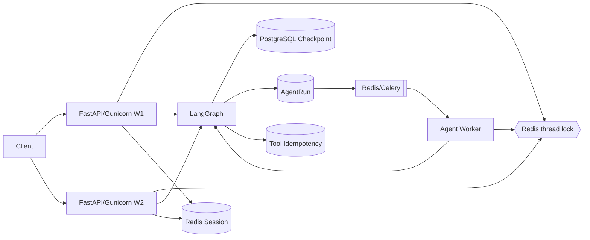

# Distributed Runtime — Evidence Boundary

> 分布式 Runtime 的证据边界：哪些是 `CI VERIFIED` / `LOCALLY_VERIFIED`，哪些
> 仍是 `NOT_VERIFIED`。所有数字来自真实命令，边界明确。详细设计见
> [distributed-agent-runtime](../design/distributed-agent-runtime.md)、
> [runtime-state-ownership](../design/runtime-state-ownership.md)、
> [ADR-009](../decisions/009-distributed-agent-runtime.md)。

## Problem

Gunicorn 多 worker + 进程内运行时状态不一致：checkpoint 不共享、会话分片、
同一 thread 并发写、worker 崩溃难恢复、重试可能重复副作用。

## Before

- LangGraph 曾默认 `MemorySaver`（进程内，重启丢失）；
- Session 生产模板默认 memory；
- MessageBus / SharedBlackboard 进程内；
- 同一 thread 无跨进程互斥。

## After



**Fast Path**：Client → FastAPI → Redis thread lock → LangGraph → Postgres
checkpoint → SSE/REST response。
**Async Path**：Client → `POST /api/runs` → AgentRun(QUEUED) → Celery/Redis →
Agent Worker → Redis thread lock → LangGraph → Postgres checkpoint → AgentRun result
→ `GET /api/runs/{run_id}`。

> 快路径与异步路径使用**同一** `agent:thread-lock:{thread_id}` key，因此**不能同时
> 修改同一 conversation thread**。

## Failure Semantics

| 场景 | 行为 |
|---|---|
| worker crash | 未 ACK 任务经 `visibility_timeout` 重投递；lease 过期被新 worker 接管；失败节点可能重执行 → 需幂等 |
| Redis unavailable | 生产 Session fail-fast；锁 fail closed（`THREAD_LOCK_UNAVAILABLE` 503），不静默并发 |
| Postgres unavailable | checkpoint 初始化 fail-fast（不回退 MemorySaver）；Run/幂等写入失败即请求失败 |
| same-thread contention | 返回 `THREAD_BUSY`（409 / SSE·WS 错误帧），不悄悄并发 |
| duplicate run | 终态重复投递 no-op（application-level 幂等） |
| duplicate tool call | ledger `(tool_name, operation_key)` 唯一约束 + claim；第二次返回已存结果 |

## Evidence

真实 PostgreSQL + Redis（本地，非生产集群）：

```bash
TEST_DISTRIBUTED_DB_URL=postgresql://... TEST_REDIS_URL=redis://... \
  python scripts/verify_distributed_runtime.py
# → artifacts/distributed-runtime/<ts>/report.json (schema v2)
#   tested_code_sha / generated_at / overall_status=PASS
```

| Check | 结果 |
|---|---|
| checkpoint_cross_process | PASS |
| same_thread_serialization | PASS |
| different_thread_parallelism | PASS |
| tool_idempotency | PASS（side_effect_calls=1） |
| worker crash recovery（pytest，gated） | PASS |
| fresh DB migration（pytest，gated） | PASS |
| `pytest tests/unit` / integration / e2e mock | PASS |

## Boundaries

**Not Production Verified**：真实公网生产集群、多副本长期稳定运行、真实用户流量、
真实 ERP 写操作、真实退款/工单副作用、大规模 queue backlog、Kubernetes autoscaling、
multi-region、cross-process SSE replay。
**Not claimed**：exactly-once、零丢失、高可用已验证、broker-native DLX。

### HITL governance boundary（可以说 / 不能说）

| 可以说（Level 2 — CI VERIFIED） | 不能说 |
|---|---|
| HIGH 风险副作用在**执行前**被拦下，挂 `WAITING_APPROVAL`（非终态） | 「`/api/chat` 快路径也受审批保护」——快路径无 run 上下文，**不在**该边界内 |
| `WAITING_APPROVAL → RUNNING` 不递增 `attempt`，等人不消耗重试预算 | 「审批等待计入重试 / 会自动 DLQ」 |
| reviewer ≠ requester 在 **service 层**强制，审批人身份拿不到就 401 | 「所有 admin-token 决策共用一个 reviewer」（不会退化） |
| TTL 到期按 **EXPIRED（拒绝）** 收敛，绝不默认放行 | 「超时自动批准 / 自动执行」 |
| 决策幂等、`resume` 原子消费一次 | 「审批通过 = 已执行」（决策≠执行，执行仍走 ledger） |
| 已批准副作用仍经 `tool_side_effects` ledger，`operation_key` 在 replay 后稳定 | 「端到端 exactly-once」（外部系统仍需接受 idempotency key） |
| 用确定性 staging 工具验证了审批—执行闭环 | 「真实 ERP 写操作已验证」——`NOT_VERIFIED` |
| — | 「审批 SLA / 人工效率已优化」——`NOT_MEASURED` |
| — | 「有审批主动通知」——**未实现**，只能靠 `GET /api/approvals` 拉取 |

**Not claimed（HITL）**：真实 ERP 写操作（`NOT_VERIFIED`）、审批 SLA
（`NOT_MEASURED`）、主动通知（TODO）、快路径覆盖（设计上不覆盖）。

## Interview Questions

### Q1 为什么 Postgres Checkpoint，而不是 Redis？
Postgres 有事务/唯一约束/持久化，checkpoint 是 canonical durable state，必须跨
worker/副本共享且重启可恢复；Redis 是 ephemeral（TTL/内存淘汰），适合锁/会话/
broker，不适合 canonical 状态。Redis 挂了不能丢图状态。

### Q2 为什么 Redis Lock 不能用 asyncio.Lock？
`asyncio.Lock` 只在单进程内有效；gunicorn 多 worker 是多个进程，进程内锁互不可见，
同一 thread 会被不同 worker 并发执行。必须用跨进程存储（Redis）做互斥。

### Q3 为什么不能靠 sticky session？
Sticky session 只把同一客户端路由到同一实例，不能替代 durable state：实例重启/
扩缩容/故障切换即失效，且不能跨副本共享 checkpoint/session。它是优化，不是正确性
基础。

### Q4 为什么 Celery payload 只放 run_id？
避免 broker payload 膨胀、避免敏感对话状态复制到 broker、避免 broker 事实源化、
worker 可从 DB 恢复完整上下文、提高 retry/crash recovery 一致性。`AgentRun`
（Postgres）才是真相源，`task_ignore_result=True`。

### Q5 acks_late 为什么仍然不能保证 exactly-once？
`acks_late` 只是"任务完成后才 ACK"；worker 崩溃 → broker 重投递 → 任务可能被执行
两次。at-least-once 是投递语义，不是执行语义。要业务幂等（run 幂等 + tool ledger）
才能在业务层达到"只生效一次"。

### Q6 visibility_timeout 配太短有什么问题？
任务仍在执行时消息就重新可见 → 另一 worker 重复消费 → duplicate execution。所以
`visibility_timeout` 必须大于最长任务时间（本仓库默认 3600s，任务 soft/hard limit
120/180s）。

### Q7 锁 TTL 到期但旧 worker 还在跑怎么办？
当前：owner token + Lua compare-and-delete 只能防"旧 owner 错删新锁"，**不能**严格
消除"pause 超过 TTL 后旧 worker 继续执行"（A 卡顿 → TTL 过期 → B 拿锁 → A 恢复 →
A/B 同时跑）。已实现的缓解：执行期间 **lease renewal / heartbeat**
（`runtime/executor.py::_heartbeat_loop` 同时续 DB lease 与 Redis lock TTL，
观测 `agent_thread_lease_renewed_total` / `agent_worker_heartbeat`）+
`TTL > task time limit + margin`（启动校验）+ checkpoint 续跑 + 工具幂等 +
任务超时。更严格场景仍应加 **fencing token / DB version check**——当前
**没有** fencing token，不假装解决。

### Q8 为什么 tool ledger 不能等同于端到端 exactly-once？
本地 ledger 只保证"同一 Agent 不重复发起同一副作用"。下游 ERP 可能已经执行但响应
丢失，或下游不支持幂等键 → 仍可能重复。下游最好支持 idempotency key；否则需要
reconciliation（对账）。本地 ledger ≠ 下游 exactly-once。
