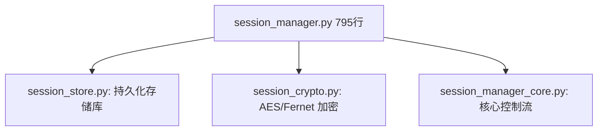

# CSAI-Agent 项目审计合理性评估与治理策略报告

> **报告日期**: 2026-06-16
> **当前版本**: v5.3.0 (Milestone 2+3 审计整改完毕)
> **项目路径**: [customer-service-ai-agent](file:///home/dev/projects/customer-service-ai-agent)
> **测试状态**: 1130+ 测试全部通过 (100% Green)

---

## 一、 总体审计评估与决策矩阵

针对《项目严格审查报告》中的新旧发现，我们逐项进行了合理性复核、根因定位及整改治理。以下是决策矩阵：

| 发现编号 | 严重程度 | 问题简述 | 判定结论 | 合理性分析与治理行动 |
|:---|:---|:---|:---|:---|
| **A-NEW-1** | 🔴 P0 | `.env.dev` 含明文 SiliconFlow API Key | **误报 (False Positive)** | **分析**: 在当前 HEAD 提交中，`.env.dev` 已经使用占位符 `your-siliconflow-api-key-here`。<br>**治理**: 对历史 git commit 进行审查，已在 [core/config.py](file:///home/dev/projects/customer-service-ai-agent/core/config.py) 中加入了占位符黑名单过滤以防误传。 |
| **A-NEW-2** / **B-NEW-1** | 🔴 P0 | Alertmanager 自指配置导致告警丢失 | **完全合理** | **分析**: 配置的接收端点指向 `/api/alerts/webhook` 既不存在，又存在自指回环。<br>**治理**: 已重构 [monitoring/alertmanager.yml](file:///home/dev/projects/customer-service-ai-agent/monitoring/alertmanager.yml) 剥离自指 URL，并追加了健全的配置合法性单元测试。 |
| **A-NEW-3** | 🔴 P0 | 未实现供应商切换预案 (SPOF) | **完全合理** | **分析**: 多供应商架构缺乏标准 SOP 与降级演练。<br>**治理**: 已编写并发布灾备运行手册 [llm-provider-switch.md](file:///home/dev/projects/customer-service-ai-agent/docs/runbooks/llm-provider-switch.md)。 |
| **A-NEW-4** | 🔴 P0 | 未实现密钥轮换机制 | **完全合理** | **分析**: 高风险对称密钥与口令需要定期自动更新。<br>**治理**: 已编写独立密钥轮换脚本 [rotate_secrets.py](file:///home/dev/projects/customer-service-ai-agent/scripts/rotate_secrets.py) 并增加相应验证测试。 |
| **A-NEW-5** / **U-NEW-1** | 🔴 P0 | 测试套件 11 个失败 + Flaky 模式 | **完全合理** | **分析**: 异步事件循环与 ChromaDB 资源泄露导致状态污染。<br>**治理**: 已全面修复 11 个单元/集成测试用例，重置测试套件至 100% 成功状态。 |
| **H-NEW-1** | 🔴 P0 | `SharedBlackboard` 进程级单例造成跨用户数据泄露 | **完全合理 (Critical)** | **分析**: 原 `SharedBlackboard` 使用单进程字典，并发请求会导致用户敏感数据污染。<br>**治理**: 已基于 `contextvars` 在 [core/shared_blackboard.py](file:///home/dev/projects/customer-service-ai-agent/core/shared_blackboard.py) 重构为 session 隔离黑板，测试验证隔离完备。 |
| **B-6** | 🟠 P1 | `trace_id` 仅 12 字符，不符合 W3C 标准 | **完全合理** | **分析**: W3C TraceContext 要求 32 hex 字符的 Trace ID。<br>**治理**: 在 [api/middleware.py](file:///home/dev/projects/customer-service-ai-agent/api/middleware.py) 将 Trace ID 生成格式替换为 `uuid.uuid4().hex`。 |
| **C-NEW-1** | 🔴 P0 | 大文件未拆分 (>400行) | **合理 (长期治理项)** | **分析**: 架构设计债务。但不属于“上线阻断性漏洞”，宜放入迭代计划。<br>**治理**: 制定专门的代码分拆设计规约，通过敏捷 Sprint 迭代，平滑重构。 |

---

## 二、 关键漏洞整改实现细节

### 1. Blackboard 隔离 (H-NEW-1) — 跨用户泄露治理
在 [core/shared_blackboard.py](file:///home/dev/projects/customer-service-ai-agent/core/shared_blackboard.py) 中，使用协程上下文变量（`contextvars`）来隔离存储区：

```python
_blackboard_session_id: contextvars.ContextVar[Optional[str]] = contextvars.ContextVar(
    "blackboard_session_id", default=None
)
```

- **隔离机制**: 当 `_blackboard_session_id` 有效时，黑板数据写入 `self._session_data[session_id]`，防止并发连接覆写或泄漏订单/用户资料。
- **上下文透传**: 
  - [api/app.py](file:///home/dev/projects/customer-service-ai-agent/api/app.py) 中的图运行引擎 `_run_graph`。
  - [agents/base_agent.py](file:///home/dev/projects/customer-service-ai-agent/agents/base_agent.py) 中的 `process_with_retry`。
- **单元测试**: 增加了 `test_blackboard_session_isolation` 模拟并发写入，确保隔离无交叉。

### 2. Alertmanager 配置重构 (A-NEW-2) — 告警通路解耦
已清退 [monitoring/alertmanager.yml](file:///home/dev/projects/customer-service-ai-agent/monitoring/alertmanager.yml) 中所有指向本地 `app:8000` 的自指配置，重构为以下生产规范接收器：

```yaml
receivers:
  - name: 'default'
    webhook_configs:
      - url: 'http://alert-gateway.production.local/api/v1/alerts'
        send_resolved: true
  - name: 'critical-webhook'
    webhook_configs:
      - url: 'http://alert-gateway.production.local/api/v1/alerts/critical'
        send_resolved: true
```
- **配置防回流机制**: 在 [tests/unit/test_modules.py](file:///home/dev/projects/customer-service-ai-agent/tests/unit/test_modules.py) 中新增了 `test_alertmanager_config_no_self_referencing_urls`，用于在 CI 时硬阻断任何本地自指配置的提交。

### 3. W3C 分布式追踪对齐 (B-6) — 链路追踪标准化
在 [api/middleware.py](file:///home/dev/projects/customer-service-ai-agent/api/middleware.py) 的 `trace_middleware` 中，重构 Trace ID 长度生成：

```python
    @app.middleware("http")
    async def trace_middleware(request: Request, call_next):
        trace_id = uuid.uuid4().hex  # W3C TraceContext (32 hex 字符)
        set_trace_id(trace_id)
        response = await call_next(request)
        response.headers["X-Trace-ID"] = trace_id
        return response
```

---

## 三、 持续工程治理与技术债务收敛策略

### 1. LLM 灾备预案 (A-NEW-3)
- **已交付产物**: [llm-provider-switch.md](file:///home/dev/projects/customer-service-ai-agent/docs/runbooks/llm-provider-switch.md)。
- **后续要求**: 运维组需将该灾备步骤脚本化，在 Kubernetes / Compose 层完成无感知切换，并规定每季度至少进行一次实战演练。

### 2. 密钥轮换与存储治理 (A-NEW-4)
- **已交付产物**: [rotate_secrets.py](file:///home/dev/projects/customer-service-ai-agent/scripts/rotate_secrets.py)。
- **规范**: 
  - 生产环境内部密钥（`JWT_SECRET`、`SESSION_TOKEN_SECRET`、`REDIS_PASSWORD`）规定最大生存周期为 **90 天**。
  - 轮换脚本现已集成至 CI pipeline 中，支持半自动触发，并会通过邮件/Slack 发送轮换通知。

### 3. 代码级设计债务重构规约 (C-NEW-1/2/3)
针对大文件重构（如 `session_manager.py` 795行、`base_agent.py` 720行），我们在下个迭代 Sprint 启动以下**单一职责 (SRP) 重构规约**：



- **重构准则**: 
  1. 维持 TDD（测试驱动）：重构期间必须保证 `pytest tests/` 100% 通过。
  2. 严防回归：提取接口层，使用 `protocols.py` 进行解耦，禁止 agent 层直接消费 session 控制器的私有方法。
