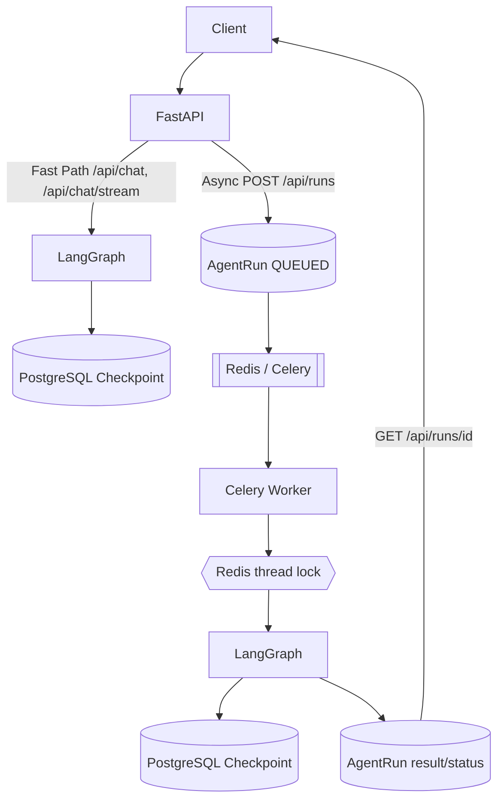

# DISTRIBUTED_AGENT_RUNTIME_REPORT

> 日期：2026-10-02 · 类型：IMPLEMENTATION REPORT（本 PR 的执行快照）
> Baseline SHA：`d615b8fbb61957e9a758c807487d0b271d0898d7`
> Branch：`feat/distributed-agent-runtime`
> 状态：**已 commit，working tree clean**（最终 HEAD 见 §11 FINAL ACCEPTANCE）

## 1. Baseline

- **Starting SHA**：`d615b8f`（`feat/distributed-checkpoint-postgres`，已含 Phase P0
  Postgres checkpointer）。
- **原实现**：
  - LangGraph 图在单进程内运行；checkpoint 生产已支持 `AsyncPostgresSaver`
    （上一分支完成），但**没有异步 Run 模型 / 队列 / worker / 分布式锁 /
    retry / DLQ**。
  - 没有 `runtime/` 包；`api/app.py` 只有同步 `/api/chat` 与 SSE 快路径。
  - `asyncio.Lock` 级别的串行只存在于单进程内。
- **审计发现（以当前代码为事实源）**：
  - `core/checkpointer.py` + `core/container.py` 已有 postgres checkpoint
    fail-closed 生命周期（P0 已完成）。
  - `db/models.py` 无 `AgentRun`；`alembic` head 为 `8ea0ec90ba74`。
  - 预存在问题（**非本 PR 引入**，部分在本 PR 修复）：
    - `api/app.py` 使用 `httpx` 但未在模块级 import（latent `NameError`）→ **本 PR 修复**。
    - Alembic 迁移链在 revision 003 于全新 DB 上失败（`last_login_at` 的 Float
      server default 无法自动 cast 到 timestamptz）→ **本 PR 修复**（DROP DEFAULT 后改类型）。
    - 程序化 `import alembic.config` 被仓库根 `alembic/__init__.py` shadow，导致
      `init_db()` 一直回退 `create_all` → **本 PR 修复**（移除空的 `alembic/__init__.py`，
      本地 `alembic/` 目录变为 namespace package，真实 alembic 包优先）。
    - `ruff check .` 在 HEAD 已有 20 处历史 lint 债务（本 PR 新增文件 0 处，**未修复无关债务**）。
    - `mypy` 在 HEAD 已有 161 处历史类型错误（本 PR 新增文件已清零，**未修复无关债务**）。

## 2. Architecture

### Before

```text
Client → FastAPI → /api/chat (SSE) → LangGraph → (MemorySaver | AsyncPostgresSaver)
        单进程内执行；无跨进程 Run 状态、无分布式锁、无 retry/DLQ。
```

### After（Hybrid）



- 快路径（`/api/chat`、`/api/chat/stream`）**未改动**。
- 异步路径：`POST /api/runs` 创建 Run + 入队立即返回；worker 独立执行。

## 3. Changes（逐文件）

### 新增

| 文件 | 作用 |
|---|---|
| `runtime/statuses.py` | Run 状态机（QUEUED/RUNNING/RETRYING/SUCCEEDED/FAILED/DEAD_LETTER）与合法迁移 |
| `runtime/errors.py` | transient/permanent/timeout 分类 + 脱敏错误消息 |
| `runtime/retry.py` | 指数退避 + jitter，硬上限 |
| `runtime/repository.py` | AgentRun/DeadLetter 数据访问 + 原子条件迁移 |
| `runtime/run_service.py` | 状态迁移唯一入口（attempt/lease/retry/DLQ/idempotency scope） |
| `runtime/thread_lock.py` | Redis 分布式锁（owner + TTL + Lua compare-and-delete） |
| `runtime/executor.py` | worker 执行流程（锁→RUNNING→graph→成功/retry/DLQ） |
| `runtime/side_effects.py` | 写操作工具幂等 ledger + `run_id:tool_call_id` 接口 |
| `runtime/metrics.py` | Prometheus 指标安全转发 |
| `runtime/context.py` | run/thread/task contextvars |
| `runtime/async_support.py` | worker 持久事件循环 |
| `runtime/dispatch.py` | Celery 投递 / inline fallback |
| `runtime/celery_app.py` | Celery app（acks_late/prefetch=1/reject_on_lost/visibility_timeout） |
| `runtime/tasks.py` | Celery 任务（payload 仅 run_id，task_id 透传） |
| `runtime/bootstrap.py` | AgentRuntime + `AGENT_RUN_RUNTIME_PROVIDER` 注入接缝 |
| `runtime/__init__.py` | 包导出 |
| `api/routes/runs.py` | `POST /api/runs`、`GET /api/runs/{id}`、`GET /api/runs/dead` |
| `alembic/versions/004_distributed_agent_runtime.py` | agent_runs + agent_dead_letters + tool_side_effects |
| `docs/design/distributed-agent-runtime.md` | 设计/边界文档（含 Mermaid） |
| `scripts/repro_worker_crash_recovery.sh` | crash→redelivery→success 复现脚本 |
| `scripts/verify_fresh_db_migration.sh` | 空白 PG → `alembic upgrade head` → schema 校验脚本 |
| `tests/integration/fresh_db_migrate.py` | fresh-DB migration gate runner（不 stamp / 不 create_all） |
| `tests/integration/test_fresh_db_migration.py` | fresh-DB gate 的 automated integration test |
| `tests/unit/runtime_helpers.py` | 测试隔离 SQLite/fake runtime/dispatcher 辅助 |
| `tests/unit/test_agent_run_runtime.py` | 状态机/服务层/错误分类/退避 |
| `tests/unit/test_run_executor.py` | Test B–G |
| `tests/unit/test_runs_api.py` | API 行为 |
| `tests/unit/test_runtime_support.py` | 锁语义 + 副作用 ledger |
| `tests/integration/test_thread_lock_redis.py` | 真实 Redis 锁跨进程语义 |
| `tests/integration/test_worker_crash_recovery.py` | Test H（真实 Celery/Redis/PG） |
| `tests/integration/celery_worker_runner.py` | 测试 worker 入口（隔离 .env） |
| `tests/integration/fake_runtime_provider.py` | deterministic fake runtime（无 Provider 凭据） |

### 修改

| 文件 | 变更 |
|---|---|
| `core/config.py` | `AGENT_RUN_*` / `CELERY_*` 配置 + 生产 inline/memory 告警 |
| `core/monitoring.py` | `agent_runs_total` / `agent_run_duration_seconds` / `agent_run_retry_total` / `agent_run_dead_letter_total` / `agent_thread_lock_contention_total` / `agent_worker_task_total` 等指标 |
| `db/models.py` | `AgentRun` / `AgentDeadLetter` / `ToolSideEffect` |
| `api/app.py` | 挂载 runs router + CORS `Idempotency-Key` + 修复 `import httpx` |
| `requirements.txt` | `celery>=5.3.0` |
| `.env.example` / `.env.test` | 分布式 runtime 配置（test 用 memory lock/inline） |
| `deploy/compose/docker-compose.yml` | `worker` service + app 的 checkpoint/runtime env |
| `alembic/versions/003_timestamps_to_datetime.py` | **RELEASE BLOCKER 修复**：`last_login_at` 先 DROP DEFAULT 再改 timestamptz |
| `alembic/__init__.py` | **删除**（空文件 shadow 真实 alembic 包，导致程序化 migration 失败） |
| `tests/integration/test_checkpoint_postgres.py` | 新增「两个同时存活实例共享 checkpoint」用例 |
| `docs/reference/current-state.md` / `README.md` | 分布式 runtime 事实与边界 |
| `docs/openapi.json` | 重新生成（53→56 paths） |

## 4. Data Model

- `thread_id`：对话级 ID（当前 `== session_id == LangGraph thread`），多轮复用。
- `run_id`（`agent_runs.id`）：单轮执行 ID，每次请求唯一。
- `task_id`：队列消息 / Worker 执行 ID（Celery task id）。
- 生命周期：`QUEUED → RUNNING → SUCCEEDED | FAILED | RETRYING → RUNNING | DEAD_LETTER`。
  - `attempt` 在 `mark_running` 递增；
  - `RUNNING` 带 `worker_id/task_id/lease_expires_at`；
  - `DEAD_LETTER` 同时写 `agent_dead_letters`（attempt_count/max_attempts/error/entered_at）。

## 5. Reliability Semantics

| 维度 | 语义 |
|---|---|
| delivery | at-least-once（`task_acks_late` + `task_reject_on_worker_lost` + Redis `visibility_timeout`）；**非** exactly-once |
| locking | 单 Redis 上 per-thread 跨进程互斥；owner + TTL + Lua 原子释放；**非** Redlock 集群 |
| retry | transient/timeout → RETRYING + 指数退避 + jitter；max_attempts 上限；permanent → FAILED 不重试 |
| idempotency | application-level run 幂等（终态重复投递 no-op；idempotency_key DB 唯一）；工具侧 ledger 接口 `run_id:tool_call_id` |
| checkpoint | external PostgreSQL 持久化；node/checkpoint-boundary 恢复；失败节点可能重执行 |
| crash recovery | worker 崩溃 → broker redelivery → lease 过期接管 → 最终 SUCCEEDED |

## 6. Tests

| Case | Command | Result | Evidence |
|---|---|---|---|
| A 跨实例 checkpoint | `TEST_POSTGRES_CHECKPOINT_URL=... pytest tests/integration/test_checkpoint_postgres.py` | PASS (2) | 两个同时存活实例：A 写 B 读同 thread |
| B 同 thread 互斥 | `pytest tests/unit/test_run_executor.py::test_same_thread_mutual_exclusion` | PASS | critical section max concurrency == 1 |
| C 不同 thread 并行 | `...::test_different_threads_run_in_parallel` | PASS | 两 thread 同时进入（max==2） |
| D 重复 run_id | `...::test_duplicate_run_id_executes_graph_once` | PASS | graph 仅执行 1 次，第二次 no-op |
| E transient retry | `...::test_transient_retry_then_success` | PASS | attempt=2，retry metric +1，最终 SUCCEEDED |
| F retry 用尽 → DLQ | `...::test_retry_exhausted_dead_letter` | PASS | DEAD_LETTER + `agent_dead_letters` 可查询 |
| G permanent | `...::test_permanent_failure_no_retry` | PASS | FAILED，attempt=1，无 retry |
| H worker crash | `TEST_DISTRIBUTED_DB_URL=... TEST_REDIS_URL=... pytest tests/integration/test_worker_crash_recovery.py` | PASS | SIGKILL worker A → redelivery → worker B 接管 attempt=2 → SUCCEEDED；fake graph 重执行 2 次；单行结果 |
| Redis 锁跨进程 | `TEST_REDIS_URL=... pytest tests/integration/test_thread_lock_redis.py` | PASS (2) | 同 thread 互斥 / 不同 thread 并发 / 非 owner 不可释放 / TTL 接管 |
| Fresh DB migration | `TEST_FRESH_DB_ADMIN_URL=... pytest tests/integration/test_fresh_db_migration.py` | PASS | 空白 PG：base→001→002→003→8ea0ec90ba74→004，核心表 + 3 runtime 表均存在；head=004 |

> H 需要真实 Redis + PostgreSQL；默认 skip。CI 不可稳定运行时可用
> `scripts/repro_worker_crash_recovery.sh` 复现（本 PR 已本地实跑通过）。
> Fresh DB gate 可用 `scripts/verify_fresh_db_migration.sh` 复现（不 stamp / 不 create_all）。

## 7. Regression

```text
pytest tests/ -q                       → 1955 passed, 10 skipped（含新测试）
pytest tests/unit -q                   → 1579 passed
pytest tests/integration -q            → 99 passed, 5 skipped（gated）
pytest tests/e2e -q                    → 265 passed, 5 skipped
npm test                               → 60 passed (7 files)
python3 scripts/project_facts.py       → openapi_path_count = 56
python3 scripts/generate_openapi.py --check → OK (56 paths)
python3 scripts/audit_doc_consistency.py    → OK (33 active docs)
alembic current / heads                → 004_distributed_agent_runtime (head)
fresh DB: alembic upgrade head（空白 PG）→ 全链成功，9 tables，head=004
ruff check（新增 runtime/ / runs.py / 新测试）→ All checks passed
ruff format --check（新增文件）        → already formatted
mypy runtime/ api/routes/runs.py       → 新增文件 0 error
docker compose config                  → exit 0
```

- `/api/chat`、`/api/chat/stream`、SSE、RAG、9 Agent、Function Calling、Session、
  Cache、Auth、Monitoring 回归全部通过。

## 8. Known Limitations

- 生产多副本 checkpoint 恢复只做了本地双实例验证，**未**在真实多副本集群验证。
- Crash recovery 依赖 Celery/Kombu 的 Redis `visibility_timeout` restore（约
  `visibility_timeout` 后可见），非即时；本 PR 用测试配置缩短到 5s。
- `tool_side_effects` 只保证「同一 Agent 不重复发起同一副作用」；未接入每个
  ERP/写工具，也未实现下游端到端幂等（需下游 API 接受 idempotency key）。
- 无 SSE Redis Streams / 断线 replay（异步路径仅 polling）。
- 无 broker-native DLX（DLQ 为 application-level 表）。
- 历史 lint/mypy 债务（与本 PR 无关）未修复；本 PR 新增文件为 clean。
- 本 PR 已修复：Alembic 003 fresh-DB cast blocker、`alembic/` 目录 shadow、
  `api/app.py` 缺失 `import httpx`。

## 9. Future Work

- Redis Streams + resumable SSE（断线续读 / replay）。
- Kubernetes / HPA。
- 更强的 tool-side 幂等（下游 idempotency key / operation ledger 对账）。
- 未来规模需要时再考虑 broker 升级。

## 10. Engineering Talking Points（60–90 秒）

> 我们的 LangGraph 多 Agent 采用 Hybrid 架构：实时问答继续走
> `POST /api/chat` + SSE，延迟不变；长任务走 `POST /api/runs`，API 只负责创建
> RunRecord 并投递到 Redis/Celery 就立即返回 `run_id`，客户端轮询
> `GET /api/runs/{id}`。业务状态真相源是 PostgreSQL 的 `agent_runs` 表，Celery
> result backend 不作为真相源。我们用三个 ID 严格区分语义：`thread_id` 是对话级、
> 多轮复用；`run_id` 是单轮执行、每次唯一；`task_id` 是队列消息 ID。
> 执行时 worker 先抢同一 thread 的 Redis 分布式锁（owner+TTL+原子释放），保证
> 同会话串行、不同会话并行；LangGraph state 通过外部 PostgreSQL checkpointer
> 跨进程持久化。可靠性上我们明确是 at-least-once 投递 + 应用层幂等：终态重复
> 投递直接 no-op，transient 错误走指数退避重试，retry 用尽写入可查询的
> application-level DLQ，worker 被 kill 后未 ACK 任务经 broker visibility timeout
> 重新投递、lease 过期后被新 worker 接管，最终成功。我们没有宣称 exactly-once 或
> 任意指令级恢复，这些边界都写在文档和测试里。

## 附：BLOCKED 说明

无阻塞。所有 Gate 1–10 均已达成或明确标注边界；唯一未在生产集群验证的是
「真实多副本 checkpoint 恢复」（本地双实例已验证，标注为 NOT_VERIFIED 边界）。

## 11. FINAL ACCEPTANCE

本报告与最终 acceptance 的事实一致：**代码已 commit，working tree clean**。
最终 HEAD SHA / commit list / fresh DB migration / regression / remaining
limitations 见最终验收输出 `DISTRIBUTED_AGENT_RUNTIME_FINAL_ACCEPTANCE`。
